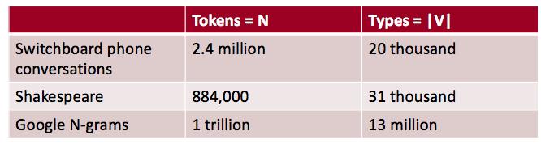

本文旨在总结一部分文本处理的基本方法，来源于Dan Jurafsky和Christopher Manning的Stanford Coursera course。

## 正则表达式 Regular Expression

正则表达式是一种正规化语言，用于在文本中找出指定的字符串。

例如，如何匹配以下4种形式中的任何一个：

- woodchuck
- woodchucks
- Woodchuck
- Woodchucks

### 正则表达式：析取

析取是表示为“或”的逻辑连接词。在正则表达式中使用中括号 `[]` 来表示，表示去其中的任何一个。

例如：

- [wW]oodchuck：匹配Woodchuck, woodchuck，首字符为w或W中的任意一个，其他字符严格匹配。
- [1234567890]：匹配任何一个数字字符。

在 `[]` 中，还支持使用范围定义来简化一些匹配操作，例如：

- [A-Z]：匹配一个大写字母，例如**D**renched Blossoms
- [a-z]：匹配一个小写字母，例如**m**y beans were impatient
- [0-9]：匹配一个数字字符，例如Chapter **1**: Down the Rabbit Hole

### 正则表达式：析取否定

否定使用 `^` 来表示，即不取`[]`的任何一个字符，只在`[]`中首部有效。

例如：

- [^A-Z]：不是一个大写字母，例如O**y**fn pripetchik
- [^Ss]：既不是S也不是s，例如**I** have no exquisite reason”
- [^e^]：既不是e也不是^，例如**L**ook here
- a^b：匹配a^b，例如Look up **a^b** now

### 正则表达式：管道 |

管道可以用于匹配多个字符串，例如woodchuck还有另外一个名称叫groundhog，可以使用 `groundhog|woodchuck` 来匹配这两个单词。

- yours|mine：匹配 yours、mine
- a|b|c：等价于 [abc]
- [gG]roundhog|[Ww]oodchuck：析取和管道相结合使用。

### 正则表达式：? * + .

- colo?r：表示r前有一个可选的字符，例如color和colour。
- oo*h!：表示h前有0个或多个o，例如oh! ooh!  oooh! ooooh!
- o+h!：表示h前有1个或多个o，例如oh! ooh!  oooh! ooooh!
- baa+：表示重复1个或多个a，例如baa baaa baaaa baaaaa
- beg.n：表示.处匹配任意一个字符，例如begin begun begun beg3n

### 正则表达式：锚 ^ $

表示字符串的开始和结尾。

- ^[A-Z]：以大写字母开始，例如**P**alo Alto
- ^[^A-Za-z]：以非字母开始，例如**1** “Hello”
- \.$：以.号结尾，例如The end**.**
- .$：以任意结尾，例如The end**?**  The end**!**

### 正则表达式：例子

找出所有的单词 the

> The Cat in the Hat! The other one there, the blithe one.

#####  直接使用 `the` 匹配，结果如下：

> The Cat in **the** Hat! The o**the**r one **the**re, **the** bli**the** one.

首字母大写的 the 没有被匹配到，其次在其他单词中间的 the 被错误匹配。

##### 使用[^a-zA-Z][tT]he[^a-zA-Z]

匹配单词 the，不仅要忽略首字母大小写，还要确保其前后没有字母，匹配结果如下：

> **The** Cat in **the** Hat! The other one there, **the** blithe one.

上面的修正解决了两个错误：

- 匹配了本不该匹配的字符串（other, there, blithe），称为False Positive.
- 未匹配到本该匹配的字符串（The），称为False Negative.

在自然语言处理中，我们总是在处理这两类错误。降低一个应用的错误率往往涉及到两方面的努力：

- 提升准确率和精确率（最小化False Positive）
- 提升覆盖率和召回率（最小化False Negative）

## 词的符号化 Word Tokenization

每一个NLP任务都需要做文本的标准化：

- 文本中词的分割和符号化
- 词格式的标准化
- 文本中句子的分割

例如以下3句，应该算有多少个词汇：

- I do uh main- mainly business data processing
  - 拟声词 uh 应不应该算一个词
  - main- 是 mainly 的片段，是否应该舍去
- Seuss’s cat in the hat is different from other cats!
  - 主旨：同样的词干，词性，粗糙的词义，例如 cat 和 cats 主旨相同
  - 词格式：cat 和 cats 词的格式不同
- they lay back on the San Francisco grass and looked at the stars and their
  - 类型Type：词汇表中的一个元素
  - 符号Token：这个类型在文本中的一个实例
  - 有多少类型和符号？
    - 15或14个符号，如果 San Francisco 算一个符号
    - 13或12或11个类型，如果忽略不同的词的格式

### 定义

- N: 符号的个数，文本中有多少个词
- V: 词汇表，类型的集合，|V|表示词汇表的大小

广义的认为 |V| > O(N<sup>1/2</sup>) (Church and Gale (1990))

例如如下几个语料库：



### 使用Unix命令进行简单符号化

给定一个文本文件（以[莎士比亚](http://norvig.com/ngrams/shakespeare.txt)为例），输入文字符号和他们的词频。

```sh
tr -sc 'A-Za-z' '\n' < shakespeare.txt  # 将所有的非字母转换为换行符
  | sort                                # 字典序排序
  | uniq -c                             # 归并与计数
  | head                                # 返回头部信息
```


可以看到，文本经过字典序排列并统计了数量。

### 更多计数

按字典序排序的意义并不大，此外该任务假设对大小写并不敏感，首先将所有大写转换为小写，然后按照词频来进行排序。

```sh
tr 'A-Z' 'a-z' < shakespeare.txt      # 大写转换为小写
  | tr -sc 'A-Za-z' '\n'              # 将所有的非字母转换为换行符
  | sort                              # 字典序排序
  | uniq -c                           # 归并与计数
  | sort -n -r                        # 按词频排序
  | head                              # 返回头部信息
```


可以看到，the、and 和 i 在文中出现最多，符合英文的写作风格。

这样的符号化过程仍然存在一些问题，如下图：


可以看到 d 和 s 并不是单词，还可以做一些调整。

### 符号化的几个问题

来看下面的几个例子：

- Finland’s capital   -> Finland Finlands Finland’s  应该转换为哪一种
- what’re, I’m, isn’t  ->  What are, I am, is not 需要将它们拆开
- Hewlett-Packard      -> Hewlett Packard     是否中断为两个单词
- state-of-the-art     ->  state of the art   同上
- Lowercase	-> lower-case lowercase lower case    是否要变为两个单词
- San Francisco	 -> one token or two       是一个符号还是两个
- m.p.h., PhD.	-> 这些又应该如何处理

### 符号化：语言的问题

- 法语：
  - L'ensemble -> 一个符号还是两个
  - 想要 L'ensemble 匹配 un ensemble
- 德语：名次不分段
  - Lebensversicherungsgesellschaftsangestellter
  - 'life insurance company employee'
  - 德语信息检索需要进行分割
- 中文和日文中词没有使用空格进行分隔。
  - 莎拉波娃现在居住在美国东南部的佛罗里达
  - 莎拉波娃  现在   居住  在    美国   东南部     的    佛罗里达
  - Sharapova now lives in US    southeastern   Florida
- 更复杂的，日文还掺杂了许多其他的符号，如中文和字母。

### 中文分词

- 中文是由字符构成的，一个字符通常为一个音节和一个词素。
- 平均的词长约为2.4个字符长度。
- 标准的baseline分割算法：最大最小匹配（贪心）

#### 最小最大匹配

给定一个词汇表，以及一个字符串

1. 以第一个字符作为起点
2. 逐步向下移动指针，找到与当前段匹配的词汇表中最长的词
3. 将该字符串作为一个词，将起始指针指向这个词的下一个字符
4. 重复2，知道到结尾

例如(以英文为例)：

> Thecatinthehat  ->  the cat in the hat

但是同样存在如下情况：

> Thetabledownthere 本应分为 the table down there，但是算法会分成 theta bled own there.

因此在英文中一般不适用，因为英文的词长很大。但是由于中文词长很小，所有比较适用。

- 莎拉波娃现在居住在美国东南部的佛罗里达。
- 莎拉波娃  现在   居住   在  美国   东南部     的  佛罗里达

使用现代的概率分割算法，能够获得更好的表现。

## 词的规范化和词干化 Normalization and Stemming

- 需要将术语规范化
  - 信息检索：检索的文本和查询的术语必须有相同的形式，例如我们相匹配 U.S.A. 和 USA。
- 可以隐式地定义相等的术语，例如删掉术语中的.号
- 其他：不对称地膨胀：
  - 输入window，搜索window，windows
  - 输入windows，搜索window，windows
  - 输入Windows，搜索Windows
- 这些方法可能更加强大，但是同样也更加低效。
