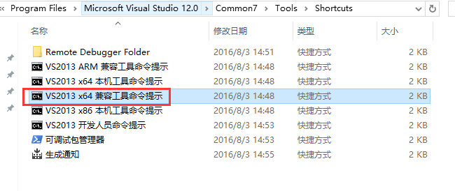
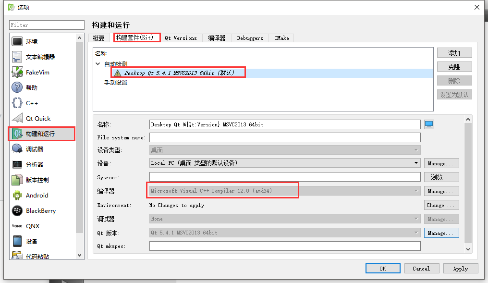

本文是对OpenBR官方文档的翻译加填坑过程。

原始文档地址：[这是链接](http://openbiometrics.org/docs/install/#windows)。

在安装的时候碰上几个说大不大说小不小的坑，折腾了很长时间，在此做个总结。

## 安装VS2013

首先要安装VS2013，官网上说装Express版本就行，我这边装了Professional中文版，除了编译的时候经常出现字符问题，其他没什么影响。

## 下载并安装 CMake 3.0.2

最好跟它的版本保持一致，以免入坑，下载地址：[这是链接](http://www.cmake.org/files/v3.0/cmake-3.0.2-win32-x86.exe)。

在安装过程中，记得选 `Add CMake to PATH`，把CMake添加到环境变量里去。

## 下载OpenCV 2.4.11

理论上说新一点的版本也是可以的。最好保持一致，官网链接：[这是链接](http://sourceforge.net/projects/opencvlibrary/files/opencv-unix/2.4.11/opencv-2.4.11.zip/download)。

解压到你想要解压的地方，官方放在了C盘，操作方便。

接下来就是编译了，先要打开VS2013 x64兼容工具命令提示，(开始菜单->所有程序->Visual Studio 2013->Visual Studio Tools里面)。



开始敲命令：

```
$ cd C:\opencv-2.4.11
$ mkdir build-msvc2013
$ cd build-msvc2013
$ cmake -G "NMake Makefiles" -DBUILD_PERF_TESTS=OFF -DBUILD_TESTS=OFF -DWITH_FFMPEG=OFF -DCMAKE_BUILD_TYPE=Debug ..
$ nmake
$ nmake install
$ cmake -DCMAKE_BUILD_TYPE=Release ..
$ nmake
$ nmake install
$ nmake clean
```

<!-- more -->

## 下载并安装QT5.4.1

无脑安装，装在C盘方便，下载链接：[这是链接](http://download.qt.io/official_releases/qt/5.4/5.4.1/qt-opensource-windows-x86-msvc2013_64-5.4.1.exe)。

## 从GitHub克隆OpenBR项目

首先要有一个GitHub账号，然后本机装上GIT，然后用GIT BASH 克隆项目，按照下面的操作来。

```
$ cd /c
$ git clone https://github.com/biometrics/openbr.git
$ cd openbr
$ git checkout v1.1.0
$ git submodule init
$ git submodule update
```

## 编译OpenBr

再次打开 VS2013 x64 兼容工具命令提示：

> -DCMAKE_PREFIX_PATH的OpenCV路径应该是 C:/opencv-2.4.11/build-msvc2013/install，少了-msvc2013

```
$ cd C:\openbr
$ mkdir build-msvc2013
$ cd build-msvc2013
$ cmake -G "CodeBlocks - NMake Makefiles" -DCMAKE_PREFIX_PATH="C:/opencv-2.4.11/build/install;C:/Qt/Qt5.4.1/5.4/msvc2013_64" -DCMAKE_INSTALL_PREFIX="./install" -DBR_INSTALL_DEPENDENCIES=ON -DCMAKE_BUILD_TYPE=Release ..
$ nmake
$ nmake install
```
检查一下install文件夹。

## Hack OpenBR

再次打开 VS2013 x64 兼容工具命令提示：

```
C:\Qt\Qt5.4.1\Tools\QtCreator\bin\qtcreator.exe
```

这就打开了QT Creater。

然后菜单栏->工具->选项->构建和运行->构建套件(Kits)，选Desktop Qt(默认)，编译器选Microsoft Visual C++ Compiler 12.0 (amd64)，OK。

> 这步不需要操作，官网说选 Microsoft Visual C++ Compiler 11.0 (x86_amd64)，但实际无法选择。



再然后，QT菜单栏->打开文件或项目，选 `C:\openbr\CMakeLists.txt`，然后点击打开。

选择你预安装的编译目录 `C:\openbr\build-msvc2013`，然后点击Next。

运行CMake，结束，这样，整个流程安装完了。

## 测试

跟着教程来：[这是教程链接](http://openbiometrics.org/docs/tutorials/)

打开命令提示符：

```
$ cd C:\openbr\build-msvc2013\install\bin
$ br -gui -algorithm "Show(false)" -enroll 0.webcam
```

如果顺利打开摄像头，恭喜你成功了。


