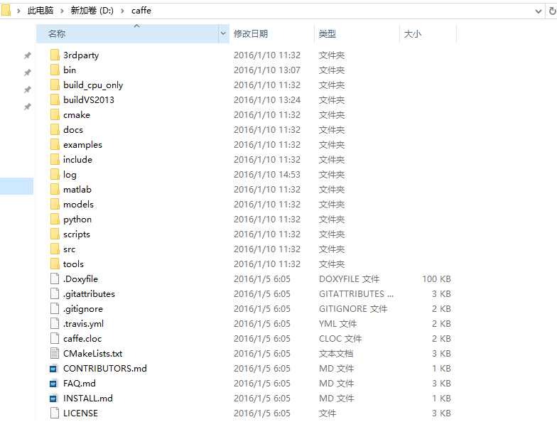
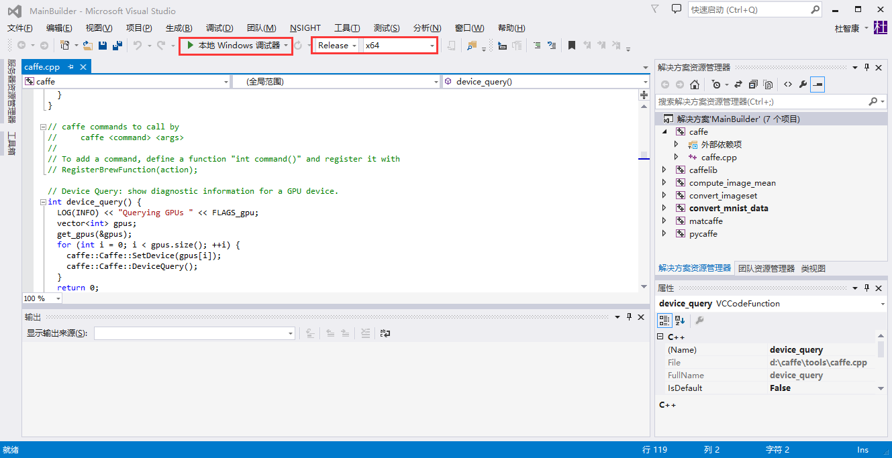
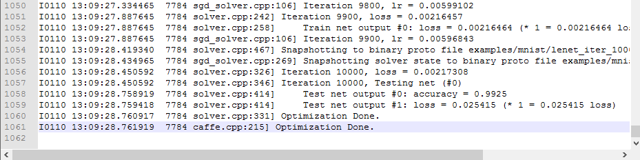

参照github上happynear的[caffe-windows](https://github.com/happynear/caffe-windows)项目，将Caffe for Windows配置成功，并且测试了其转换好的mnist数据库，不论是速度还是结果上，效果都相当好。现总结一下配置方法。

## 实验环境

| 操作系统 | Windows 10 Professional |
|:-----|:---:|----------:|
| CPU | Intel Core i5-4590 |
| GPU | Nvidia GeForce GTX 970 |
| VS | Microsoft Visual Studio 2013 |
| CUDA | CUDA 7.5 |

## 软件安装

首先需要安装Visual Studio 2013。

然后再安装CUDA 7.5。注意先后顺序。

<!-- more -->

## 配置

下载整个的[caffe-windows](https://github.com/happynear/caffe-windows)项目，解压缩到所需目录下，例如本文中 D:\caffe。

下载作者制作的[三方库](http://pan.baidu.com/s/1sjIKsc1)并解压缩到项目的3rdparty目录。解压好后，将3rdparty/bin文件夹加入到环境变量PATH中，这样程序才能找到这些三方dll。

## 编译

1. 双击./src/caffe/proto/extractproto.bat批处理文件来生成caffe.pb.h和caffe.pb.cc两个c++文件，和caffepb2.py这个python使用的文件。
2. 打开./buildVS2013/MainBuilder.sln，打开之后切换编译模式至Release X64模式。
3. 修改设置中的compute capability（caffelib --> 属性 --> CUDA C/C++ --> Device --> Code Generation）

| GPU | Computer Capability |
|:-----|:---:|----------:|
| GTX660, 680, 760, 770 | compute_30,sm_30 |
| GTX780, Titan Z, Titan Black, K20, K40 | compute_35,sm_35 |
| GTX960, 970, 980, Titan X | compute_52,sm_52 |

你可以在[https://en.wikipedia.org/wiki/CUDA](https://en.wikipedia.org/wiki/CUDA)上查看你的GPU所对应的Computer Capability。

点击工具栏绿色箭头进行编译，需要一定时间。

## 测试

下载作者已经转换好的[MNIST的leveldb数据文件](http://pan.baidu.com/s/1mgl9ndu)，解压到./examples/mnist文件夹中，然后运行根目录下的run_mnist.bat即可开始训练，日志会保存在./log文件夹中。可看到，迭代10000次，准确率达到了0.9925。

若有更新，请到文中所给链接处实时查看。

