> 注：此教程仅供本人记录使用。


#### 添加用户，以存放项目

```bash
# useradd -m git
# passwd git
# (输入密码)
# (再次输入密码)
```

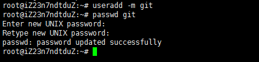

#### 创建本地仓库

```bash
# su git
$ cd ~
$ mkdir test.git
$ cd test.git
$ git init
```

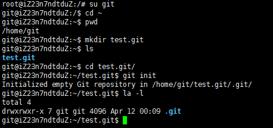

#### 添加git用户名和email

```bash
$ git config --global user.email "git@xxx.com"
$ git config --global user.name "git"
```

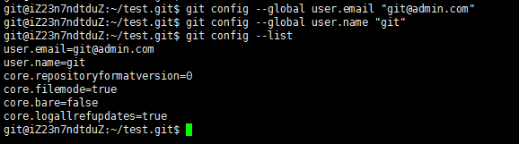

#### 添加文件并提交

```bash
$ echo "hello, git" >> test.txt
$ git add .
$ git commit -m "initial version"
```

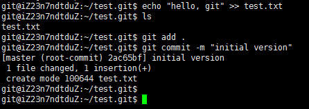

<!-- more -->

#### 建立远程仓库

```bash
$ git remote add origin ssh://git@this.is.your.ip/~/test.git
$ git push origin master
```

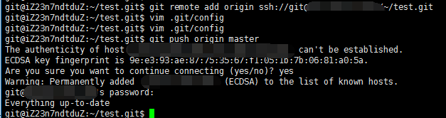

#### 创建另一台机器的ssh-key

(若之前已创建，本条可忽略)

```bash
$ ssh-keygen -t rsa -C "dzkang@hotmail.com"
```

这一步生成了idrsa和idrsa.pub两个文件(windows在用户文件夹找)，将idrsa.pub上传到git用户的.ssh目录下，并添加如authorizedkeys文件内

```bash
$ cat id_rsa.pub >> authorized_keys
```

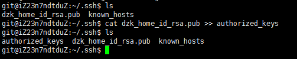

#### 使用另一台机器克隆项目

(windows下打开git bash)

```bash
$ git clone ssh://git@xx.xx.xx.xx/~/test.git
```

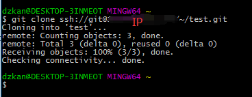

可看到git已经将该项目克隆到本地test文件夹

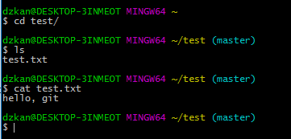

#### 配置一下本机的git用户名和email

```bash
$ git config --global user.email "dzkang@xxx.com"
$ git config --global user.name "dzkang"
```

#### 添加新文件并提交

```bash
$ echo "just a test" >> test2.txt
$ git add .
$ git commit -m "add test2"
```

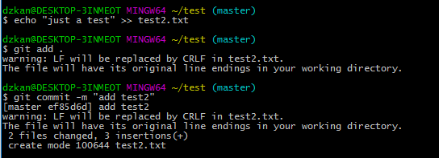

#### PUSH到远程仓库

```bash
$ git push origin master
```

出现报错信息，被远程仓库拒绝：

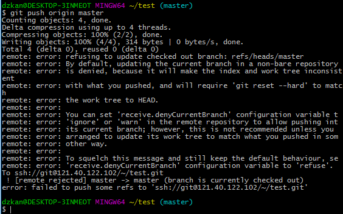

修改远程仓库 .git/config配置

```bash
$ git config receive.denyCurrentBranch ignore
```

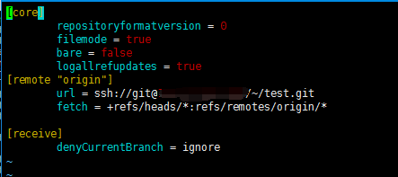

这样，每次push成功，在远程服务器输入 git reset --hard能看到最新内容。

引用网上一段话：

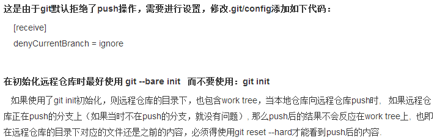
