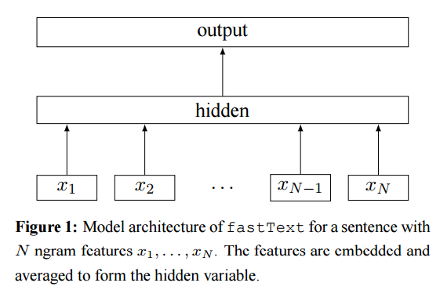

Github代码： [Keras样例解析](https://github.com/gaussic/keras-examples)

Keras的官方Examples里面展示了四种训练IMDB文本情感分类的方法，借助这4个Python程序，可以对Keras的使用做一定的了解。以下是对各个样例的解析。

## IMDB 数据集

IMDB情感分类数据集是Stanford整理的一套IMDB影评的情感数据，它含有25000个训练样本，25000个测试样本。以下是其中的一个正样本:

> Bromwell High is a cartoon comedy. It ran at the same time as some other programs about school life, such as "Teachers". My 35 years in the teaching profession lead me to believe that Bromwell High's satire is much closer to reality than is "Teachers". The scramble to survive financially, the insightful students who can see right through their pathetic teachers' pomp, the pettiness of the whole situation, all remind me of the schools I knew and their students. When I saw the episode in which a student repeatedly tried to burn down the school, I immediately recalled ......... at .......... High. A classic line: INSPECTOR: I'm here to sack one of your teachers. STUDENT: Welcome to Bromwell High. I expect that many adults of my age think that Bromwell High is far fetched. What a pity that it isn't!

本文中的Keras样例使用的是整理好已经符号化的pkl文件，其数据格式大致如下：

```
from six.moves import cPickle
(x_train, labels_train), (x_test, labels_test) = cPickle.load(open('imdb_full.pkl', 'rb'))
print(x_train[0])
>>> [23022, 309, 6, 3, 1069, 209, 9, 2175, 30, 1, 169, 55, 14, 46, 82, 5869, 41, 393, 110, 138, 14, 5359, 58, 4477, 150, 8, 1, 5032, 5948, 482, 69, 5, 261, 12, 23022, 73935, 2003, 6, 73, 2436, 5, 632, 71, 6, 5359, 1, 25279, 5, 2004, 10471, 1, 5941, 1534, 34, 67, 64, 205, 140, 65, 1232, 63526, 21145, 1, 49265, 4, 1, 223, 901, 29, 3024, 69, 4, 1, 5863, 10, 694, 2, 65, 1534, 51, 10, 216, 1, 387, 8, 60, 3, 1472, 3724, 802, 5,3521, 177, 1, 393, 10, 1238, 14030, 30, 309, 3, 353, 344, 2989, 143, 130, 5, 7804, 28, 4, 126, 5359, 1472, 2375, 5, 23022, 309, 10, 532, 12, 108, 1470, 4, 58, 556, 101, 12, 23022, 309, 6, 227, 4187, 48, 3, 2237, 12, 9, 215]
print(labels_train[0])
>>> 1
```
> 更详细的预处理过程请看 [keras/dataset/imdb.py](https://github.com/fchollet/keras/blob/master/keras/datasets/imdb.py)

## FastText

FastText是Joulin等人在[Bags of Tricks for Efficient Text Classification](https://arxiv.org/abs/1607.01759)一文中提到的快速文本分类的方法，论文作者说这个方法可以作为很多文本分类任务的baseline。整个模型的结构如下图所示：



给定一个输入序列，首先提取N gram特征得到N gram特征序列，然后对每个特征做词嵌入操作，在把该序列的所有特征词向量相加做平均，作为模型的隐藏层，最后在输出层接任何的分类器（常用的softmax）就可以进行分类了。

这个思路类似于平均化的Sentence Embedding，将句子中的所有词向量相加求平均，得到句子的向量表示。

整个模型的 Keras 实现如下，相关的注释已经加入到代码中：

```
from __future__ import print_function
import numpy as np
np.random.seed(1337)  # for reproducibility

from keras.preprocessing import sequence
from keras.models import Sequential
from keras.layers import Dense
from keras.layers import Embedding
from keras.layers import GlobalAveragePooling1D
from keras.datasets import imdb


# 构建 ngram 数据集
def create_ngram_set(input_list, ngram_value=2):
    """
    Extract a set of n-grams from a list of integers.
    从一个整数列表中提取  n-gram 集合。
    >>> create_ngram_set([1, 4, 9, 4, 1, 4], ngram_value=2)
    {(4, 9), (4, 1), (1, 4), (9, 4)}
    >>> create_ngram_set([1, 4, 9, 4, 1, 4], ngram_value=3)
    [(1, 4, 9), (4, 9, 4), (9, 4, 1), (4, 1, 4)]
    """
    return set(zip(*[input_list[i:] for i in range(ngram_value)]))


def add_ngram(sequences, token_indice, ngram_range=2):
    """
    Augment the input list of list (sequences) by appending n-grams values.
    增广输入列表中的每个序列，添加 n-gram 值
    Example: adding bi-gram
    >>> sequences = [[1, 3, 4, 5], [1, 3, 7, 9, 2]]
    >>> token_indice = {(1, 3): 1337, (9, 2): 42, (4, 5): 2017}
    >>> add_ngram(sequences, token_indice, ngram_range=2)
    [[1, 3, 4, 5, 1337, 2017], [1, 3, 7, 9, 2, 1337, 42]]
    Example: adding tri-gram
    >>> sequences = [[1, 3, 4, 5], [1, 3, 7, 9, 2]]
    >>> token_indice = {(1, 3): 1337, (9, 2): 42, (4, 5): 2017, (7, 9, 2): 2018}
    >>> add_ngram(sequences, token_indice, ngram_range=3)
    [[1, 3, 4, 5, 1337], [1, 3, 7, 9, 2, 1337, 2018]]
    """
    new_sequences = []
    for input_list in sequences:
        new_list = input_list[:]
        for i in range(len(new_list) - ngram_range + 1):
            for ngram_value in range(2, ngram_range + 1):
                ngram = tuple(new_list[i:i + ngram_value])
                if ngram in token_indice:
                    new_list.append(token_indice[ngram])
        new_sequences.append(new_list)

    return new_sequences

# Set parameters: 设定参数
# ngram_range = 2 will add bi-grams features ngram_range=2会添加二元特征
ngram_range = 2
max_features = 20000  # 词汇表大小
maxlen = 400          # 序列最大长度
batch_size = 32       # 批数据量大小
embedding_dims = 50   # 词向量维度
nb_epoch = 5          # 迭代轮次

# 载入 imdb 数据
print('Loading data...')
(X_train, y_train), (X_test, y_test) = imdb.load_data(nb_words=max_features)
print(len(X_train), 'train sequences')
print(len(X_test), 'test sequences')
print('Average train sequence length: {}'.format(
    np.mean(list(map(len, X_train)), dtype=int)))
print('Average test sequence length: {}'.format(
    np.mean(list(map(len, X_test)), dtype=int)))


if ngram_range > 1:
    print('Adding {}-gram features'.format(ngram_range))
    # Create set of unique n-gram from the training set.
    ngram_set = set()
    for input_list in X_train:
        for i in range(2, ngram_range + 1):
            set_of_ngram = create_ngram_set(input_list, ngram_value=i)
            ngram_set.update(set_of_ngram)

    # Dictionary mapping n-gram token to a unique integer. 将 ngram token 映射到独立整数的词典
    # Integer values are greater than max_features in order
    # to avoid collision with existing features.
    # 整数大小比 max_features 要大，按顺序排列，以避免与已存在的特征冲突
    start_index = max_features + 1
    token_indice = {v: k + start_index for k, v in enumerate(ngram_set)}
    indice_token = {token_indice[k]: k for k in token_indice}

    # max_features is the highest integer that could be found in the dataset.
    # max_features 是可以在数据集中找到的最大的整数
    max_features = np.max(list(indice_token.keys())) + 1

    # Augmenting X_train and X_test with n-grams features
    # 使用 n-gram 特征增广 X_train 和 X_test
    X_train = add_ngram(X_train, token_indice, ngram_range)
    X_test = add_ngram(X_test, token_indice, ngram_range)
    print('Average train sequence length: {}'.format(
        np.mean(list(map(len, X_train)), dtype=int)))
    print('Average test sequence length: {}'.format(
        np.mean(list(map(len, X_test)), dtype=int)))

# 填充序列至固定长度
print('Pad sequences (samples x time)')
X_train = sequence.pad_sequences(X_train, maxlen=maxlen)
X_test = sequence.pad_sequences(X_test, maxlen=maxlen)
print('X_train shape:', X_train.shape)
print('X_test shape:', X_test.shape)

# 构建模型
print('Build model...')
model = Sequential()

# we start off with an efficient embedding layer which maps
# our vocab indices into embedding_dims dimensions
# 先从一个高效的嵌入层开始，它将词汇表索引映射到 embedding_dim 维度的向量上
model.add(Embedding(max_features,
                    embedding_dims,
                    input_length=maxlen))

# we add a GlobalAveragePooling1D, which will average the embeddings
# of all words in the document
# 添加一个 GlobalAveragePooling1D 层，它将平均整个序列的词嵌入
model.add(GlobalAveragePooling1D())

# We project onto a single unit output layer, and squash it with a sigmoid:
# 投影到一个单神经元输出层，然后使用 sigmoid 挤压。
model.add(Dense(1, activation='sigmoid'))

model.summary()  # 概述

model.compile(loss='binary_crossentropy',
              optimizer='adam',
              metrics=['accuracy'])

# 训练与验证
model.fit(X_train, y_train,
          batch_size=batch_size,
          nb_epoch=nb_epoch,
          validation_data=(X_test, y_test))
```

### N-gram 特征提取

本例中 `create_ngram_set()` 和 `add_ngram()` 两个函数用于像输入中添加N-gram特征。

`create_ngram_set()`函数整理了训练集中的所有N-gram特征，再将这些特征添加到词汇表中，其具体操作可参考代码中的注释部分。

```
>>> create_ngram_set([1, 4, 9, 4, 1, 4], ngram_value=2)
    {(4, 9), (4, 1), (1, 4), (9, 4)}
    >>> create_ngram_set([1, 4, 9, 4, 1, 4], ngram_value=3)
    [(1, 4, 9), (4, 9, 4), (9, 4, 1), (4, 1, 4)]
```

`add_ngram()`函数与论文中的思路有些不同，它将一个序列的N-gram特征值（即n-gram特征在词汇表中的Id）放到该序列的尾部，不舍弃原始的序列，其操作如代码中解释：

```
    Example: adding bi-gram
    >>> sequences = [[1, 3, 4, 5], [1, 3, 7, 9, 2]]
    >>> token_indice = {(1, 3): 1337, (9, 2): 42, (4, 5): 2017}
    >>> add_ngram(sequences, token_indice, ngram_range=2)
    [[1, 3, 4, 5, 1337, 2017], [1, 3, 7, 9, 2, 1337, 42]]
    Example: adding tri-gram
    >>> sequences = [[1, 3, 4, 5], [1, 3, 7, 9, 2]]
    >>> token_indice = {(1, 3): 1337, (9, 2): 42, (4, 5): 2017, (7, 9, 2): 2018}
    >>> add_ngram(sequences, token_indice, ngram_range=3)
    [[1, 3, 4, 5, 1337], [1, 3, 7, 9, 2, 1337, 2018]]
```

### Padding

Padding有填充的意思，它将不定长的序列变成定长的序列，方便循环神经网络处理，在Keras中，`pad_sequences`的操作过程是，如果序列没有达到最大长度，则在前部补 `0` ，如果超过最大长度，则从后面截取最大长度的序列。

```
X_train = sequence.pad_sequences(X_train, maxlen=maxlen)
X_test = sequence.pad_sequences(X_test, maxlen=maxlen)
print('X_train shape:', X_train.shape)
print('X_test shape:', X_test.shape)
```

### 模型构建

#### Embedding

首先是一个嵌入层，将样本序列的每个id投影到固定维度的向量空间中，每个id由一个固定维度的词向量表示，即，原先输入的维度为 `[样本个数，序列长度]`，经过嵌入层后，变为 `[样本个数，序列长度，词向量维度]`。

```
model.add(Embedding(max_features, embedding_dims, input_length=maxlen))
```

#### GlobalAveragePooling1D

`GlobalAveragePooling1D`的操作非常简单，将输入的词向量序列相加在求平均，整合成一个向量。

```
model.add(GlobalAveragePooling1D())
```

官方的实现代码是：

```
class GlobalAveragePooling1D(_GlobalPooling1D):
    """Global average pooling operation for temporal data.
    # Input shape
        3D tensor with shape: `(samples, steps, features)`.
    # Output shape
        2D tensor with shape: `(samples, features)`.
    """

    def call(self, x, mask=None):
        return K.mean(x, axis=1)
```

#### Dense

由于 IMDB 情感数据集只有正负两个类别，因此全连接层是只有一个神经元的二元分类，使用 `sigmoid` 激活函数。

```
model.add(Dense(1, activation='sigmoid'))
```

整个模型的结构如下：

```
____________________________________________________________________________________________________
Layer (type)                     Output Shape          Param #     Connected to
====================================================================================================
embedding_1 (Embedding)          (None, 400, 50)       60261500    embedding_input_1[0][0]
____________________________________________________________________________________________________
globalaveragepooling1d_1 (Global (None, 50)            0           embedding_1[0][0]
____________________________________________________________________________________________________
dense_1 (Dense)                  (None, 1)             51          globalaveragepooling1d_1[0][0]
====================================================================================================
```

### 训练

在该样例的二元分类器中，使用了二元交叉熵作为损失函数，使用 `adam` 作为优化器，使用 `accuracy` 作为评估矩阵。

```
model.compile(loss='binary_crossentropy', optimizer='adam', metrics=['accuracy'])
```

训练过程中，使用测试集验证训练结果:

```
model.fit(X_train, y_train,
          batch_size=batch_size,
          nb_epoch=nb_epoch,
          validation_data=(X_test, y_test))
```

其训练结果如下：

```
Train on 25000 samples, validate on 25000 samples
Epoch 1/5
25000/25000 [==============================] - 63s - loss: 0.5812 - acc: 0.7871 - val_loss: 0.4320 - val_acc: 0.8593
Epoch 2/5
25000/25000 [==============================] - 58s - loss: 0.2776 - acc: 0.9307 - val_loss: 0.2992 - val_acc: 0.8936
Epoch 3/5
25000/25000 [==============================] - 58s - loss: 0.1370 - acc: 0.9718 - val_loss: 0.2603 - val_acc: 0.9016
Epoch 4/5
25000/25000 [==============================] - 58s - loss: 0.0738 - acc: 0.9886 - val_loss: 0.2428 - val_acc: 0.9040
Epoch 5/5
25000/25000 [==============================] - 58s - loss: 0.0415 - acc: 0.9951 - val_loss: 0.2351 - val_acc: 0.9066
```

使用`bi-gram`时，验证集的准确率达到了0.9066。

## CNN

这个例子介绍了如何使用一维卷积来处理文本数据，提供了一种将擅长于图像处理的CNN引入到文本处理中的思路，使用 `Convolution1D` 对序列进行卷积操作，再使用 `GlobalMaxPooling1D` 对其进行最大池化操作，这个处理类似于CNN的特征提取过程，用以提升传统神经网络的效果。其详细代码如下：

```
from __future__ import print_function
import numpy as np
np.random.seed(1337)  # for reproducibility

from keras.preprocessing import sequence
from keras.models import Sequential
from keras.layers import Dense, Dropout, Activation
from keras.layers import Embedding
from keras.layers import Convolution1D, GlobalMaxPooling1D
from keras.datasets import imdb


# set parameters:  设定参数
max_features = 5000  # 最大特征数（词汇表大小）
maxlen = 400         # 序列最大长度
batch_size = 32      # 每批数据量大小
embedding_dims = 50  # 词嵌入维度
nb_filter = 250      # 1维卷积核个数
filter_length = 3    # 卷积核长度
hidden_dims = 250    # 隐藏层维度
nb_epoch = 10        # 迭代次数

# 载入 imdb 数据
print('Loading data...')
(X_train, y_train), (X_test, y_test) = imdb.load_data(nb_words=max_features)
print(len(X_train), 'train sequences')
print(len(X_test), 'test sequences')

# 样本填充到固定长度 maxlen，在每个样本前补 0 
print('Pad sequences (samples x time)')
X_train = sequence.pad_sequences(X_train, maxlen=maxlen)
X_test = sequence.pad_sequences(X_test, maxlen=maxlen)
print('X_train shape:', X_train.shape)
print('X_test shape:', X_test.shape)

# 构建模型
print('Build model...')
model = Sequential()

# we start off with an efficient embedding layer which maps
# our vocab indices into embedding_dims dimensions
# 先从一个高效的嵌入层开始，它将词汇的索引值映射为 embedding_dims 维度的词向量
model.add(Embedding(max_features,
                    embedding_dims,
                    input_length=maxlen,
                    dropout=0.2))

# we add a Convolution1D, which will learn nb_filter
# word group filters of size filter_length:
# 添加一个 1D 卷积层，它将学习 nb_filter 个 filter_length 大小的词组卷积核
model.add(Convolution1D(nb_filter=nb_filter,
                        filter_length=filter_length,
                        border_mode='valid',
                        activation='relu',
                        subsample_length=1))
# we use max pooling:
# 使用最大池化
model.add(GlobalMaxPooling1D())

# We add a vanilla hidden layer:
# 添加一个原始隐藏层
model.add(Dense(hidden_dims))
model.add(Dropout(0.2))
model.add(Activation('relu'))

# We project onto a single unit output layer, and squash it with a sigmoid:
# 投影到一个单神经元的输出层，并且使用 sigmoid 压缩它
model.add(Dense(1))
model.add(Activation('sigmoid'))

model.summary()  # 模型概述

# 定义损失函数，优化器，评估矩阵
model.compile(loss='binary_crossentropy',
              optimizer='adam',
              metrics=['accuracy'])

# 训练，迭代 nb_epoch 次
model.fit(X_train, y_train,
          batch_size=batch_size,
          nb_epoch=nb_epoch,
          validation_data=(X_test, y_test))
```

### 模型构建

#### Embedding

词嵌入层与 FastText 类似，但是多了一个`dropout`参数，它的存在意义是随机的丢弃一部分数据，将一定百分比的数据置为0，这样做有助于防止过拟合。

更多关于 Dropout 的解释可以看论文：[Dropout: A Simple Way to Prevent Neural Networks from Overfitting](http://www.cs.toronto.edu/~rsalakhu/papers/srivastava14a.pdf)

```
model.add(Embedding(max_features,
                    embedding_dims,
                    input_length=maxlen,
                    dropout=0.2))
```

#### Convolution1D

在嵌入层之后，引入一个一维卷积操作，一维卷积的输入为`[nb_samples, steps, input_dim]`，输出为`[nb_samples, new_steps, output_dim]`，可见在这个卷积操作后词向量的维度会变为 `nb_filters`。

> 由于是基于时序卷积，所以 steps 可能会发生变化

```
model.add(Convolution1D(nb_filter=nb_filter,
                        filter_length=filter_length,
                        border_mode='valid',
                        activation='relu',
                        subsample_length=1))
```

`Convlution1D`与`Convolution2d`不同，前者基于时间卷积，后者则基于空间卷积，其具体含义比较难以理解，有时间另开一篇讲解这两个的区别，当然，也可以参考以下几个网页的解释：

- [Keras中文文档](https://keras-cn.readthedocs.io/en/latest/layers/convolutional_layer/#convolution1d)
- [Keras - 1D Convolution How it works](http://stackoverflow.com/questions/40121337/keras-1d-convolution-how-it-works)
- [input dimensions to a one dimensional convolutional network in keras](http://stackoverflow.com/questions/38656566/input-dimensions-to-a-one-dimensional-convolutional-network-in-keras)

#### GlobalMaxPooling1D

```
model.add(GlobalMaxPooling1D())
```

对卷积后的序列做1维最大池化操作，以`[10, 50]`的序列为例，序列的长度为10即10行，每个特征50位即50列，最大池化操作取每一列的最大值，最后输出变为`[10]`的一个向量。

官方的实现如下：

```
class GlobalMaxPooling1D(_GlobalPooling1D):
    """Global max pooling operation for temporal data.
    # Input shape
        3D tensor with shape: `(samples, steps, features)`.
    # Output shape
        2D tensor with shape: `(samples, features)`.
    """

    def call(self, x, mask=None):
        return K.max(x, axis=1)
```

#### Dense

在1D池化操作完成之后，输出变成了向量，添加一个原始的全连接隐藏层进一步训练，以让`CNN+MaxPooling`得到的特征发挥更大作用。

再接上单神经元的全连接层进行分类，这一点与 FastText 相同。

```
# We add a vanilla hidden layer:
# 添加一个原始隐藏层
model.add(Dense(hidden_dims))
model.add(Dropout(0.2))
model.add(Activation('relu'))

# We project onto a single unit output layer, and squash it with a sigmoid:
# 投影到一个单神经元的输出层，并且使用 sigmoid 压缩它
model.add(Dense(1))
model.add(Activation('sigmoid'))
```

整个模型的结构如下：

```
____________________________________________________________________________________________________
Layer (type)                     Output Shape          Param #     Connected to
====================================================================================================
embedding_1 (Embedding)          (None, 400, 50)       250000      embedding_input_1[0][0]
____________________________________________________________________________________________________
convolution1d_1 (Convolution1D)  (None, 398, 250)      37750       embedding_1[0][0]
____________________________________________________________________________________________________
globalmaxpooling1d_1 (GlobalMaxP (None, 250)           0           convolution1d_1[0][0]
____________________________________________________________________________________________________
dense_1 (Dense)                  (None, 250)           62750       globalmaxpooling1d_1[0][0]
____________________________________________________________________________________________________
dropout_1 (Dropout)              (None, 250)           0           dense_1[0][0]
____________________________________________________________________________________________________
activation_1 (Activation)        (None, 250)           0           dropout_1[0][0]
____________________________________________________________________________________________________
dense_2 (Dense)                  (None, 1)             251         activation_1[0][0]
____________________________________________________________________________________________________
activation_2 (Activation)        (None, 1)             0           dense_2[0][0]
====================================================================================================
```

### 训练

训练过程与 FastText 相同，不再赘述。

其结果如下：

```
Train on 25000 samples, validate on 25000 samples
Epoch 1/10
25000/25000 [==============================] - 12s - loss: 0.4323 - acc: 0.7879 - val_loss: 0.3123 - val_acc: 0.8690
Epoch 2/10
25000/25000 [==============================] - 10s - loss: 0.2947 - acc: 0.8759 - val_loss: 0.2831 - val_acc: 0.8820
Epoch 3/10
25000/25000 [==============================] - 10s - loss: 0.2466 - acc: 0.9009 - val_loss: 0.3057 - val_acc: 0.8672
Epoch 4/10
25000/25000 [==============================] - 10s - loss: 0.2124 - acc: 0.9141 - val_loss: 0.2667 - val_acc: 0.8893
Epoch 5/10
25000/25000 [==============================] - 10s - loss: 0.1780 - acc: 0.9297 - val_loss: 0.2696 - val_acc: 0.8883
Epoch 6/10
25000/25000 [==============================] - 10s - loss: 0.1571 - acc: 0.9396 - val_loss: 0.2900 - val_acc: 0.8800
Epoch 7/10
25000/25000 [==============================] - 10s - loss: 0.1321 - acc: 0.9483 - val_loss: 0.2909 - val_acc: 0.8826
Epoch 8/10
25000/25000 [==============================] - 10s - loss: 0.1175 - acc: 0.9552 - val_loss: 0.2924 - val_acc: 0.8866
Epoch 9/10
25000/25000 [==============================] - 10s - loss: 0.1024 - acc: 0.9616 - val_loss: 0.3194 - val_acc: 0.8775
Epoch 10/10
25000/25000 [==============================] - 10s - loss: 0.0933 - acc: 0.9642 - val_loss: 0.3102 - val_acc: 0.8851
```

训练后，在验证集上得到了0.8851的准确率。

