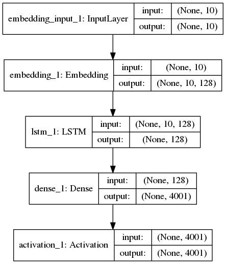

测试了一下Keras的[LSTM_text_generation](https://github.com/fchollet/keras/blob/master/examples/lstm_text_generation.py)的例子。

代码在这里：[Github fancywriter](https://github.com/gaussic/fancywriter/blob/master/language-model-keras.ipynb)

原先的例子是字符级别的，使用了尼采的作品作为训练集，总的词汇只有57个，因而整个网络相对简单，且训练起来速度比较快。

但是使用中文训练，且加大训练集大小时，词汇表明显增大。使用整本《三国演义》词汇表大小为4001，经过处理之后，序列数量为201260，如果按照序列长度为20，使用原先的`one-hot`表示的话，那么整个训练集的矩阵大小为 `201260*20*4001`，严重影响了矩阵运算速度，因此中间加了一个Embedding层，整个网络结构如下：



### 预处理

整个的数据需要经过预处理之后，才能使用到网络中：

```
    def load_data(self, path):
        # read the entire text
        text = open(path).read().strip().replace('\u3000', '').replace('\n', '')
        print('corpus length:', len(text))
        
        # all the vocabularies
        vocab = sorted(list(set(text)))
        print('total words:', len(vocab))

        # create word-index dict
        word_to_index = dict((c, i) for i, c in enumerate(vocab))
        index_to_word = dict((i, c) for i, c in enumerate(vocab))
        
        # cut the text into fixed size sequences
        sentences = []
        next_words = []
        for i in range(0, len(text) - self.seq_length, self.step):
            sentences.append(list(text[i: i+self.seq_length]))
            next_words.append(text[i+self.seq_length])
        print('nb sequences:', len(sentences))
        
        # generate training samples
        X = np.asarray([[word_to_index[w] for w in sent[:]] for sent in sentences])
        y = np.zeros((len(sentences), len(vocab)))
        for i, word in enumerate(next_words):
            y[i, word_to_index[word]] = 1
```

处理之后，X是序列表示，维度为 `训练集数量, 序列长度`，y是 `one-hot`向量，维度为`词汇表长度`。

### 定义模型

```
    def load_model(self):
        # load a Sequential model
        model = Sequential()
        model.add(Embedding(len(self.vocab), self.embed_size, input_length=self.seq_length))
        model.add(LSTM(self.embed_size, input_shape=(self.seq_length, self.embed_size), return_sequences=False))
        model.add(Dense(len(self.vocab)))
        model.add(Activation('softmax'))
```

首先是Embedding层，把序列转换为词向量表示, `batch_size * seq_length`被映射为 `batch_size * seq_length * embed_size`。

然后是LSTM层，输出结果是序列后面的词，只返回最后的值。

再使用Dense将期映射为词汇表长度的向量，再连接softmax激活函数，就是最后的y。

### 编译与训练

```
    def compile_model(self, lr=0.01):
        # compile the model
        optimizer = RMSprop(lr=lr)
        self.model.compile(loss='categorical_crossentropy', optimizer=optimizer)
    
    def fit_model(self, batch_size=128, nb_epoch=1):
        # fit the model with trainind data
        self.model.fit(self.X, self.y, batch_size, nb_epoch)
```

优化器选择`RMSprop`，损失函数为`category_crossentropy`。训练时`batch_size`默认为128，轮次默认为1。

### 生成

```
    def _sample(self, preds, diversity=1.0):
        # sample from te given prediction
        preds = np.asarray(preds).astype('float64')
        preds = np.log(preds) / diversity
        exp_preds = np.exp(preds)
        preds = exp_preds / np.sum(exp_preds)
        probas = np.random.multinomial(1, preds, 1)
        
        return np.argmax(probas)
    
    def generate_text(self):
        # generate text from randon text seed
        start_index = random.randint(0, len(self.text) - self.seq_length - 1)
        
        for diversity in [0.2, 0.5, 1.0, 1.2]:
            print()
            print('----- diversity:', diversity)
        
            generated = ''
            sentence = self.text[start_index: start_index + self.seq_length]
            generated += sentence
            print('----- Generating with seed: "' + sentence + '"')
            sys.stdout.write(generated)

            for i in range(400):
                x = np.asarray([self.word_to_index[w] for w in sentence]).reshape([1, self.seq_length])
                preds = self.predict(x)
                next_index = self._sample(preds, diversity)
                next_word = self.index_to_word[next_index]

                generated += next_word
                sentence = sentence[1:] + next_word

                sys.stdout.write(next_word)
                sys.stdout.flush()
            print()         
```

生成时，随机挑选一个序列，预测得到结果，再将结果映射为词，循环生成400次。此处使用了diversity的概念，调整生成结果，以得到不同答案。

以下是部分结果：

```
Iteration: 2

----- diversity: 0.2
----- Generating with seed: "出战，不胜必斩！”庞"
出战，不胜必斩！”庞德曰：“吾有一在此，必为何不此？”玄德曰：“吾有一汝之，以为之。”玄德曰：“吾自此，不可为，以此人之。”玄德曰：“吾欲为人，以为何不此？”操曰：“吾自此，以为何，且看下文分解。第人五十一，使人。”玄德曰：“汝为何，今日，以为人，不可之。”玄德曰：“吾有一，以此人有一之。”玄德曰：“此人，以为人，必有一之。”玄德曰：“吾有一汝，以为何不其言？”玄德曰：“吾有一，以为来。”玄德曰：“吾有一如何，且看下文分解。第人有一时，只得引兵来。却说张飞，只得一为了。”操曰：“吾有一时，以为何。”玄德曰：“吾有一言，以此人也。”玄德曰：“吾自此，不可之。”玄德曰：“吾有一时，不可也。”玄德曰：“吾有一时，只得有一为，以为何不来？”遂大将，张飞为令人，使人。”玄德曰：“吾欲为何，且看下文分解。第人大惊，以为大，以为何不此也？”玄德曰：“吾欲为何，且看下文分解。第人在前，使人。”玄德曰：“吾有一时，不可为之。”

----- diversity: 0.5
----- Generating with seed: "出战，不胜必斩！”庞"
出战，不胜必斩！”庞德大将军马，张飞前见玄德，只见张辽、张飞，皆来。”遂旗号遂大败，使后人有一于””遂令，引日入寨，只见孙策为住。”玄德曰：“吾有一便，只得此人，使许都督，即孔明为使人，以上马，遂引兵来。”玄德曰：“汝为何？”正欲使入，遂出当口。”众皆奏曰：“吾有张辽，以为郡。”瑜曰：“今若公非手，不不为天”！”，搬兵大，忽报知关公曰：“吾为方计，以取无人，以有一人，有一而来。”玄德曰：“今吾无计，以何不其来，以为原。”玄德曰：“吾在此，以为者。”。战不引兵，以为韩遂。”孔明曰：“某有一于”””””遂，只得起兵，先为不出。”绍曰：“此人一兵，只得天下，以为同；一议，以用为多，不可守。”玄德曰：“汝非死于此，不可之。”瑜曰：“汝自引兵者不出。”操曰：“今若得其人，如此人，皆使人之。”玄德曰：“先生先了，今日，却得黄忠探得一入，何曰：“汝为人，乃之。”孔明曰：“不然后，不可君也。吾如何不之？”遂急到，大于后人也。

----- diversity: 1.0
----- Generating with seed: "出战，不胜必斩！”庞"
出战，不胜必斩！”庞德有张，而来。二人与言！”二绍急闻将骑去了了，不可护弟如开策一十，各兵当夺。，入荆州，皆口而奉，金密有奉罪。”绍曰：“吾朝曰：“张玄德此人主不可生、守来，曹操为了他军，各通无，不大事矣。李傕都督民告正。曹操来于马前故面奏曰：“次左将于表孔明留二人皆太守外。马二公大，即去高刀军。且为拜兴路。却说张飞王便欲；大马二十二报：“船无左右也，勿当马作血阵，随盛不用数。又见以心乃赐之使者，帝高郡者曰：“汝得王蜀来乃为。”即下来，使了行，欲赏耶？”将甲见玄德，然不；败甲守计，聚众路已其城。魏，尽不见吕布良不玄德旗号。汝召当高余魏延赵云，以定不之。人马败军郡，传请小射出。且备兵，名命。。赵云在五关军，回投：“等亦一风九曰：“幸，使孙权之太孔瑜；将百笑；左领兵北而年举。却说刘繇知谢天子曹操，未绝前；上丞相人白家。”操曰：“我许昌大城与计：其必有王卓，只在王，以有一身人，则五色，使恩余弟，以邓艾君归而之之之而

----- diversity: 1.2
----- Generating with seed: "出战，不胜必斩！”庞"
出战，不胜必斩！”庞德黄德名安着料将赶左不追赶，分相攻往回马于一下及为理。但中回头到，引听住昭肯出丁奉分高里召车而走。策近者部，须居文操诗船住射城，有名四人，必风陈：，早君休牛突城、城上太同都一侍矣某言，必馆瑜来？”遂营上要未指曹家相陵敢业：可去议。不知此，必主受起。于是也兵，时一人出迎，何人足一进，不指曹操事，天青里死者事。至安地寨上，名群皆降，不敢数，字名官，两路死破。，何其日新野贼。今汝在兄弟战名人名。”将来书里，。”遂征也。之言计挺枪，魏公月回平曰：“步甚背入内着，然更颜信马曰：“斩相见此。玄德未知左角十数。今若何充教复饮；非夏侯渊车既送恩数日；无阳二人，使被使防骑杀血参好。分布前到星听离城来见后主到果川笑。玄德受而昭。城中徐州本部口军时：一其言，命诸葛亮杀斩了斩之。”平人尚曰：“若去原杀了将，字洛阳。不若孔明之加。军金议已在尽得所耳，则奉见，乃细光为杀先处见杀之，乃臣随矣。却说关上犹毕，以意亦公孙。
```