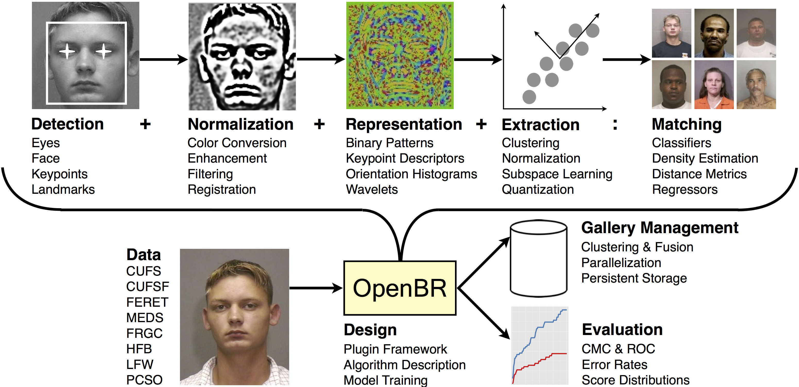
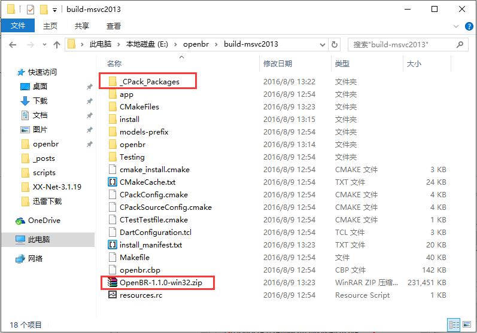
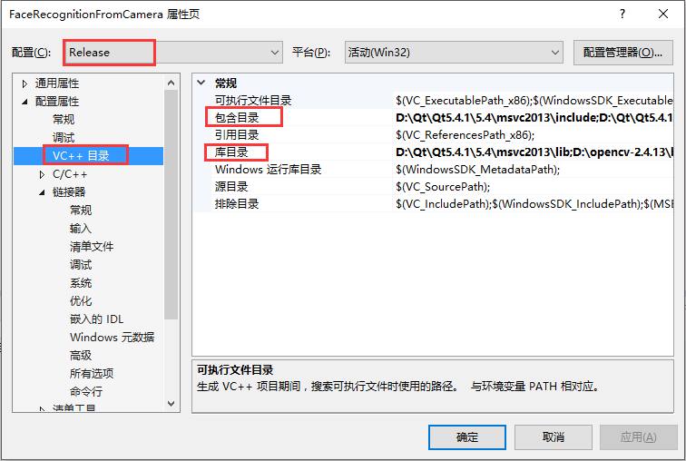
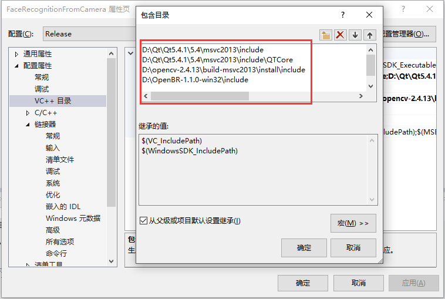
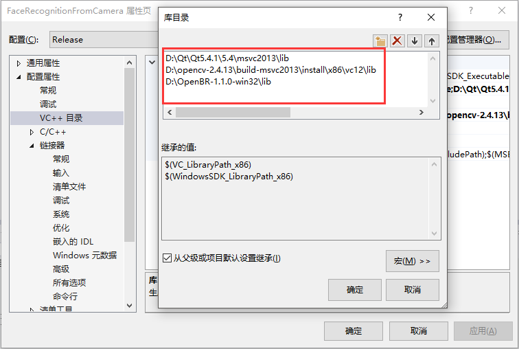
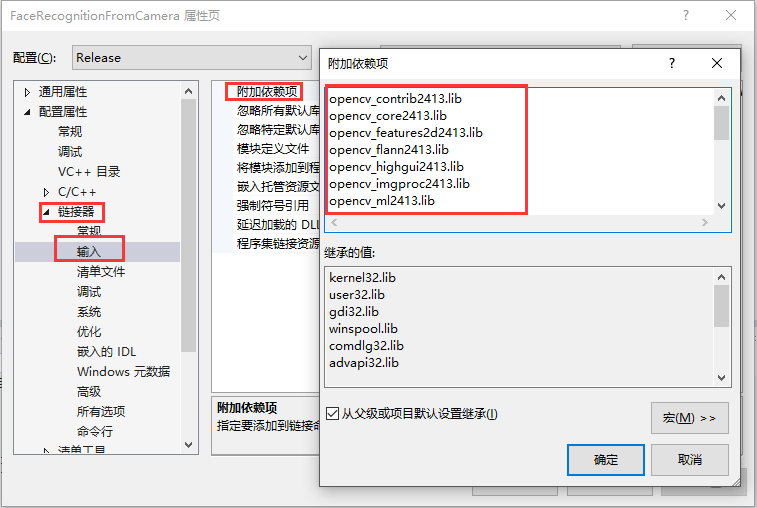
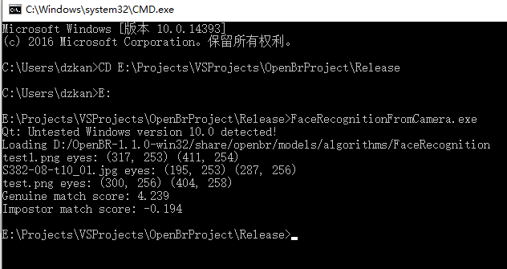

本文是基于OpenBR的人脸识别简单实现，首先从摄像头采集图像，在与库中的两张图片进行对比，分值越高越匹配。

## 环境

| 软件 | 版本 |
|:-----|:---:|----------:|
| OpenCV | v2.4.13 |
| QT | windows-x86-msvc2013-5.4.1 |
| VS | Microsoft Visual Studio 2013 |
| OpenBR | v1.1.0 |

## 编译

编译过程参照[官方文档](http://openbiometrics.org/docs/install/#windows)以及[OpenBR安装与编译过程](https://gaussic.github.io/2016/08/05/openbr-install-build/)。

本文基于VS2013 x86架构进行编译，在编译时请选择：**VS2013 x86 本机工具命令提示**

**请确保安装与编译好OpenCV，以及安装好QT。**

**请把 `path to opencv/build-msvc2013/install\x86\v12\bin` 添加到环境变量Path中**

在编译过程中 Hack OpenBR 这一步可以不执行，执行 Package OpenBR 将 OpenBR 打包。

打包好后，在openbr/build-msvc2013目录下找到.zip文件，若未找到请查看_CPack_Packages。



该ZIP文件包含了集成到其他应用的库文件等，解压到所需路径。

<!-- more -->

## VS 环境配置

### 创建项目

通过VS2013新建项目->Win32控制台应用, 并将项目配置改为Release。

### 菜单栏项目->属性->VC++目录：



编辑包含目录：



编辑库目录：



### 链接器->输入->附加依赖项：



添加以下依赖：

```
opencv_contrib2413.lib
opencv_core2413.lib
opencv_features2d2413.lib
opencv_flann2413.lib
opencv_highgui2413.lib
opencv_imgproc2413.lib
opencv_ml2413.lib
opencv_nonfree2413.lib
opencv_objdetect2413.lib
opencv_photo2413.lib
opencv_video2413.lib
QT5Concurrent.lib
QT5Core.lib
QT5Gui.lib
QT5Network.lib
QT5Sql.lib
QT5Widgets.lib
QT5Xml.lib
openbr.lib
```

注：以上为打包后的OpenBR的bin目录下的OpenCV和QT的dll的lib包，如果缺少请补齐。

以上配置完成，点击确定。

## 人脸识别代码

首先使用OpenCV从摄像头采集图片，然后调用OpenBR FaceRcognition进行对比，输出返回结果。

```
// FaceRecognitionFromCamera.cpp : 定义控制台应用程序的入口点。
//

#include "stdafx.h"
#include <iostream>
#include <opencv2/core/core.hpp>
#include <opencv2/opencv.hpp>
#include <opencv2/highgui/highgui.hpp>
#include <openbr/openbr_plugin.h>

static void printTemplate(const br::Template &t)
{
	const QPoint firstEye = t.file.get<QPoint>("Affine_0");
	const QPoint secondEye = t.file.get<QPoint>("Affine_1");
	printf("%s eyes: (%d, %d) (%d, %d)\n", qPrintable(t.file.fileName()), firstEye.x(), firstEye.y(), secondEye.x(), secondEye.y());
}

static int capWebcamImage()
{
	// 从摄像头读取一张图片，注意在打开摄像头的时刻摆正姿势
	cv::VideoCapture cap(0);
	if (!cap.isOpened())
	{
		std::cerr << "Can not open a camera or file." << std::endl;
		return -1;
	}
	cv::Mat frame;

	for (int i = 0; i < 200; i++)
	{
		cap >> frame;
		if (frame.empty())
			break;
		cv::imshow("window", frame);
		if (cv::waitKey(1) >= 0)
			break;
	}

	cv::imwrite("test.png", frame); // 写入到文件中
	return 0;
}

static void compare()
{
	// 以下是官方的人脸识别代码调用

	// Retrieve classes for enrolling and comparing templates using the FaceRecognition algorithm
	QSharedPointer<br::Transform> transform = br::Transform::fromAlgorithm("FaceRecognition");
	QSharedPointer<br::Distance> distance = br::Distance::fromAlgorithm("FaceRecognition");

	// Initialize templates
	br::Template queryA("F:/test1.png");    // 库中本人图片
	br::Template queryB("D:/openbr/data/MEDS/img/S382-08-t10_01.jpg");  // 库中它人图片

	br::Template target("test.png");   // 刚刚采集的目标图片

	// Enroll templates
	queryA >> *transform;
	queryB >> *transform;
	target >> *transform;

	printTemplate(queryA);
	printTemplate(queryB);
	printTemplate(target);

	// Compare templates
	float comparisonA = distance->compare(target, queryA);
	float comparisonB = distance->compare(target, queryB);

	// Scores range from 0 to 1 and represent match probability
	printf("Genuine match score: %.3f\n", comparisonA);   // 与本人图片对比结果
	printf("Impostor match score: %.3f\n", comparisonB);  // 与他人图片对比结果

	br::Context::finalize();
}

int main(int argc, char* argv[])
{
	if (capWebcamImage() == -1)
		return -1;
	br::Context::initialize(argc, argv);
	compare();
	return 0;
}
```

程序会先弹出摄像头显示，然后关闭摄像头，执行运算，运行结果如下：



可以看出，本人的匹配度为4.239，远高于他人的-0.194。

## 几个小问题

- 官方也给出了类似从摄像头获取输入的方法，但是其方法退出时存在异常，不可控，因而用OpenCV自行实现。
- 按照官方文档的说法，可以直接把OpenCV的Mat存入Template中，但是实测似乎不可行，因而走了个弯路，先保存图片，再将图片读入Template中。
- for循环写了200次，可以让摄像头画面多显示一会儿，方便采集用户数据，并取最后一帧。
- 不能直接点击本地Windows调试器运行，需要到项目的Release目录下运行exe文件，暂时无法解决。
- 目前官方OpenBR只支持QT 5.4，Windows 10上会如上图所示提示：`QT: Untested Windows version 10.0 detected!`，应该不影响。
- OpenBR程序使用了部分C99语法，VS2012及以下对C99不支持，因而VS最低可用版本为2013。

转载请说明出处：[http://gaussic.github.io](http://gaussic.github.io)


