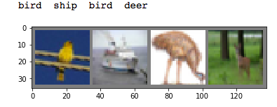
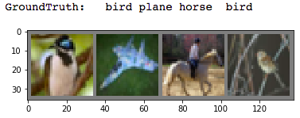

由于种种奇怪的原因，近段时间开始尝试使用Pytorch。照着官方给的教程慢慢搞，稍微有一点点理解。在这里做一点小小的记录和翻译工作。

官方地址：[Deep Learning with PyTorch: A 60 Minute Blitz](http://pytorch.org/tutorials/beginner/deep_learning_60min_blitz.html)

感谢作者： [Soumith Chintala](http://soumith.ch/)

转载请说明出处：[Gaussic:夜露](https://gaussic.github.io/2017/05/05/pytorch-60-minutes/)

这个教程的目标：

- 更高层次地理解Pythrch的Tensor库以及神经网络。
- 训练一个小的神经网络模型用于分类图像。


## 什么是Pytorch

这是一个基于Python的科学计算包，主要针对两类人群：

- 替代Numpy以发挥GPU的强大能力
- 一个提供最大灵活性和速度的深度学习研究平台

### 开始

#### Tensors 

Tensors类似于numpy的ndarray，但是带了一些附加的功能，例如可以使用GPU加速计算等等。

```python
import torch
```

构建一个未初始化的 5x3 矩阵：

```python
x = torch.Tensor(5, 3)
print(x)
```

输出：

```python
1.00000e-28 *
  0.0000  0.2524  0.0000
  0.2524  2.8715  0.0000
  2.9158  0.0000  2.9157
  0.0000  2.9158  0.0000
  0.0003  0.0000  0.0000
[torch.FloatTensor of size 5x3]
```

构建一个随机初始化的矩阵：

```python
x = torch.rand(5, 3)
print(x)
```

输出：

```python
 0.5453  0.4855  0.7236
 0.3199  0.4525  0.4917
 0.6965  0.8742  0.9948
 0.9029  0.1873  0.0018
 0.3080  0.2953  0.4313
[torch.FloatTensor of size 5x3]
```

获取矩阵维度大小：

```python
print(x.size())
```

输出:

```python
torch.Size([5, 3])
```

> 注意：
> 
> `torch.Size` 实际上是一个元组，因此它支持相同的操作。

#### 运算操作

运算操作有多种语法，让我们看看加法的例子。

加法：语法1

```python
y = torch.rand(5, 3)
print(x + y)
```

输出：

```python
 1.1177  0.8514  1.1459
 1.1878  0.9249  0.5759
 1.3508  1.4628  1.2833
 1.8678  0.8499  0.2941
 0.9718  1.0785  0.6914
[torch.FloatTensor of size 5x3]
```

加法：语法2

```python
print(torch.add(x, y))
```

输出：

```python
 1.1177  0.8514  1.1459
 1.1878  0.9249  0.5759
 1.3508  1.4628  1.2833
 1.8678  0.8499  0.2941
 0.9718  1.0785  0.6914
[torch.FloatTensor of size 5x3]
```

加法：给定一个输出tensor

```python
result = torch.Tensor(5, 3)
torch.add(x, y, out=result)
print(result)
```

输出：

```python
 1.1177  0.8514  1.1459
 1.1878  0.9249  0.5759
 1.3508  1.4628  1.2833
 1.8678  0.8499  0.2941
 0.9718  1.0785  0.6914
[torch.FloatTensor of size 5x3]
```

加法：就地

```python
# adds x to y
y.add_(x)
print(y)
```

输出：

```python
 1.1177  0.8514  1.1459
 1.1878  0.9249  0.5759
 1.3508  1.4628  1.2833
 1.8678  0.8499  0.2941
 0.9718  1.0785  0.6914
[torch.FloatTensor of size 5x3]
```

> 注意：
> 任何就地改变一个tensor的操作都以`_`为后缀。例如：`x.copy_(y)`, `x.t_()`，都会改变`x`。

你可以像numpy一样使用索引!

```python
print(x[:, 1])
```

输出：

```python
 0.4855
 0.4525
 0.8742
 0.1873
 0.2953
[torch.FloatTensor of size 5]
```

**延伸阅读**：

100+ Tensor运算，包括转置、索引、切分、数学运算、线性代数随机数等等，链接：[戳这](http://pytorch.org/docs/torch)

### Numpy的桥梁

Torch的Tensor和Numpy的数组之间的互转简直像一阵清风一样。

Torch的Tensor和Numpy的数组会共享它们的底层存储位置，该变其中一个，另外一个也会改变。

#### 将Torch Tensor转换为Numpy数组

```python
a = torch.ones(5)
print(a)
```

输出：

```python
 1
 1
 1
 1
 1
[torch.FloatTensor of size 5]
```

```python
b = a.numpy()
print(b)
```
输出：

```python
[ 1.  1.  1.  1.  1.]
```

看看当改变numpy数组的值时发生了什么。

```python
a.add_(1)
print(a)
print(b)
```

输出：

```python
 2
 2
 2
 2
 2
[torch.FloatTensor of size 5]

[ 2.  2.  2.  2.  2.]
```

#### 将Numpy数组转换为Torch Tensor

看看更改Numpy数组的同时自动地更改了Torch Tensor

```python
import numpy as np
a = np.ones(5)
b = torch.from_numpy(a)
np.add(a, 1, out=a)
print(a)
print(b)
```

输出：

```python
[ 2.  2.  2.  2.  2.]

 2
 2
 2
 2
 2
[torch.DoubleTensor of size 5]
```

除了CharTensor之外，CPU上的所有Tensor都支持与Numpy数组的来回转换。

### CUDA Tensors

可以使用`.cuda`函数将Tensor转移到GPU上。

```python
# let us run this cell only if CUDA is available
if torch.cuda.is_available():
    x = x.cuda()
    y = y.cuda()
    x + y
```

## Autograd:自动求导

Pytorch中所有神经网络的中心部分是`autograd`包。我们首先浏览一下它，然后再构建我们的第一个神经网络。

`autograd`包为Tensor上的所有运算提供了自动求导功能。它是一个由运行定义的框架，即你的反向传播是由你的代码如何运行来决定的，而且每一轮迭代都可能是不同的。

让我们用几个简单的例子来了解几个简单的术语。

### Variable 变量

`autograd.Variable`是这个包的中心类。它包装一个Tensor，并且支持几乎所有定义在这个Tensor上的运算。一旦你完成了你的计算，你可以调用`.backward()`来自动地计算全部的梯度。

你可以通过`.data`属性来访问最原始的tensor，而梯度则相应地被累计到了`.grad`中。


autograd的实现中还有一个非常重要的类-`Function`。

`Variable`和`Function`是相互关联的并且构建了一个非循环图，其中编码了整个的计算历史。每一个变量都有一个`.creator`属性，它引用一个常见`Variable`的`Function`（除了用户创建的Variables-它们的`creator是None`）。

如果你想计算导数，可以在`Variable`上调用`.backward()`。如果`Variable`是个标量（一个单元素数据），那么你不用为`backward()`指定任何参数，然而如果它有多个元素，你需要指定一个`grad_output`参数，它是一个匹配尺寸的tensor。

```python
import torch
from torch.autograd import Variable
```

创建一个变量：

```python
x = Variable(torch.ones(2, 2), requires_grad=True)
print(x)
```

输出：

```python
Variable containing:
 1  1
 1  1
[torch.FloatTensor of size 2x2]
```

对变量进行运算：

```python
y = x + 2
print(y)
```

输出：

```python
Variable containing:
 3  3
 3  3
[torch.FloatTensor of size 2x2]
```

`y`是作为一个运算操作的结果而创建的，因而它有一个creator

```python
print(y.creator)
```

输出:

```python
<torch.autograd._functions.basic_ops.AddConstant object at 0x108ada4a8>
```

在y上做更多的运算：

```python
z = y * y * 3
out = z.mean()

print(z, out)
```

输出：

```python
Variable containing:
 27  27
 27  27
[torch.FloatTensor of size 2x2]
 Variable containing:
 27
[torch.FloatTensor of size 1]
```

### Gradients 梯度

让我们使用反向传播`out.backward()`，它等同于`out.backward(torch.Tensor([1.0]))`。

```python
out.backward()
```

打印梯度 d(out)/dx：

```python
print(x.grad)
```

输出：

```python
Variable containing:
 4.5000  4.5000
 4.5000  4.5000
[torch.FloatTensor of size 2x2]
```

你应该会得到一个`4.5`的矩阵。让我们称`out`变量为*o*。我们有$o = \frac{1}{4}\sum_i z_i$，$z_i = 3(x_i+2)^2$ 以及 $ z\_i\bigr\rvert_{x_i=1} = 27 $ 。因此，$\frac{\partial o}{\partial x_i} = \frac{3}{2}(x_i+2)$，从而$\frac{\partial o}{\partial x\_i}\bigr\rvert_{x_i=1} = \frac{9}{2} = 4.5$。

你还可以使用autograd做一些疯狂的事情！

```python
x = torch.randn(3)
x = Variable(x, requires_grad=True)

y = x * 2
while y.data.norm() < 1000:
    y = y * 2

print(y)
```

输出：

```python
Variable containing:
 596.2775
-807.4459
-550.6819
[torch.FloatTensor of size 3]
```

```python
gradients = torch.FloatTensor([0.1, 1.0, 0.0001])
y.backward(gradients)

print(x.grad)
```

输出:

```python
Variable containing:
  102.4000
 1024.0000
    0.1024
[torch.FloatTensor of size 3]
```

延伸阅读：

`Variable`和`Function`的文档：[http://pytorch.org/docs/autograd](http://pytorch.org/docs/autograd)

## 神经网络

神经网络可以使用`torch.nn`包来构建。

现在你大致了解了`autograd`，`nn`依赖于`autograd`来定义模型并进行求导。一个`nn.Module`包含多个神经网络层，以及一个`forward(input)`方法来返回`output`。

例如，看看以下这个分类数字图像的网络：


它是一个简单的前馈网络。它将输入逐步地喂给多个层，然后给出输出。

一个典型的神经网络训练过程如下：

- 定义一个拥有可学习参数（或权重）的神经网络
- 在输入数据上进行迭代
- 在网络中处理数据
- 计算损失（输出离分类正确有多远）
- 梯度反向传播给网络的参数
- 更新网络的权重，通常使用一个简单的更新规则：`weight = weight + learning_rate * gradient`

### 定义网络

```python
import torch
from torch.autograd import Variable
import torch.nn as nn
import torch.nn.functional as F

class Net(nn.Module):
    
    def __init__(self):
        super(Net, self).__init__()
        # 1 图像输入通道, 6 输出通道, 5x5 正方形卷积核
        self.conv1 = nn.Conv2d(1, 6, 5)
        self.conv2 = nn.Conv2d(6, 16, 5)
        # an affine operation: y = Wx + b
        self.fc1 = nn.Linear(16 * 5 * 5, 120)
        self.fc2 = nn.Linear(120, 84)
        self.fc3 = nn.Linear(84, 10)
        
    def forward(self, x):
        # 使用 (2, 2) 窗口最大池化
        x = F.max_pool2d(F.relu(self.conv1(x)), (2, 2))
        # If the size is a square you can only specify a single number
        x = F.max_pool2d(F.relu(self.conv2(x)), 2)
        x = x.view(-1, self.num_flat_features(x))
        x = F.relu(self.fc1(x))
        x = F.relu(self.fc2(x))
        x = self.fc3(x)
        return x
    
    def num_flat_features(self, x):
        size = x.size()[1:]   # 所有维度，除了批尺寸
        num_features = 1
        for s in size:
            num_features *= s
        return num_features
        
net = Net()
print(net)
```

输出：

```python
Net (
  (conv1): Conv2d(1, 6, kernel_size=(5, 5), stride=(1, 1))
  (conv2): Conv2d(6, 16, kernel_size=(5, 5), stride=(1, 1))
  (fc1): Linear (400 -> 120)
  (fc2): Linear (120 -> 84)
  (fc3): Linear (84 -> 10)
)
```

你只需要定义`forward`函数，`backward`函数（用来计算梯度）是使用`autograd`自动为你定义的。你可以在`forward`中使用任意的Tensor运算操作。

模型中可学习的参数是通过`net.parameters()`返回的：

```python
params = list(net.parameters())
print(len(params))
print(params[0].size())  # conv1's .weight
```

输出：

```python
10
torch.Size([6, 1, 5, 5])
```

forward的输入是一个`autograd.Variable`	，输出亦然。

```python
input = Variable(torch.randn(1, 1, 32, 32))
out = net(input)
print(out)
```

输出：

```python
Variable containing:
 0.0455 -0.0445  0.0064 -0.0310  0.0945 -0.0362 -0.1971  0.0555  0.0943  0.1016
[torch.FloatTensor of size 1x10]
```

将梯度缓冲区置0，并使用随机的梯度进行反向传播：

```python
net.zero_grad()
out.backward(torch.randn(1, 10))
```

> 注意：
> 
> `torch.nn`仅支持mini-batch。整个的`torch.nn`包仅支持小批量的数据，而不是一个单独的样本。
> 
> 例如，`nn.Conv2d`应传入一个4D的Tensor，维度为`nSamples x nChannels x Height x Width`。
> 
> 如果你有一个单独的样本，使用`input.unsqueeze(0)`来添加一个伪批维度。

在继续之前，我们先回顾一下迄今为止的所有课程。

回顾：

- `torch.Tensor` 一个多维数组
- `autograd.Variable` 包装一个Tensor并且记录应用在其上的历史运算操作。拥有与`Tensor`相同的API，添加了一些像`backward()`的操作。还包括相关tensor的梯度。
- `nn.Module` 神经网络模块。封装参数的方便方式，带有将它们转移到GPU、导出、载入等的帮助函数。
- `nn.Parameter` 一种Variable，当给`Module`赋值时自动注册一个参数。
- `autograd.Function` 实现一个autograd 操作的 forward 和 backward 定义。每一个`Variable`操作，创建至少一个`Function`节点，来连接那些创建`Variable`的函数，并且记录其历史。

在这里，我们涵盖了：

- 定义神经网络
- 处理输入并调用backward

还剩下：

- 计算损失
- 更新网络权重

### 损失函数

一个损失函数以一个(output, target)对为输入，然后计算一个值用以估计输出结果离目标结果多远。

存在多种的[损失函数](http://pytorch.org/docs/nn.html#loss-functions)。一个简单的损失函数：`nn.MSELoss`，它计算输出与目标的均方误差。

例如：

```python
output = net(input)
target = Variable(torch.arange(1, 11))  # a dummy target, for example
criterion = nn.MSELoss()

loss = criterion(output, target)
print(loss)
```

输出：

```python
Variable containing:
 38.3005
[torch.FloatTensor of size 1]
```

现在，如果你在反方向跟随`loss`，使用它的`.creator`属性，你会看到一个如下所示的计算图：

```
input -> conv2d -> relu -> maxpool2d -> conv2d -> relu -> maxpool2d
      -> view -> linear -> relu -> linear -> relu -> linear
      -> MSELoss
      -> loss
```

因此，当我们调用`loss.backward()`时，损失对应的整个图都被求导，并且图中所有的变量都会带有累积了梯度的`.grad`属性。

```python
print(loss.creator)  # MSELoss
print(loss.creator.previous_functions[0][0])  # linear
print(loss.creator.previous_functions[0][0].previous_functions[0][0])  # ReLU
```

输出：

```python
<torch.nn._functions.thnn.auto.MSELoss object at 0x10e0bdd68>
<torch.nn._functions.linear.Linear object at 0x10e0bdba8>
<torch.nn._functions.thnn.auto.Threshold object at 0x10e0bdac8>
```

### 反向传播

要进行反向传播，我们只需要调用`loss.backward()`。你需要清除现有的梯度，否则梯度将累积到现有梯度。

现在我们将调用`loss.backward()`，并看看conv1在backward之前和之后的梯度变化。

```python
net.zero_grad()   # zeroes the gradient buffers of all parameters

print('conv1.bias.grad before backward')
print(net.conv1.bias.grad)

loss.backward()

print('conv1.bias.grad after backward')
print(net.conv1.bias.grad)
```

输出：

```python
conv1.bias.grad before backward
Variable containing:
 0
 0
 0
 0
 0
 0
[torch.FloatTensor of size 6]

conv1.bias.grad after backward
Variable containing:
 0.1392
-0.1155
 0.0247
 0.1121
-0.0559
 0.0363
[torch.FloatTensor of size 6]
```

现在我们知道怎么使用损失函数了。

*延伸阅读*

神经网络包包含构建深度神经网络的多个模块和损失函数。一个完整的文档列表[在这里](http://pytorch.org/docs/nn)

仅剩的一个要学习的东西：

- 更新网络权重

### 更新权重

实践中最简单的更新规则是随机梯度下降（SGD）：

```
weight = weight - learning_rate * gradient
```

我们可以使用简单的Python代码实现：

```python
learning_rate = 0.01
for f in net.parameters():
    f.data.sub_(f.grad.data * learning_rate)
```

然而，当您使用神经网络时，您希望使用各种不同的更新规则，例如SGD，Nesterov-SGD，Adam，RMSProp等等。为了实现这一点，我们构建一个小的包：`torch.optim`，来实现所有的方法。使用非常简单：

```
import torch.optim as optim

# create your optimizer
optimizer = optim.SGD(net.parameters(), lr=0.01)

# in your training loop:
optimizer.zero_grad()   # zero the gradient buffers
output = net(input)
loss = criterion(output, target)
loss.backward()
optimizer.step()    # Does the update
```

## 训练一个分类器

在此，你已经知道如何定义神经网络，计算损失以及更新网络权重。

现在你可能会想，

### 数据怎么办

一般来说，当你处理图像、文本、音频或视频数据时，你可以使用标准的python包来将数据载入到numpy数组中。然后你可以将这个数组转化为`torch.Tensor`。

- 对于图像，诸如Pillow, OpenCV这些包很好用。
- 对于音频，可以使用scipy和librosa。
- 对于文本，要么使用原始的Python或Cython载入方式，要么使用NLTK和SpaCy。

特别的对于`vision`，我们创建了一个叫做`torchvision`的包，它有一些常用数据集（Imagenet, CIFAR10, MNIST等）的数据载入器，以及图像的数据转换器, `torchvision.datasets`和`torch.utils.data.DataLoader`。

这提供了巨大的便利，避免编写样板代码。

在本教程中，我们使用CIFAR10数据集。它有10个类别：‘airplane’, ‘automobile’, ‘bird’, ‘cat’, ‘deer’, ‘dog’, ‘frog’, ‘horse’, ‘ship’, ‘truck’。CIFAR10中的图像尺寸在3x32x32，即3通道彩色图像，32x32像素大小。


### 训练一个图像分类器

我们将按顺序完成以下步骤：

1. 载入和规范化CIFAR10的训练和测试集，使用`torchvision`
2. 定义一个卷积神经网络
3. 定义损失函数
4. 在训练集上进行训练
5. 在测试集上测试网络

#### 1. 载入和规范化CIFAR10

使用`torchvision`，载入CIFAR10非常简单。

```python
import torch
import torchvision
import torchvision.transforms as transforms
```

torchvision datasets的输出时范围在[0, 1]的PILImage图像。我们将它们转换为规范区间[-1, 1]的Tensor。

```python
transform = transforms.Compose(
    [transforms.ToTensor(),
     transforms.Normalize((0.5, 0.5, 0.5), (0.5, 0.5, 0.5))])

trainset = torchvision.datasets.CIFAR10(root='./data', train=True,
                                       download=True, transform=transform)
trainloader = torch.utils.data.DataLoader(trainset, batch_size=4,
                                          shuffle=True, num_workers=2)

testset = torchvision.datasets.CIFAR10(root='./data', train=False,
                                       download=True, transform=transform)

testloader = torch.utils.data.DataLoader(testset, batch_size=4,
                                         shuffle=True, num_workers=2)

classes = ('plane', 'car', 'bird', 'cat', 'deer', 'dog', 'frog', 'horse', 'ship', 'truck')
```

输出：

```python
Downloading http://www.cs.toronto.edu/~kriz/cifar-10-python.tar.gz to ./data/cifar-10-python.tar.gz
Files already downloaded and verified
```

让我们展示一些训练图像。

```python
import matplotlib.pyplot as plt
import numpy as np

# functions to show image
def imshow(img):
    img = img / 2 + 0.5 # unnormalize
    npimg = img.numpy()
    plt.imshow(np.transpose(npimg, (1, 2, 0)))

# get some random training images
dataiter = iter(trainloader)
images, labels = dataiter.next()

# show images
imshow(torchvision.utils.make_grid(images))
# print labels
print(' '.join('%5s' % classes[labels[j]] for j in range(4)))
```

输出：



#### 2. 定义一个卷积神经网络

复制在神经网络那一节的神经网络，将其更改为3通道图像输入（而不是原始的单通道输入）。

```python
from torch.autograd import Variable
import torch.nn as nn
import torch.nn.functional as F

class Net(nn.Module):
    def __init__(self):
        super(Net, self).__init__()
        self.conv1 = nn.Conv2d(3, 6, 5)
        self.pool = nn.MaxPool2d(2, 2)
        self.conv2 = nn.Conv2d(6, 16, 5)
        self.fc1 = nn.Linear(16 * 5 * 5, 120)
        self.fc2 = nn.Linear(120, 84)
        self.fc3 = nn.Linear(84, 10)
        
    def forward(self, x):
        x = self.pool(F.relu(self.conv1(x)))
        x = self.pool(F.relu(self.conv2(x)))
        x = x.view(-1, 16 * 5 * 5)
        x = F.relu(self.fc1(x))
        x = F.relu(self.fc2(x))
        x = self.fc3(x)
        return x
    
net = Net()
```

#### 3. 定义损失函数和优化器

让我们来使用分类交叉熵和带有动量的SGD

```python
import torch.optim as optim

criterion = nn.CrossEntropyLoss()
optimizer = optim.SGD(net.parameters(), lr=0.001, momentum=0.9)
```

#### 4. 训练网络

```python
for epoch in range(10): # loop over the dataset multiple times
    running_loss = 0.0
    for i, data in enumerate(trainloader, 0):
        # get the input
        inputs, labels = data
        
        # wrap time in Variable
        inputs, labels = Variable(inputs), Variable(labels)
        
        # zero the parameter gradients
        optimizer.zero_grad()
        
        # forward + backward + optimize
        outputs = net(inputs)
        loss = criterion(outputs, labels)
        loss.backward()
        optimizer.step()
        
        # print statistics
        running_loss += loss.data[0]
        if i % 2000 == 1999:   # print every 2000 mini-batches
            print('[%d, %5d] loss: %.3f' %
                  (epoch + 1, i + 1, running_loss / 2000))
            running_loss = 0.0

print('Finished Training')
```

输出：

```python
[1,  2000] loss: 1.184
[1,  4000] loss: 1.206
[1,  6000] loss: 1.186
[1,  8000] loss: 1.162
[1, 10000] loss: 1.195
[1, 12000] loss: 1.165
[2,  2000] loss: 1.095
[2,  4000] loss: 1.076
[2,  6000] loss: 1.086
[2,  8000] loss: 1.092
[2, 10000] loss: 1.060
[2, 12000] loss: 1.110
[3,  2000] loss: 0.999
[3,  4000] loss: 1.005
[3,  6000] loss: 1.016
[3,  8000] loss: 1.016
[3, 10000] loss: 1.017
[3, 12000] loss: 1.023
[4,  2000] loss: 0.922
[4,  4000] loss: 0.933
[4,  6000] loss: 0.959
[4,  8000] loss: 0.975
[4, 10000] loss: 0.985
[4, 12000] loss: 0.968
[5,  2000] loss: 0.861
[5,  4000] loss: 0.908
[5,  6000] loss: 0.911
[5,  8000] loss: 0.932
[5, 10000] loss: 0.920
[5, 12000] loss: 0.919
[6,  2000] loss: 0.839
[6,  4000] loss: 0.853
[6,  6000] loss: 0.887
[6,  8000] loss: 0.891
[6, 10000] loss: 0.890
[6, 12000] loss: 0.876
[7,  2000] loss: 0.819
[7,  4000] loss: 0.808
[7,  6000] loss: 0.831
[7,  8000] loss: 0.852
[7, 10000] loss: 0.842
[7, 12000] loss: 0.869
[8,  2000] loss: 0.761
[8,  4000] loss: 0.784
[8,  6000] loss: 0.808
[8,  8000] loss: 0.827
[8, 10000] loss: 0.841
[8, 12000] loss: 0.860
[9,  2000] loss: 0.731
[9,  4000] loss: 0.758
[9,  6000] loss: 0.801
[9,  8000] loss: 0.784
[9, 10000] loss: 0.831
[9, 12000] loss: 0.817
[10,  2000] loss: 0.723
[10,  4000] loss: 0.733
[10,  6000] loss: 0.775
[10,  8000] loss: 0.763
[10, 10000] loss: 0.802
[10, 12000] loss: 0.799
Finished Training
```

#### 5. 在测试数据上测试网络

我们已经在训练集上训练了10轮。但是我们需要检查网络是否有学到什么。

我们可以通过检测预测的类别标签，再与真实标签进行对比。如果预测是对的，我们将这个样本加到分类正确的列表中。

Okay，第一步。让我们先展示一些测试数据集中的图像。

```python
dataiter = iter(testloader)
images, labels = dataiter.next()

# print images
imshow(torchvision.utils.make_grid(images))
print('GroundTruth: ', ' '.join('%5s' % classes[labels[j]] for j in range(4)))
```

输出：



再来看一下神经网络认为这些样本是什么。

输出是10个类别的能量。一个类别能量越高，网络就更多地认为图像是这个特定的类别。因此，让我们获取最高能量类别的索引。

```python
outputs = net(Variable(images))

_, predicted = torch.max(outputs.data, 1)

print('Predicted: ', ' '.join('%5s' % classes[predicted[j][0]] for j in range(4)))
```

输出：

```python
Predicted:  horse plane horse  frog
```

结果看起来不错。

让我们再来看看网络在整个数据集上的性能。

```python
correct = 0
total = 0
for data in testloader:
    images, labels = data
    outputs = net(Variable(images))
    _, predicted = torch.max(outputs.data, 1)
    total += labels.size(0)
    correct += (predicted == labels).sum()
    
print('Accuracy of the network on the 10000 test images: %d %%' % (100 * correct / total))
```

输出：

```python
Accuracy of the network on the 10000 test images: 63 %
```

这个结果看起来远比随机抽取要好，随机抽取的概率为10%。看起来网络确实学到了一些东西。

那么，有哪些类别表现优秀，哪些类别表现不佳呢？

```python
class_correct = list(0. for i in range(10))
class_total = list(0. for i in range(10))
for data in testloader:
    images, labels = data
    outputs = net(Variable(images))
    _, predicted = torch.max(outputs.data, 1)
    c = (predicted == labels).squeeze()
    for i in range(4):
        label = labels[i]
        class_correct[label] += c[i]
        class_total[label] += 1
        
for i in range(10):
    print('Accuracy of %5s: %2d %%' % (classes[i], 100 * class_correct[i] / class_total[i]))
```

输出：

```python
Accuracy of plane: 59 %
Accuracy of   car: 73 %
Accuracy of  bird: 51 %
Accuracy of   cat: 46 %
Accuracy of  deer: 51 %
Accuracy of   dog: 54 %
Accuracy of  frog: 76 %
Accuracy of horse: 69 %
Accuracy of  ship: 78 %
Accuracy of truck: 72 %
```

Okay，还有什么要说明的？

如何在GPU上面运行这个神经网络？

### 在GPU上训练

与你如何将Tensor转移到GPU上类似，你可以将神经网络转移到GPU上。这将递归的遍历所有的模块并将它们的参数和缓存转化为CUDA tensors。

```python
net.cuda()
```

记住，你还必须在每一步将输入和结果数据传输到GPU上：

```python
inputs, labels = Variable(inputs.cuda()), Variable(labels.cuda())
```

为什么我没有注意到相比CPU的巨大的加速？因为你的神经网络非常小。

**训练**：试着增加你的网络宽度（将第一个`nn.Conv@d`增广2，将第二个`nn.Conv2d`增广1 - 它们需要相同的数量），看看你的网络提速了多少。

**目标达成：**

- 理解Pytorch的Tensor库以及高层次的神经网络
- 训练一个小的神经网络来分类图像

转载请说明出处：[Gaussic:夜露](https://gaussic.github.io/2017/05/05/pytorch-60-minutes/)


