>  本章主要说明如何使用神经网络训练MNIST手写体字符识别，以及如何可视化权重。

原作者：[Magnus Erik Hvass Pedersen](http://www.hvass-labs.org/)  / [GitHub](https://github.com/Hvass-Labs/TensorFlow-Tutorials) / [Videos on YouTube](https://www.youtube.com/playlist?list=PL9Hr9sNUjfsmEu1ZniY0XpHSzl5uihcXZ)

在[上一章节](https://gaussic.github.io/2017/08/11/tensorflow-linear-model/)中，我们在MNIST数据集上得到了91%的测试准确率。这个结果其实并不太理想。

在本章中，我们将使用卷积神经网络来得到一个准确率更高的模型，接近99%。卷积神经网络使用共享的卷积核对图像进行卷积操作，以提取图像深层特征。这些深层特征然后组合成特征向量输入全连接的神经网络中，再使用类似上一章的方法进行分类。

## 网络结构图

在本章中需要实现的整个网络结构如下图所示：

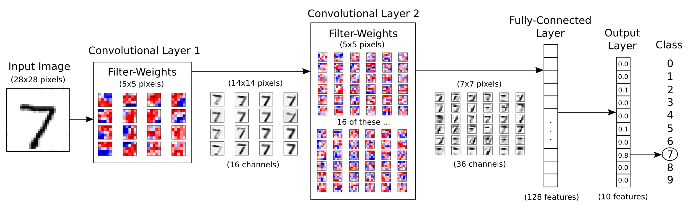

输入为原始的28x28的图像，它首先进入第一个拥有16个5x5卷积核的卷积层，得到16张28x28的卷积后的图像，再进入降采样层（图中未体现）最终得到16张14x14的图像（可称为16个通道）。为了保证卷积前后图像的像素不变，在卷积过后，对图像边框采取补零的操作（在TensorFlow中的conv2d的padding参数为'SAME'，如果不采取补零而是缩小像素值，padding参数值设置为'VALID'）。降采样层使用max pooling操作，将2x2的像素块取最大值合并为一个像素点，这个操作会将图像缩小1倍。

对于得到的16通道的14x14图像，进入第二个拥有36个卷积核的卷积层，得到36张14x14的卷积后图像，再进入降采样层得到36张7x7的图像。在这里包括了一些隐含的操作，对于16张原始图像，每一张图像使用36个卷积核卷积，应该得到16x36张新的图像，但是为了减少模型的参数量，降低复杂度，卷积层对每个卷积核得到的16张图像取平均，最后得到36张卷积后图像。

经过两层卷积后，将36张7x7的图像展平，得到一个7x7x36的向量，输入到一个128维的全连接层，再输入到10维的softmx层进行分类，这一块与上一章类似。

### 卷积层

卷积层使用多个卷积核作用于同一幅图像，以得到多个卷积后的图像。如下图所示：


对于原始的图像7，使用一个5x5的卷积核，从左到右从上到下滑动。滑动的过程称为stride，一个卷积层有两个stride，分别从上到下，从左到右，步长一般设定为1或2。对卷积核覆盖的区域于卷积核进行点乘操作得到一个值作为该区域的中心点的像素。在上图中，红色代表这部分的像素对原始图像存在一个正的影响，而蓝色表示负的影响，在这个样例中卷积核似乎在识别图像中的横线部分，因为从结果看来7的那一横具有更强烈的反应。

此外，对于每一个卷积层的输出，一般会经过一个relu层，以保证全部的像素值都为正（因为所有为负的像素值都被设定为0）。

## 需要导入的包

```python
import tensorflow as tf          # TensorFlow
import matplotlib.pyplot as plt  # matplotlib绘图
import numpy as np              # Numpy
from sklearn.metrics import confusion_matrix    # 混淆矩阵，分析模型误差

import time      # 计时
from datetime import timedelta
import math

# notebook使用
%matplotlib inline       
```

## 卷积神经网络配置

```python
# 卷积层 1
filter_size1 = 5          # 5 x 5 卷积核
num_filters1 = 16        # 共 16 个卷积核

# 卷积层 2
filter_size2 = 5          # 5 x 5 卷积核
num_filters2 = 36        # 共 36 个卷积核

# Fully-connected layer.
fc_size = 128            # Number of neurons in fully-connected layer.
```

## 载入数据

TensorFlow在样例教程中已经做了下载并导入MNIST数字手写体识别数据集的实现，可以直接使用。以下代码会将MNIST数据集下载到`data/MNIST`目录下，将标签保存为`one-hot`编码。

```python
from tensorflow.examples.tutorials.mnist import input_data
mnist = input_data.read_data_sets('data/MNIST', one_hot=True)
```

MNIST数据集总共有70000张手写数字图片，数据集被分为训练集、测试集和验证集三部分。

```python
print("数据集大小：")
print('- 训练集：{}'.format(len(data.train.labels)))
print('- 测试集：{}'.format(len(data.test.labels)))
print('- 验证集：{}'.format(len(data.validation.labels)))
```

输出：

```
数据集大小：
- 训练集：55000
- 测试集：10000
- 验证集：5000
```

###  One-hot编码

每一张图的标签使用了`one-hot`编码保存在numpy矩阵中，而不是原本的类别，这是为了方便神经网络的处理。

```python
print(data.test.labels[:5])
```

输出：

```
[[ 0.  0.  0.  0.  0.  0.  0.  1.  0.  0.]
 [ 0.  0.  1.  0.  0.  0.  0.  0.  0.  0.]
 [ 0.  1.  0.  0.  0.  0.  0.  0.  0.  0.]
 [ 1.  0.  0.  0.  0.  0.  0.  0.  0.  0.]
 [ 0.  0.  0.  0.  1.  0.  0.  0.  0.  0.]]
```
在`one-hot`编码中，只有对应类别的那个位置为1，其余都为0，我们可以使用以下代码将其转换为真实类别：

```python
data.test.cls = np.argmax(data.test.labels, axis=1)
print(data.test.cls[:5])
```

输出：

```
[7 2 1 0 4]
```

### 数据维度

在MNIST数据集中，原始的28*28像素的黑白图片被展平为784维的向量。

```python
print("样本维度：", data.train.images.shape)
print("标签维度：", data.train.labels.shape)
```

输出：

```
样本维度： (55000, 784)
标签维度： (55000, 10)
```

为使得网络结构更加清晰，在这里对这些固定维度做如下定义：

```python
img_size = 28                        # 图片的高度和宽度
img_size_flat = img_size * img_size  # 展平为向量的尺寸
img_shape = (img_size, img_size)    # 图片的二维尺寸

num_channels = 1                    # 输入为单通道灰度图像
num_classes = 10                    # 类别数目
```

### 打印部分样例图片

```python
def plot_images(images, cls_true, cls_pred=None):
    """
    绘制图像，输出真实标签与预测标签
    images:  图像（9张）
    cls_true: 真实类别
    cls_pred: 预测类别
    """
    assert len(images) == len(cls_true) == 9  # 保证存在9张图片
    
    fig, axes = plt.subplots(3, 3)  # 创建3x3个子图的画布
    fig.subplots_adjust(hspace=0.3, wspace=0.3)  # 调整每张图之间的间隔
    
    for i, ax in enumerate(axes.flat):
        # 绘图，将一维向量变为二维矩阵，黑白二值图像使用 binary
        ax.imshow(images[i].reshape(img_shape), cmap='binary')
        
        if cls_pred is None:  # 如果未传入预测类别
            xlabel = "True: {0}".format(cls_true[i])
        else:
            xlabel = "True: {0}, Pred: {1}".format(cls_true[i], cls_pred[i])
        ax.set_xlabel(xlabel)

        # 删除坐标信息
        ax.set_xticks([])
        ax.set_yticks([])    
    plt.show()           
```

```python
# 随机取9张图片
indices = np.arange(len(data.test.cls))
np.random.shuffle(indices)
indices = indices[:9]    

images = data.test.images[indices]
cls_true = data.test.cls[indices]

plot_images(images, cls_true)
```

输出：

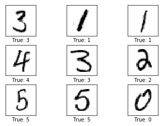

## TensorFlow计算图

TensorFlow使用计算图模型来构建神经网络。其主要流程是先建立好整个网络的计算图模型，然后再导入数据进行计算。

一个TensorFlow计算图包含以下几个部分：

- Placeholder:       占位符，用来读取用户输入与输出；
- Variable:             模型的变量，也称为参数，在计算过程中逐步优化；
- Model:                使用的神经网络模型，也可以使用一些简单的计算；
- Cost Function： 代价函数，也称损失函数，如何计算模型的误差；
- Optimizer：        优化器，使用哪种优化策略来降低损失。

### 创建变量

```python
def new_weights(shape):  
    return tf.Variable(tf.truncated_normal(shape, stddev=0.05))    # 初始化为随机值

def new_biases(length):
    return tf.Variable(tf.constant(0.05, shape=[length]))          # 初始化为常数
```

卷积神经网络中同样有两类变量，权重和偏置项。注意，这里的初始化只有在运行计算图时才会执行。

### 创建卷积层

这个函数创建了一个卷积层。输入为4维的tensor，维度如下：

1. 图像数量
2. 图像宽度
3. 图像高度
4. 通道数

输出同样是一个4维的tensor，维度如下：

1. 图像数量，与输入相同
2. 图像宽度，如果使用2x2 pooling，高宽都除以2
3. 图像高度，同上
4. 由卷积层生成的通道数

```python
def new_conv_layer(input,              # 前一层.
                  num_input_channels, # 前一层通道数
                  filter_size,        # 卷积核尺寸
                  num_filters,        # 卷积核数目
                  use_pooling=True):  # 使用 2x2 max-pooling.

    # 卷积核权重的形状，由TensorFlow API决定
    shape = [filter_size, filter_size, num_input_channels, num_filters]

    # 根据跟定形状创建权重
    weights = new_weights(shape=shape)

    # 创建新的偏置，每个卷积核一个偏置
    biases = new_biases(length=num_filters)

    # 创建卷积层。注意stride全设置为1。
    # 第1个和第4个必须是1，因为第1个是图像的数目，第4个是图像的通道。
    # 第2和第3指定和左右、上下的步长。
    # padding设置为'SAME' 意味着给图像补零，以保证前后像素相同。
    layer = tf.nn.conv2d(input=input,
                        filter=weights,
                        strides=[1, 1, 1, 1],
                        padding='SAME')

    # 给卷积层的输出添加一个偏置，每个卷积通道一个偏置值
    layer += biases

    # 是否使用pooling
    if use_pooling:
        # 这是 2x2 max-pooling, 表明使用 2x2 的窗口，选择每一窗口的最大值作为该窗口的像素，
        # 然后移动2格到下一窗口。
        layer = tf.nn.max_pool(value=layer,
                              ksize=[1, 2, 2, 1],
                              strides=[1, 2, 2, 1],
                              padding='SAME')

    # Rectified Linear Unit (ReLU).
    # 对每个输入像素x，计算 max(x, 0)，把负数的像素值变为0.
    # 这一步为原输出添加了一定的非线性特性，允许我们学习更加复杂的函数。
    layer = tf.nn.relu(layer)

    # 注意 relu 通常在pooling前执行，但是由于 relu(max_pool(x)) == max_pool(relu(x))，
    # 我们可以通过先max_pooling再relu省去75%的计算。

    # 返回结果层和权重，结果层用于下一层输入，权重用于显式输出
    return layer, weights
```

### 展平操作

一个卷积层的输出为4维度的tensor。我们需要在卷积层后添加一个全连接层，首先得将4为的tensor展平为2维的tensor，这样才能直接输入到全连接层。

```python
def flatten_layer(layer):
    # 获取输入层的形状，
    # layer_shape == [num_images, img_height, img_width, num_channels]
    layer_shape = layer.get_shape()

    # 特征数量: img_height * img_width * num_channels
    # 可以使用TensorFlow内建操作计算.
    num_features = layer_shape[1:4].num_elements()
    
    # 将形状重塑为 [num_images, num_features].
    # 注意只设定了第二个维度的尺寸为num_filters，第一个维度为-1，保证第一个维度num_images不变
    # 展平后的层的形状为:
    # [num_images, img_height * img_width * num_channels]
    layer_flat = tf.reshape(layer, [-1, num_features])

    return layer_flat, num_features
```

### 创建全连接层

```python
def new_fc_layer(input,          # 前一层.
                num_inputs,    # 前一层输入维度
                num_outputs,    # 输出维度
                use_relu=True): # 是否使用RELU

    # 新的权重和偏置，与第一章一样.
    weights = new_weights(shape=[num_inputs, num_outputs])
    biases = new_biases(length=num_outputs)

    # 计算 y = wx + b，同第一章
    layer = tf.matmul(input, weights) + biases

    # 是否使用RELU
    if use_relu:
        layer = tf.nn.relu(layer)

    return layer
```

### Placeholder占位符

占位符为输入与输出占据位置，这些输入输出一般在不同的轮次都会有所变化。由于TensorFlow先构图再计算，所以需要使用占位符为输入和输出预留位置。

```python
x = tf.placeholder(tf.float32, shape=[None, img_size_flat], name='x')          # 原始输入
x_image = tf.reshape(x, [-1, img_size, img_size, num_channels])                # 转换为2维图像
y_true = tf.placeholder(tf.float32, shape=[None, num_classes], name='y_true')  # 原始输出
y_true_cls = tf.argmax(y_true, axis=1)                  # 转换为真实类别，与之前的使用placeholder不同
```

### 卷积层 1

```python
layer_conv1, weights_conv1 = \
    new_conv_layer(input=x_image,                    # 输入图像
                  num_input_channels=num_channels,  # 输入通道数
                  filter_size=filter_size1,          # 卷积核尺寸
                  num_filters=num_filters1,          # 卷积核数目
                  use_pooling=True)
print(layer_conv1)
```

输出：

```
Tensor("Relu:0", shape=(?, 14, 14, 16), dtype=float32)
```

输入为(?, 28, 28, 1)的图像，其中?为图像数量。可以看到，第一个卷积层的输入为(?, 14, 14, 16)的tensor，即14x14像素的16通道图像。

### 卷积层 2

```python
layer_conv2, weights_conv2 = \
    new_conv_layer(input=layer_conv1,
                   num_input_channels=num_filters1,
                   filter_size=filter_size2,
                   num_filters=num_filters2,
                   use_pooling=True)
print(layer_conv2)
```

输出：

```python
Tensor("Relu_1:0", shape=(?, 7, 7, 36), dtype=float32)
```

解释同上，输入为上一层的输出。

### 展平层

展平层将第二个卷积层展平为二维tensor。

```python
layer_flat, num_features = flatten_layer(layer_conv2)
print(layer_flat)
```

输出：

```
Tensor("Reshape_1:0", shape=(?, 1764), dtype=float32)
```

输出为(?, 1764)的tensor。

### 全连接层 1

```python
layer_fc1 = new_fc_layer(input=layer_flat,   # 展平层输出
                         num_inputs=num_features,   # 输入特征维度
                         num_outputs=fc_size,       # 输出特征维度
                         use_relu=True)
print(layer_fc1)
```

输出：

```
Tensor("Relu_2:0", shape=(?, 128), dtype=float32)
```

输出为(?, 128)的2维tensor。

### 全连接层 2

```python
layer_fc2 = new_fc_layer(input=layer_fc1,           # 上一全连接层
                         num_inputs=fc_size,        # 输入特征维度
                         num_outputs=num_classes,   # 输出类别数
                         use_relu=False)
print(layer_fc2)
```

输出：

```
Tensor("add_3:0", shape=(?, 10), dtype=float32)
```

输出为(?, 10)的二维tensor，意在判定输入图像属于哪一类, 注意该层未使用relu，因为将要输入到后续的softmax中。

### 预测类别

第二个全连接层估计输入的图像属于某一类别的程度，这个估计有些粗糙，需要添加一个softmax层归一化为概率表示。

```python
y_pred = tf.nn.softmax(layer_fc2)              # softmax归一化
y_pred_cls = tf.argmax(y_pred, axis=1)         # 真实类别
```

### 代价函数

这一部分与上一章的类似。

```python
cross_entropy = tf.nn.softmax_cross_entropy_with_logits(logits=layer_fc2,
                                                        labels=y_true)
cost = tf.reduce_mean(cross_entropy)
```

### 优化方法

这一部分与上一章类似，但是优化器使用改进版的梯度下降，Adam。

```python
optimizer = tf.train.AdamOptimizer(learning_rate=1e-4).minimize(cost)
```

### 性能度量

同上一章

```python
correct_prediction = tf.equal(y_pred_cls, y_true_cls)
accuracy = tf.reduce_mean(tf.cast(correct_prediction, tf.float32))
```

## 运行TensorFlow计算图

### 创建Session以及变量初始化

TensorFlow计算图运行在一个session中，计算之前需要先创建这个session，并初始化其中的一些变量（w 和 b），TensorFlow使用`session.run()`来运行计算图。

```python
session = tf.Session()   # 创建session
session.run(tf.global_variables_initializer())   # 变量初始化
```

### 执行优化的帮助函数

同第一章，添加了部分状态输出的代码：

```python
train_batch_size = 64

# 计算目前执行的总迭代次数
total_iterations = 0

def optimize(num_iterations):
    # 保证更新全局变量.
    global total_iterations

    # 用来输出用时.
    start_time = time.time()

    for i in range(total_iterations, total_iterations + num_iterations):
        # 获取一批数据，放入dict，同第一章
        x_batch, y_true_batch = data.train.next_batch(train_batch_size)
        feed_dict_train = {x: x_batch,
                          y_true: y_true_batch}
        # 运行优化器
        session.run(optimizer, feed_dict=feed_dict_train)

        # 每100轮迭代输出状态
        if i % 100 == 0:
            # 计算训练集准确率.
            acc = session.run(accuracy, feed_dict=feed_dict_train)
            msg = "迭代轮次: {0:>6}, 训练准确率: {1:>6.1%}"
            print(msg.format(i + 1, acc))

    total_iterations += num_iterations

    end_time = time.time()
    time_dif = end_time - start_time

    # 输出用时.
    print("用时: " + str(timedelta(seconds=int(round(time_dif)))))
```

### 输出部分错误样例和混淆矩阵

与上一章类似。

```python
def plot_example_errors(cls_pred, correct):
    # 计算错误情况
    incorrect = (correct == False)
    images = data.test.images[incorrect]
    cls_pred = cls_pred[incorrect]
    cls_true = data.test.cls[incorrect]
    
    # 随机挑选9个
    indices = np.arange(len(images))
    np.random.shuffle(indices)
    indices = indices[:9] 

    plot_images(images[indices], cls_true[indices], cls_pred[indices])

def plot_confusion_matrix(cls_pred):
    cls_true = data.test.cls  # 真实类别  
    
    # 使用scikit-learn的confusion_matrix来计算混淆矩阵
    cm = confusion_matrix(y_true=cls_true, y_pred=cls_pred)
    
    # 打印混淆矩阵
    print(cm)
    
    # 将混淆矩阵输出为图像
    plt.imshow(cm, interpolation='nearest', cmap=plt.cm.Blues)
    
    # 调整图像
    plt.tight_layout()
    plt.colorbar()
    tick_marks = np.arange(num_classes)
    plt.xticks(tick_marks, range(num_classes))
    plt.yticks(tick_marks, range(num_classes))
    plt.xlabel('Predicted')
    plt.ylabel('True')
    plt.show()
```

### 显示性能的帮助函数

用来输出测试准确率的的函数。计算所有图像的分类需要一定的时间，因此我们在上面定义的一些函数中重用了分类结果。这个函数会占据大量的内存，所以将测试集分成了多个小的批次。如果你的机器内存太小，你可以尝试减小batch_size。

```python
# 将测试集分成更小的批次
test_batch_size = 256

def print_test_accuracy(show_example_errors=False,
                        show_confusion_matrix=False):
    # 测试集图像数量.
    num_test = len(data.test.images)

    # 为预测结果申请一个数组.
    cls_pred = np.zeros(shape=num_test, dtype=np.int)

    # 数据集的起始id为0
    i = 0
    while i < num_test:
        # j为下一批次的截止id
        j = min(i + test_batch_size, num_test)

        # 获取i，j之间的图像
        images = data.test.images[i:j, :]

        # 获取相应标签.
        labels = data.test.labels[i:j, :]

        # 创建feed_dict
        feed_dict = {x: images,
                    y_true: labels}

        # 计算预测结果
        cls_pred[i:j] = session.run(y_pred_cls, feed_dict=feed_dict)

        # 设定为下一批次起始值.
        i = j

    cls_true = data.test.cls
    # 正确的分类
    correct = (cls_true == cls_pred)
    # 正确分类的数量
    correct_sum = correct.sum()
    # 分类准确率
    acc = float(correct_sum) / num_test

    # 打印准确率.
    msg = "测试集准确率: {0:.1%} ({1} / {2})"
    print(msg.format(acc, correct_sum, num_test))

    # 打印部分错误样例.
    if show_example_errors:
        print("Example errors:")
        plot_example_errors(cls_pred=cls_pred, correct=correct)

    # 打印混淆矩阵.
    if show_confusion_matrix:
        print("Confusion Matrix:")
        plot_confusion_matrix(cls_pred=cls_pred)
```

### 优化前的性能测试

```python
print_test_accuracy()
```

输出：

```
测试集准确率: 4.2% (424 / 10000)
```

可以看到，测试的准确率极低，但是函数的功能正常。

### 执行一轮优化后的性能

```python
optimize(num_iterations=1)
print_test_accuracy()
```

输出：

```
迭代轮次:      1, 训练准确率:   3.1%
用时: 0:00:00
测试集准确率: 5.3% (534 / 10000)
```

一轮迭代后，性能稍有提升。

### 100轮优化后的性能

```python
optimize(num_iterations=99)
print_test_accuracy()
```

输出：

```
用时: 0:00:08
测试集准确率: 70.8% (7077 / 10000)
```

可以看到，执行100轮迭代后，性能存在大幅度提升。

### 1000轮优化后性能

```python
optimize(num_iterations=900)
print_test_accuracy(show_example_errors=True)
```

输出：

```
迭代轮次:    101, 训练准确率:  70.3%
迭代轮次:    201, 训练准确率:  87.5%
迭代轮次:    301, 训练准确率:  84.4%
迭代轮次:    401, 训练准确率:  84.4%
迭代轮次:    501, 训练准确率:  95.3%
迭代轮次:    601, 训练准确率:  90.6%
迭代轮次:    701, 训练准确率:  95.3%
迭代轮次:    801, 训练准确率:  89.1%
迭代轮次:    901, 训练准确率:  93.8%
用时: 0:01:12
测试集准确率: 93.5% (9351 / 10000)
Example errors:
```

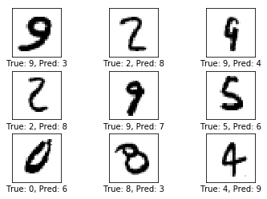

可以发现，测试集的准确率为93.5%，已经比第一章的91.9%要高。输出的部分错误样例显示，部分形状相似的数字仍然难以区分。

### 10000轮次优化后的性能

```python
optimize(num_iterations=9000)
print_test_accuracy(show_example_errors=True,
                    show_confusion_matrix=True)
```

输出：

```
迭代轮次:   1001, 训练准确率:  93.8%
迭代轮次:   1101, 训练准确率:  92.2%
迭代轮次:   1201, 训练准确率:  95.3%
迭代轮次:   1301, 训练准确率:  98.4%
迭代轮次:   1401, 训练准确率:  96.9%
迭代轮次:   1501, 训练准确率:  92.2%
迭代轮次:   1601, 训练准确率:  96.9%
迭代轮次:   1701, 训练准确率:  92.2%
迭代轮次:   1801, 训练准确率:  98.4%
迭代轮次:   1901, 训练准确率:  98.4%
迭代轮次:   2001, 训练准确率:  98.4%
迭代轮次:   2101, 训练准确率:  93.8%
迭代轮次:   2201, 训练准确率:  98.4%
迭代轮次:   2301, 训练准确率:  93.8%
迭代轮次:   2401, 训练准确率:  96.9%
迭代轮次:   2501, 训练准确率:  95.3%
迭代轮次:   2601, 训练准确率:  95.3%
迭代轮次:   2701, 训练准确率:  95.3%
迭代轮次:   2801, 训练准确率: 100.0%
迭代轮次:   2901, 训练准确率:  96.9%
迭代轮次:   3001, 训练准确率:  90.6%
迭代轮次:   3101, 训练准确率:  98.4%
迭代轮次:   3201, 训练准确率:  98.4%
迭代轮次:   3301, 训练准确率:  98.4%
迭代轮次:   3401, 训练准确率:  96.9%
迭代轮次:   3501, 训练准确率:  96.9%
迭代轮次:   3601, 训练准确率:  96.9%
迭代轮次:   3701, 训练准确率: 100.0%
迭代轮次:   3801, 训练准确率:  96.9%
迭代轮次:   3901, 训练准确率:  98.4%
迭代轮次:   4001, 训练准确率:  96.9%
迭代轮次:   4101, 训练准确率:  96.9%
迭代轮次:   4201, 训练准确率:  98.4%
迭代轮次:   4301, 训练准确率:  98.4%
迭代轮次:   4401, 训练准确率:  98.4%
迭代轮次:   4501, 训练准确率:  96.9%
迭代轮次:   4601, 训练准确率: 100.0%
迭代轮次:   4701, 训练准确率:  96.9%
迭代轮次:   4801, 训练准确率:  98.4%
迭代轮次:   4901, 训练准确率:  98.4%
迭代轮次:   5001, 训练准确率:  93.8%
迭代轮次:   5101, 训练准确率:  98.4%
迭代轮次:   5201, 训练准确率:  92.2%
迭代轮次:   5301, 训练准确率:  96.9%
迭代轮次:   5401, 训练准确率:  98.4%
迭代轮次:   5501, 训练准确率:  98.4%
迭代轮次:   5601, 训练准确率:  98.4%
迭代轮次:   5701, 训练准确率:  98.4%
迭代轮次:   5801, 训练准确率:  95.3%
迭代轮次:   5901, 训练准确率:  96.9%
迭代轮次:   6001, 训练准确率: 100.0%
迭代轮次:   6101, 训练准确率:  98.4%
迭代轮次:   6201, 训练准确率: 100.0%
迭代轮次:   6301, 训练准确率: 100.0%
迭代轮次:   6401, 训练准确率: 100.0%
迭代轮次:   6501, 训练准确率:  98.4%
迭代轮次:   6601, 训练准确率: 100.0%
迭代轮次:   6701, 训练准确率:  95.3%
迭代轮次:   6801, 训练准确率: 100.0%
迭代轮次:   6901, 训练准确率: 100.0%
迭代轮次:   7001, 训练准确率: 100.0%
迭代轮次:   7101, 训练准确率:  98.4%
迭代轮次:   7201, 训练准确率: 100.0%
迭代轮次:   7301, 训练准确率:  96.9%
迭代轮次:   7401, 训练准确率: 100.0%
迭代轮次:   7501, 训练准确率: 100.0%
迭代轮次:   7601, 训练准确率:  98.4%
迭代轮次:   7701, 训练准确率:  98.4%
迭代轮次:   7801, 训练准确率: 100.0%
迭代轮次:   7901, 训练准确率: 100.0%
迭代轮次:   8001, 训练准确率:  95.3%
迭代轮次:   8101, 训练准确率:  98.4%
迭代轮次:   8201, 训练准确率:  96.9%
迭代轮次:   8301, 训练准确率:  98.4%
迭代轮次:   8401, 训练准确率:  98.4%
迭代轮次:   8501, 训练准确率: 100.0%
迭代轮次:   8601, 训练准确率:  96.9%
迭代轮次:   8701, 训练准确率:  98.4%
迭代轮次:   8801, 训练准确率:  98.4%
迭代轮次:   8901, 训练准确率:  96.9%
迭代轮次:   9001, 训练准确率: 100.0%
迭代轮次:   9101, 训练准确率: 100.0%
迭代轮次:   9201, 训练准确率:  98.4%
迭代轮次:   9301, 训练准确率: 100.0%
迭代轮次:   9401, 训练准确率:  98.4%
迭代轮次:   9501, 训练准确率:  98.4%
迭代轮次:   9601, 训练准确率: 100.0%
迭代轮次:   9701, 训练准确率: 100.0%
迭代轮次:   9801, 训练准确率:  98.4%
迭代轮次:   9901, 训练准确率: 100.0%
用时: 0:12:42
测试集准确率: 98.7% (9873 / 10000)
Example errors:
```

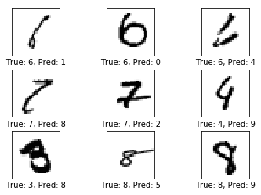

```
Confusion Matrix:
[[ 974    0    1    0    0    1    1    1    2    0]
 [   0 1130    1    0    0    1    0    2    1    0]
 [   4    1 1020    0    1    0    0    3    3    0]
 [   1    0    1 1000    0    3    0    2    3    0]
 [   0    0    2    0  968    0    1    2    2    7]
 [   2    0    0    6    0  878    2    2    1    1]
 [   5    2    0    0    2    2  945    0    2    0]
 [   1    0    7    2    0    0    0 1016    1    1]
 [   5    0    2    1    0    2    0    2  959    3]
 [   2    5    1    3    4    4    0    5    2  983]]
```

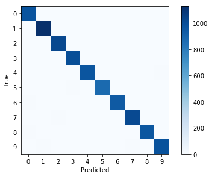

经过10000轮迭代后，测试集的准确率达到了98.7%的准确率。在分错的样本中，部分用肉眼也难以分辨。而混淆矩阵表明绝大部分的样本都分类正确。这是一个非常好的模型。

## 权重和层的可视化

为了更好的理解卷积神经网络为何能识别手写体数字，我来来可视化部分权重和层输出。

### 卷积权重可视化

```python
def plot_conv_weights(weights, input_channel=0):
    # weights_conv1 or weights_conv2.
    
    # 运行weights以获得权重
    w = session.run(weights)

    # 获取权重最小值最大值，这将用户纠正整个图像的颜色密集度，来进行对比
    w_min = np.min(w)
    w_max = np.max(w)

    # 卷积核树木
    num_filters = w.shape[3]

    # 需要输出的卷积核
    num_grids = math.ceil(math.sqrt(num_filters))
    
    fig, axes = plt.subplots(num_grids, num_grids)
    for i, ax in enumerate(axes.flat):
        # 只输出有用的子图.
        if i<num_filters:
            # 获得第i个卷积核在特定输入通道上的权重
            img = w[:, :, input_channel, i]

            ax.imshow(img, vmin=w_min, vmax=w_max,
                      interpolation='nearest', cmap='seismic')
        
        # 移除坐标.
        ax.set_xticks([])
        ax.set_yticks([])
    plt.show()
```

### 卷积层输出可视化

```python
def plot_conv_layer(layer, image):
    # layer_conv1 or layer_conv2.

    # feed_dict只需要x，标签信息在此不需要.
    feed_dict = {x: [image]}

    # 获取该层的输出结果
    values = session.run(layer, feed_dict=feed_dict)

    # 卷积核树木
    num_filters = values.shape[3]

    # 每行需要输出的卷积核网格数
    num_grids = math.ceil(math.sqrt(num_filters))
    
    fig, axes = plt.subplots(num_grids, num_grids)
    for i, ax in enumerate(axes.flat):
        # 只输出有用的子图.
        if i<num_filters:
            # 获取第i个卷积核的输出
            img = values[0, :, :, i]

            ax.imshow(img, interpolation='nearest', cmap='binary')
        
        # 移除坐标.
        ax.set_xticks([])
        ax.set_yticks([])
    plt.show()
```

### 打印输入图像

```python
def plot_image(image):
    plt.imshow(image.reshape(img_shape),
              interpolation='nearest',
              cmap='binary')

    plt.show()
```

打印第一章图像：

```
image1 = data.test.images[0]
plot_image(image1)
```

输出：


打印另一张图像:

```python
image2 = data.test.images[13]
plot_image(image2)
```

输出：

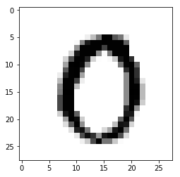

### 卷积层 1

```python
plot_conv_weights(weights=weights_conv1)
```

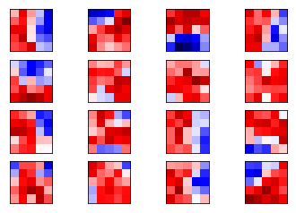

以上就是16个卷积核在第一个通道的权重情况。其中红色为正的权重，蓝色为负的权重。在这里我们很难判别这些权重是如何起作用的。

将image1喂入卷积层1，得到使用不同卷积后得到的图像，这些图像的棱角更加分明，而且在不同的边的突出情况也不同：

```python
plot_conv_layer(layer=layer_conv1, image=image1)
```

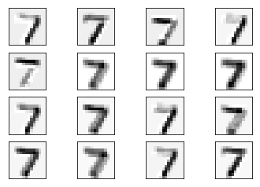

将image2喂入卷积层1，得到如下图像，在不同部位的突出情况不同：

```python
plot_conv_layer(layer=layer_conv1, image=image2)
```

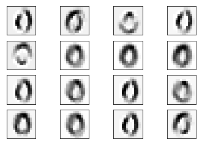

### 卷积层 2

现在输出第二个卷积层的权重。

由于卷积层1有16个输出通道，这意味着卷积层2有16个输入通道，每个通道的输入又对应36个输出通道，因此总共有16x36个通道的卷积核。我们先输出第一个通道的卷积核。

```python
plot_conv_weights(weights=weights_conv2, input_channel=0)
```

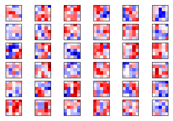

这些权重相对与卷积层1的权重更加抽象，无法用语言来解释。接下来输出第二个通道的卷积核。

```python
plot_conv_weights(weights=weights_conv2, input_channel=1)
```

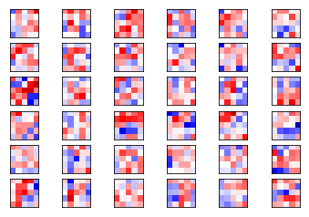

可以说明，不同输入通道对应的卷积核是不同的。将image1在卷积层1的输出再次输入卷积层2，得到如下输出：

```python
plot_conv_layer(layer=layer_conv1, image=image2)
```

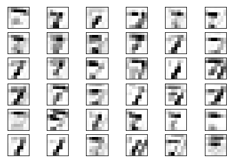

image2的输出如下：

```python
plot_conv_layer(layer=layer_conv1, image=image2)
```

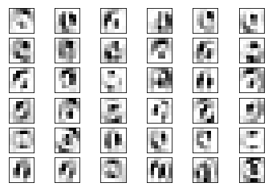

所输出的图像达到了一个更高的层次，卷积核试图提取一些边缘化的特征，这些特征对于同类图像的变化并不敏感。

在运行完整个计算图后，需要将它关闭，否则将一直占用资源:

```python
session.close()
```


