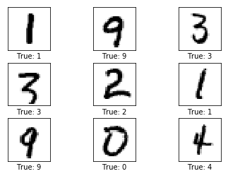
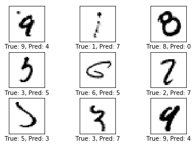
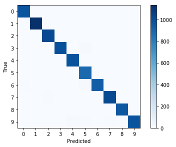
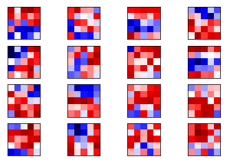
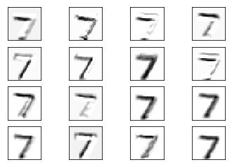
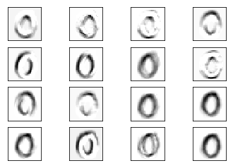
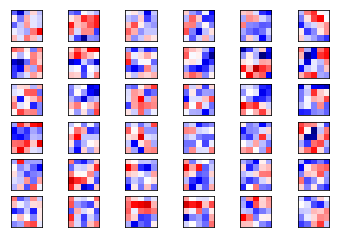
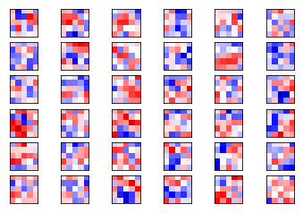
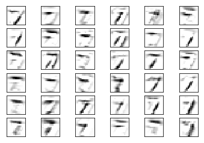
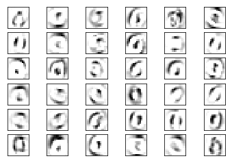

>  本章主要说明如何使用TensorFlow API简化神经网络构建，以及新的变量获取方法，在原作的基础上会做相应的改变。

原作者：[Magnus Erik Hvass Pedersen](http://www.hvass-labs.org/)  / [GitHub](https://github.com/Hvass-Labs/TensorFlow-Tutorials) / [Videos on YouTube](https://www.youtube.com/playlist?list=PL9Hr9sNUjfsmEu1ZniY0XpHSzl5uihcXZ)

在[第二章](https://gaussic.github.io/2017/08/14/tensorflow-cnn/)中，我们实现了使用卷积神经网络对MNIST数据集进行分类。可以发现，需要实现一个简单的CNN模型，也需要实现很多细节类的代码，如定义权重、偏置、展平操作等。TensorFlow对这些模型做了一定的API封装，使得使用者可以更加方便地实现神经网络的构建。

在TensorFlow中存在的API有多个，最大的是tf.contrib，其中封装了大量的网络层layers，以及新集成的keras网络层。部分的layers也重定向到了外层，可直接使用tf.layers，而不需要tf.contrib.layers。访问[这个链接](https://www.tensorflow.org/api_docs/python/tf/layers)可以了解tf.layers所支持的网络层。

本章节尝试使用tf.layers来重新实现[第二章](https://gaussic.github.io/2017/08/14/tensorflow-cnn/)的卷积神经网络。其中大量的帮助函数可以重用。重用这些函数需要做一定的修改。现在把这些函数放在一个单独的脚本中。

文件：`cnn_helper.py`

```python
import tensorflow as tf          # TensorFlow
import matplotlib.pyplot as plt  # matplotlib绘图
import numpy as np               # Numpy
from sklearn.metrics import confusion_matrix    # 混淆矩阵，分析模型误差

import time       # 计时
from datetime import timedelta
import math


def plot_images(images, cls_true, img_shape, cls_pred=None):
    """
    绘制图像，输出真实标签与预测标签
    images:   图像（9张）
    cls_true: 真实类别
    cls_pred: 预测类别
    """
    assert len(images) == len(cls_true) == 9   # 保证存在9张图片
    
    
    fig, axes = plt.subplots(3, 3)   # 创建3x3个子图的画布
    fig.subplots_adjust(hspace=0.3, wspace=0.3)  # 调整每张图之间的间隔
    
    for i, ax in enumerate(axes.flat):
        # 绘图，将一维向量变为二维矩阵，黑白二值图像使用 binary
        ax.imshow(images[i].reshape(img_shape), cmap='binary')
        
        if cls_pred is None:  # 如果未传入预测类别
            xlabel = "True: {0}".format(cls_true[i])
        else:
            xlabel = "True: {0}, Pred: {1}".format(cls_true[i], cls_pred[i])
        ax.set_xlabel(xlabel)

        # 删除坐标信息
        ax.set_xticks([])
        ax.set_yticks([])    
    plt.show()
    

def plot_example_errors(data_test, cls_pred, correct, img_shape):
    # 计算错误情况
    incorrect = (correct == False)
    images = data_test.images[incorrect]
    cls_pred = cls_pred[incorrect]
    cls_true = data_test.cls[incorrect]
    
    # 随机挑选9个
    indices = np.arange(len(images))
    np.random.shuffle(indices)
    indices = indices[:9] 

    plot_images(images[indices], cls_true[indices], img_shape, cls_pred[indices])
    
    
def plot_confusion_matrix(cls_true, cls_pred):  
    
    # 使用scikit-learn的confusion_matrix来计算混淆矩阵
    cm = confusion_matrix(y_true=cls_true, y_pred=cls_pred)
    
    # 打印混淆矩阵
    print(cm)
    
    num_classes = cm.shape[0]
    
    # 将混淆矩阵输出为图像
    plt.imshow(cm, interpolation='nearest', cmap=plt.cm.Blues)
    
    # 调整图像
    plt.tight_layout()
    plt.colorbar()
    tick_marks = np.arange(num_classes)
    plt.xticks(tick_marks, range(num_classes))
    plt.yticks(tick_marks, range(num_classes))
    plt.xlabel('Predicted')
    plt.ylabel('True')
    plt.show()
        
    
def plot_conv_weights(weights, input_channel=0):
    # weights_conv1 or weights_conv2.
    

    # 获取权重最小值最大值，这将用户纠正整个图像的颜色密集度，来进行对比
    w_min = np.min(weights)
    w_max = np.max(weights)

    # 卷积核树木
    num_filters = weights.shape[3]

    # 每行需要输出的卷积核网格数
    num_grids = math.ceil(math.sqrt(num_filters))
    
    fig, axes = plt.subplots(num_grids, num_grids)
    for i, ax in enumerate(axes.flat):
        # 只输出有用的子图.
        if i<num_filters:
            # 获得第i个卷积核在特定输入通道上的权重
            img = weights[:, :, input_channel, i]

            ax.imshow(img, vmin=w_min, vmax=w_max,
                      interpolation='nearest', cmap='seismic')
        
        # 移除坐标.
        ax.set_xticks([])
        ax.set_yticks([])
    plt.show()
    
    
def plot_conv_layer(values):
    # layer_conv1 or layer_conv2

    # 卷积核数目
    num_filters = values.shape[3]

    # 每行需要输出的卷积核网格数
    num_grids = math.ceil(math.sqrt(num_filters))
    
    fig, axes = plt.subplots(num_grids, num_grids)
    for i, ax in enumerate(axes.flat):
        # 只输出有用的子图.
        if i<num_filters:
            # 获取第i个卷积核的输出
            img = values[0, :, :, i]

            ax.imshow(img, interpolation='nearest', cmap='binary')
        
        # 移除坐标.
        ax.set_xticks([])
        ax.set_yticks([])
    plt.show()
    

def plot_image(image, img_shape):
    plt.imshow(image.reshape(img_shape),
               interpolation='nearest',
               cmap='binary')
    plt.show()
```

## 引入

```python
from cnn_helper import *

# notebook使用
%load_ext autoreload  
%autoreload 2
%matplotlib inline
```

## 载入数据

这一块与前几章一样，不做介绍：

```python
from tensorflow.examples.tutorials.mnist import input_data
data = input_data.read_data_sets('data/MNIST/', one_hot=True)
```

```python
print("数据集大小：")
print('- 训练集：{}'.format(len(data.train.labels)))
print('- 测试集：{}'.format(len(data.test.labels)))
print('- 验证集：{}'.format(len(data.validation.labels)))
```

输出:

```
数据集大小：
- 训练集：55000
- 测试集：10000
- 验证集：5000
```

```python
data.test.cls = np.argmax(data.test.labels, axis=1)
print("样本维度：", data.train.images.shape)
print("标签维度：", data.train.labels.shape)
```

输出：

```
样本维度： (55000, 784)
标签维度： (55000, 10)
```

```
img_size = 28                        # 图片的高度和宽度
img_size_flat = img_size * img_size  # 展平为向量的尺寸
img_shape = (img_size, img_size)     # 图片的二维尺寸

num_channels = 1                     # 输入为单通道灰度图像
num_classes = 10                     # 类别数目

# 随机取9张图片
indices = np.arange(len(data.test.cls))
np.random.shuffle(indices)
indices = indices[:9]    

images = data.test.images[indices]
cls_true = data.test.cls[indices]

plot_images(images, cls_true, img_shape)
```



## 输入输出占位符

```python
# 卷积层 1
filter_size1 = 5          # 5 x 5 卷积核
num_filters1 = 16         # 共 16 个卷积核

# 卷积层 2
filter_size2 = 5          # 5 x 5 卷积核
num_filters2 = 36         # 共 36 个卷积核

# Fully-connected layer.
fc_size = 128             # Number of neurons in fully-connected layer.

x = tf.placeholder(tf.float32, shape=[None, img_size_flat], name='x')          # 原始输入
x_image = tf.reshape(x, [-1, img_size, img_size, num_channels])                # 转换为2维图像
y_true = tf.placeholder(tf.float32, shape=[None, num_classes], name='y_true')  # 原始输出
y_true_cls = tf.argmax(y_true, axis=1)                                         # 转换为真实类别
```

## 使用layers API构建网络

```python
layer_conv1 = tf.layers.conv2d(inputs=x_image,            # 输入
                               filters=num_filters1,      # 卷积核个数
                               kernel_size=filter_size1,  # 卷积核尺寸
                               padding='same',            # padding方法
                               activation=tf.nn.relu,     # 激活函数relu
                               name='layer_conv1')        # 命名用于获取变量
print(layer_conv1)
```

输出：

```
Tensor("layer_conv1/Relu:0", shape=(?, 28, 28, 16), dtype=float32)
```

输出为(?, 28, 28, 16)的Tensor，可以发现，使用API省去了大量的操作，如定义weight, biase, strides, relu等参数，只需要传入适当的参数，就可以完成与之前同样的操作。

```python
net = tf.layers.max_pooling2d(inputs=layer_conv1, pool_size=2, strides=(2, 2),  padding='same')
layer_conv2 = tf.layers.conv2d(inputs=net,          
                               filters=num_filters2, 
                               kernel_size=filter_size2, 
                               padding='same', 
                               activation=tf.nn.relu, 
                               name='layer_conv2')
print(layer_conv2)
```

输出：

```
Tensor("layer_conv2/Relu:0", shape=(?, 14, 14, 36), dtype=float32)
```

我们为两个卷积层都加了一个name参数，这个参数用来指明该网络层在TensorFlow计算图中的名字，在后面可以根据这个名字来访问这一层的信息。


```python
net = tf.layers.max_pooling2d(inputs=layer_conv2, pool_size=2, strides=(2, 2),  padding='same')
layer_flat = tf.contrib.layers.flatten(net)    # flatten暂时在tf.contrib一层
print(layer_flat)
```

输出：

```python
Tensor("Flatten/Reshape:0", shape=(?, 1764), dtype=float32)
```

展平层自动的将输入展平成2维的tensor，而不需要人为的使用tf.reshape来操作。目前该层仍然在tf.contrib.layers下，未来可能会直接到tf.layers下。

```python
layer_fc1 = tf.layers.dense(inputs=layer_flat, units=fc_size, activation=tf.nn.relu, name='layer_fc1')
print(layer_fc1)
```

输出：

```
Tensor("layer_fc1/Relu:0", shape=(?, 128), dtype=float32)
```

TensorFlow与Keras一样，使用了dense来表示全连接层，用户无需在使用tf.matmul来定义这一层。

```python
layer_fc2 = tf.layers.dense(inputs=layer_fc1, units=num_classes, name='layer_fc2')
print(layer_fc2)
```

输出：

```
Tensor("layer_fc2/BiasAdd:0", shape=(?, 10), dtype=float32)
```

最后使用一个dense层将其映射为(?, 10)的tensor，用于后续的分类。

## 预测

这一部分的代码与第二章完全相同：

```python
y_pred = tf.nn.softmax(layer_fc2)              # softmax归一化
y_pred_cls = tf.argmax(y_pred, axis=1)         # 真实类别

cross_entropy = tf.nn.softmax_cross_entropy_with_logits(logits=layer_fc2,
                                                        labels=y_true)
cost = tf.reduce_mean(cross_entropy)

optimizer = tf.train.AdamOptimizer(learning_rate=1e-4).minimize(cost)

correct_prediction = tf.equal(y_pred_cls, y_true_cls)
accuracy = tf.reduce_mean(tf.cast(correct_prediction, tf.float32))
```

## 权重输出

为了输出网络的权重，还需要一些其他的操作。TensorFlow内部维护了一系列的变量名。

尝试打印所有的变量名：

```python
for var in tf.get_collection(tf.GraphKeys.GLOBAL_VARIABLES):
    print(var)
```

输出：

```python
<tf.Variable 'layer_conv1/kernel:0' shape=(5, 5, 1, 16) dtype=float32_ref>
<tf.Variable 'layer_conv1/bias:0' shape=(16,) dtype=float32_ref>
<tf.Variable 'layer_conv2/kernel:0' shape=(5, 5, 16, 36) dtype=float32_ref>
<tf.Variable 'layer_conv2/bias:0' shape=(36,) dtype=float32_ref>
<tf.Variable 'layer_fc1/kernel:0' shape=(1764, 128) dtype=float32_ref>
<tf.Variable 'layer_fc1/bias:0' shape=(128,) dtype=float32_ref>
<tf.Variable 'layer_fc2/kernel:0' shape=(128, 10) dtype=float32_ref>
<tf.Variable 'layer_fc2/bias:0' shape=(10,) dtype=float32_ref>
<tf.Variable 'beta1_power:0' shape=() dtype=float32_ref>
<tf.Variable 'beta2_power:0' shape=() dtype=float32_ref>
<tf.Variable 'layer_conv1/kernel/Adam:0' shape=(5, 5, 1, 16) dtype=float32_ref>
<tf.Variable 'layer_conv1/kernel/Adam_1:0' shape=(5, 5, 1, 16) dtype=float32_ref>
<tf.Variable 'layer_conv1/bias/Adam:0' shape=(16,) dtype=float32_ref>
<tf.Variable 'layer_conv1/bias/Adam_1:0' shape=(16,) dtype=float32_ref>
<tf.Variable 'layer_conv2/kernel/Adam:0' shape=(5, 5, 16, 36) dtype=float32_ref>
<tf.Variable 'layer_conv2/kernel/Adam_1:0' shape=(5, 5, 16, 36) dtype=float32_ref>
<tf.Variable 'layer_conv2/bias/Adam:0' shape=(36,) dtype=float32_ref>
<tf.Variable 'layer_conv2/bias/Adam_1:0' shape=(36,) dtype=float32_ref>
<tf.Variable 'layer_fc1/kernel/Adam:0' shape=(1764, 128) dtype=float32_ref>
<tf.Variable 'layer_fc1/kernel/Adam_1:0' shape=(1764, 128) dtype=float32_ref>
<tf.Variable 'layer_fc1/bias/Adam:0' shape=(128,) dtype=float32_ref>
<tf.Variable 'layer_fc1/bias/Adam_1:0' shape=(128,) dtype=float32_ref>
<tf.Variable 'layer_fc2/kernel/Adam:0' shape=(128, 10) dtype=float32_ref>
<tf.Variable 'layer_fc2/kernel/Adam_1:0' shape=(128, 10) dtype=float32_ref>
<tf.Variable 'layer_fc2/bias/Adam:0' shape=(10,) dtype=float32_ref>
<tf.Variable 'layer_fc2/bias/Adam_1:0' shape=(10,) dtype=float32_ref>
```

可以发现，在layer_conv1和layer_conv2下的变量kernel与我们所需的权重有着同样的shape，这正是我们所需要的权重的变量名。现在我们尝试使用这些变量名获取权重这一变量：

```python
def get_weights_variable(layer_name):
    # 根据给定的layer_name，返回名为'kernel'的变量
    with tf.variable_scope(layer_name, reuse=True):
        variable = tf.get_variable('kernel')
    return variable
    
weights_conv1 = get_weights_variable(layer_name='layer_conv1')
weights_conv2 = get_weights_variable(layer_name='layer_conv2')
```

## 优化与测试

创建session：

```python
session = tf.Session()
session.run(tf.global_variables_initializer())
```

以下的代码为了适应独立出来的`cnn_helper.py`做了小部分的改变：

```python
train_batch_size = 64

# 计算目前执行的总迭代次数
total_iterations = 0

def optimize(num_iterations):
    # 保证更新全局变量.
    global total_iterations

    # 用来输出用时.
    start_time = time.time()

    for i in range(total_iterations, total_iterations + num_iterations):
        # 获取一批数据，放入dict，同第一章
        x_batch, y_true_batch = data.train.next_batch(train_batch_size)
        feed_dict_train = {x: x_batch,
                           y_true: y_true_batch}
        # 运行优化器
        session.run(optimizer, feed_dict=feed_dict_train)

        # 每100轮迭代输出状态
        if i % 100 == 0:
            # 计算训练集准确率.
            acc = session.run(accuracy, feed_dict=feed_dict_train)
            msg = "迭代轮次: {0:>6}, 训练准确率: {1:>6.1%}"
            print(msg.format(i + 1, acc))

    total_iterations += num_iterations

    end_time = time.time()
    time_dif = end_time - start_time

    # 输出用时.
    print("用时: " + str(timedelta(seconds=int(round(time_dif)))))
    
# 将测试集分成更小的批次
test_batch_size = 256

def print_test_accuracy(show_example_errors=False,
                        show_confusion_matrix=False):
    # 测试集图像数量.
    num_test = len(data.test.images)

    # 为预测结果申请一个数组.
    cls_pred = np.zeros(shape=num_test, dtype=np.int)

    # 数据集的起始id为0
    i = 0
    while i < num_test:
        # j为下一批次的截止id
        j = min(i + test_batch_size, num_test)

        # 获取i，j之间的图像
        images = data.test.images[i:j, :]

        # 获取相应标签.
        labels = data.test.labels[i:j, :]

        # 创建feed_dict
        feed_dict = {x: images,
                     y_true: labels}

        # 计算预测结果
        cls_pred[i:j] = session.run(y_pred_cls, feed_dict=feed_dict)

        # 设定为下一批次起始值.
        i = j

    cls_true = data.test.cls
    # 正确的分类
    correct = (cls_true == cls_pred)
    # 正确分类的数量
    correct_sum = correct.sum()
    # 分类准确率
    acc = float(correct_sum) / num_test

    # 打印准确率.
    msg = "测试集准确率: {0:.1%} ({1} / {2})"
    print(msg.format(acc, correct_sum, num_test))

    # 打印部分错误样例.
    if show_example_errors:
        print("Example errors:")
        plot_example_errors(data_test=data.test, cls_pred=cls_pred, correct=correct, img_shape=img_shape)

    # 打印混淆矩阵.
    if show_confusion_matrix:
        print("Confusion Matrix:")
        plot_confusion_matrix(cls_true=cls_true, cls_pred=cls_pred)
```

## 结果

直接迭代10000轮：

```python
optimize(num_iterations=10000)
print_test_accuracy(show_example_errors=True, show_confusion_matrix=True)
```

输出：

```
迭代轮次:      1, 训练准确率:  15.6%
迭代轮次:    101, 训练准确率:  76.6%
迭代轮次:    201, 训练准确率:  87.5%
迭代轮次:    301, 训练准确率:  87.5%
迭代轮次:    401, 训练准确率:  90.6%
迭代轮次:    501, 训练准确率:  89.1%
迭代轮次:    601, 训练准确率:  90.6%
迭代轮次:    701, 训练准确率:  93.8%
迭代轮次:    801, 训练准确率:  93.8%
迭代轮次:    901, 训练准确率:  93.8%
迭代轮次:   1001, 训练准确率:  93.8%
迭代轮次:   1101, 训练准确率: 100.0%
迭代轮次:   1201, 训练准确率:  93.8%
迭代轮次:   1301, 训练准确率:  96.9%
迭代轮次:   1401, 训练准确率:  95.3%
迭代轮次:   1501, 训练准确率:  98.4%
迭代轮次:   1601, 训练准确率:  96.9%
迭代轮次:   1701, 训练准确率:  98.4%
迭代轮次:   1801, 训练准确率: 100.0%
迭代轮次:   1901, 训练准确率: 100.0%
迭代轮次:   2001, 训练准确率: 100.0%
迭代轮次:   2101, 训练准确率:  95.3%
迭代轮次:   2201, 训练准确率:  96.9%
迭代轮次:   2301, 训练准确率:  93.8%
迭代轮次:   2401, 训练准确率:  98.4%
迭代轮次:   2501, 训练准确率:  96.9%
迭代轮次:   2601, 训练准确率:  96.9%
迭代轮次:   2701, 训练准确率:  96.9%
迭代轮次:   2801, 训练准确率:  96.9%
迭代轮次:   2901, 训练准确率: 100.0%
迭代轮次:   3001, 训练准确率: 100.0%
迭代轮次:   3101, 训练准确率:  98.4%
迭代轮次:   3201, 训练准确率:  98.4%
迭代轮次:   3301, 训练准确率:  96.9%
迭代轮次:   3401, 训练准确率:  98.4%
迭代轮次:   3501, 训练准确率: 100.0%
迭代轮次:   3601, 训练准确率: 100.0%
迭代轮次:   3701, 训练准确率:  98.4%
迭代轮次:   3801, 训练准确率: 100.0%
迭代轮次:   3901, 训练准确率:  98.4%
迭代轮次:   4001, 训练准确率:  95.3%
迭代轮次:   4101, 训练准确率:  96.9%
迭代轮次:   4201, 训练准确率:  96.9%
迭代轮次:   4301, 训练准确率:  96.9%
迭代轮次:   4401, 训练准确率:  98.4%
迭代轮次:   4501, 训练准确率:  98.4%
迭代轮次:   4601, 训练准确率:  98.4%
迭代轮次:   4701, 训练准确率:  96.9%
迭代轮次:   4801, 训练准确率:  98.4%
迭代轮次:   4901, 训练准确率:  98.4%
迭代轮次:   5001, 训练准确率:  96.9%
迭代轮次:   5101, 训练准确率:  98.4%
迭代轮次:   5201, 训练准确率:  98.4%
迭代轮次:   5301, 训练准确率: 100.0%
迭代轮次:   5401, 训练准确率:  98.4%
迭代轮次:   5501, 训练准确率:  98.4%
迭代轮次:   5601, 训练准确率:  98.4%
迭代轮次:   5701, 训练准确率:  98.4%
迭代轮次:   5801, 训练准确率:  98.4%
迭代轮次:   5901, 训练准确率:  98.4%
迭代轮次:   6001, 训练准确率:  98.4%
迭代轮次:   6101, 训练准确率: 100.0%
迭代轮次:   6201, 训练准确率: 100.0%
迭代轮次:   6301, 训练准确率: 100.0%
迭代轮次:   6401, 训练准确率:  95.3%
迭代轮次:   6501, 训练准确率:  96.9%
迭代轮次:   6601, 训练准确率:  96.9%
迭代轮次:   6701, 训练准确率:  98.4%
迭代轮次:   6801, 训练准确率: 100.0%
迭代轮次:   6901, 训练准确率:  98.4%
迭代轮次:   7001, 训练准确率:  98.4%
迭代轮次:   7101, 训练准确率:  98.4%
迭代轮次:   7201, 训练准确率: 100.0%
迭代轮次:   7301, 训练准确率: 100.0%
迭代轮次:   7401, 训练准确率:  98.4%
迭代轮次:   7501, 训练准确率: 100.0%
迭代轮次:   7601, 训练准确率:  98.4%
迭代轮次:   7701, 训练准确率: 100.0%
迭代轮次:   7801, 训练准确率:  98.4%
迭代轮次:   7901, 训练准确率: 100.0%
迭代轮次:   8001, 训练准确率: 100.0%
迭代轮次:   8101, 训练准确率: 100.0%
迭代轮次:   8201, 训练准确率: 100.0%
迭代轮次:   8301, 训练准确率: 100.0%
迭代轮次:   8401, 训练准确率:  96.9%
迭代轮次:   8501, 训练准确率: 100.0%
迭代轮次:   8601, 训练准确率: 100.0%
迭代轮次:   8701, 训练准确率: 100.0%
迭代轮次:   8801, 训练准确率: 100.0%
迭代轮次:   8901, 训练准确率:  98.4%
迭代轮次:   9001, 训练准确率: 100.0%
迭代轮次:   9101, 训练准确率:  96.9%
迭代轮次:   9201, 训练准确率:  98.4%
迭代轮次:   9301, 训练准确率: 100.0%
迭代轮次:   9401, 训练准确率: 100.0%
迭代轮次:   9501, 训练准确率: 100.0%
迭代轮次:   9601, 训练准确率:  98.4%
迭代轮次:   9701, 训练准确率: 100.0%
迭代轮次:   9801, 训练准确率: 100.0%
迭代轮次:   9901, 训练准确率:  98.4%
用时: 0:13:00
测试集准确率: 98.7% (9867 / 10000)
Example errors:
```



```
Confusion Matrix:
[[ 973    0    1    0    0    1    2    1    2    0]
 [   0 1133    1    0    0    0    0    1    0    0]
 [   2    3 1018    0    1    0    0    4    3    1]
 [   1    0    1  992    0   12    0    3    1    0]
 [   0    0    1    0  979    0    0    1    0    1]
 [   1    0    1    1    0  888    1    0    0    0]
 [   6    3    0    0    4   12  933    0    0    0]
 [   0    2    6    1    1    0    0 1017    1    0]
 [   4    0    1    2    1    4    0    2  957    3]
 [   2    4    0    0   11    6    0    8    1  977]]
```




## 权重与层的可视化

### 第一层权重

```python
weights1 = session.run(weights_conv1)
plot_conv_weights(weights=weights1)
```



### 第一层输出

```python
image1 = data.test.images[0]
layer1 = session.run(layer_conv1, feed_dict={x: [image1]})
plot_conv_layer(values=layer1)
```




```python
image2 = data.test.images[13]
layer1 = session.run(layer_conv1, feed_dict={x: [image2]})
plot_conv_layer(values=layer1)
```




### 第二层权重

```python
weights2 = session.run(weights_conv2)
plot_conv_weights(weights=weights2, input_channel=0)
```



```python
plot_conv_weights(weights=weights2, input_channel=0)
```



### 第二层输出

```python
layer2 = session.run(layer_conv2, feed_dict={x: [image1]})
plot_conv_layer(values=layer2)
```



```python
layer2 = session.run(layer_conv2, feed_dict={x: [image2]})
plot_conv_layer(values=layer2)
```



## 关闭session

```python
session.close()
```

尽管TensorFlow为使用者提供了一些简化代码的便利，我们仍然应当先了解其中的原理再使用，不要一味地把深度学习当成黑盒子来使用。
