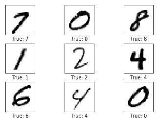
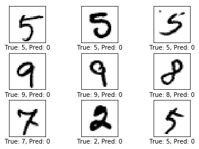
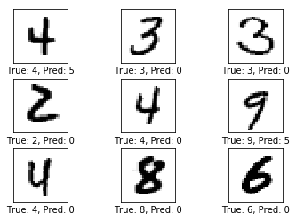
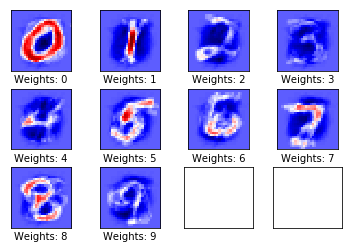
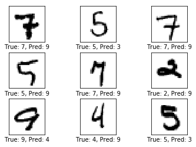
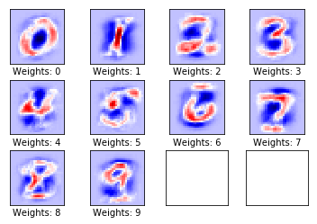
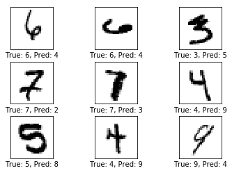
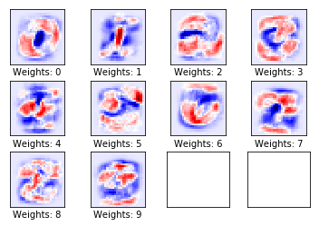
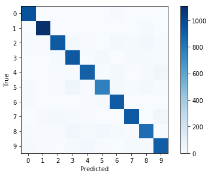

> 本章主要通过线性模型介绍TensorFlow的一些基本使用流程。

这是几篇与原作不完全相同的教程，转载请说明出处：[Gaussic](https://gaussic.github.io/)

原作者：[Magnus Erik Hvass Pedersen](http://www.hvass-labs.org/)  / [GitHub](https://github.com/Hvass-Labs/TensorFlow-Tutorials) / [Videos on YouTube](https://www.youtube.com/playlist?list=PL9Hr9sNUjfsmEu1ZniY0XpHSzl5uihcXZ)

## 需要导入的包

```python
import tensorflow as tf          # TensorFlow
import matplotlib.pyplot as plt  # matplotlib绘图
import numpy as np               # Numpy
from sklearn.metrics import confusion_matrix    # 混淆矩阵，分析模型误差

# notebook使用
%matplotlib inline    
```

## 载入数据

TensorFlow在样例教程中已经做了下载并导入MNIST数字手写体识别数据集的实现，可以直接使用。以下代码会将MNIST数据集下载到`data/MNIST`目录下，将标签保存为`one-hot`编码。

```python
from tensorflow.examples.tutorials.mnist import input_data
mnist = input_data.read_data_sets('data/MNIST', one_hot=True)
```

MNIST数据集总共有70000张手写数字图片，数据集被分为训练集、测试集和验证集三部分。

```python
print("数据集大小：")
print('- 训练集：{}'.format(len(data.train.labels)))
print('- 测试集：{}'.format(len(data.test.labels)))
print('- 验证集：{}'.format(len(data.validation.labels)))
```

输出：

```
数据集大小：
- 训练集：55000
- 测试集：10000
- 验证集：5000
```

###  One-hot编码

每一张图的标签使用了`one-hot`编码保存在numpy矩阵中，而不是原本的类别，这是为了方便神经网络的处理。

```python
print(data.test.labels[:5])
```

输出：

```
[[ 0.  0.  0.  0.  0.  0.  0.  1.  0.  0.]
 [ 0.  0.  1.  0.  0.  0.  0.  0.  0.  0.]
 [ 0.  1.  0.  0.  0.  0.  0.  0.  0.  0.]
 [ 1.  0.  0.  0.  0.  0.  0.  0.  0.  0.]
 [ 0.  0.  0.  0.  1.  0.  0.  0.  0.  0.]]
```
在`one-hot`编码中，只有对应类别的那个位置为1，其余都为0，我们可以使用以下代码将其转换为真实类别：

```python
data.test.cls = np.argmax(data.test.labels, axis=1)
print(data.test.cls[:5])
```

输出：

```
[7 2 1 0 4]
```

### 数据维度

在MNIST数据集中，原始的28*28像素的黑白图片被展平为784维的向量。

```python
print("样本维度：", data.train.images.shape)
print("标签维度：", data.train.labels.shape)
```

输出：

```
样本维度： (55000, 784)
标签维度： (55000, 10)
```

为使得网络结构更加清晰，在这里对这些固定维度做如下定义：

```python
img_size = 28                        # 图片的高度和宽度
img_size_flat = img_size * img_size  # 展平为向量的尺寸
img_shape = (img_size, img_size)     # 图片的二维尺寸

num_classes = 10                     # 类别数目
```

### 打印部分样例图片

```python
def plot_images(images, cls_true, cls_pred=None):
    """
    绘制图像，输出真实标签与预测标签
    images:   图像（9张）
    cls_true: 真实类别
    cls_pred: 预测类别
    """
    assert len(images) == len(cls_true) == 9   # 保证存在9张图片
    
    fig, axes = plt.subplots(3, 3)   # 创建3x3个子图的画布
    fig.subplots_adjust(hspace=0.3, wspace=0.3)  # 调整每张图之间的间隔
    
    for i, ax in enumerate(axes.flat):
        # 绘图，将一维向量变为二维矩阵，黑白二值图像使用 binary
        ax.imshow(images[i].reshape(img_shape), cmap='binary')
        
        if cls_pred is None:  # 如果未传入预测类别
            xlabel = "True: {0}".format(cls_true[i])
        else:
            xlabel = "True: {0}, Pred: {1}".format(cls_true[i], cls_pred[i])
        ax.set_xlabel(xlabel)

        # 删除坐标信息
        ax.set_xticks([])
        ax.set_yticks([])            
```

```python
# 随机取9张图片
indices = np.arange(len(data.test.cls))
np.random.shuffle(indices)
indices = indices[:9]    

images = data.test.images[indices]
cls_true = data.test.cls[indices]

plot_images(images, cls_true)
```

输出：



## TensorFlow计算图

TensorFlow使用计算图模型来构建神经网络。其主要流程是先建立好整个网络的计算图模型，然后再导入数据进行计算。

一个TensorFlow计算图包含以下几个部分：

- Placeholder:       占位符，用来读取用户输入与输出；
- Variable:             模型的变量，也称为参数，在计算过程中逐步优化；
- Model:                使用的神经网络模型，也可以使用一些简单的计算；
- Cost Function： 代价函数，也称损失函数，如何计算模型的误差；
- Optimizer：        优化器，使用哪种优化策略来降低损失。

### Placeholder占位符

占位符为输入与输出占据位置，这写输入输出一般在不同的轮次都会有所变化。由于TensorFlow先构图再计算，所以需要使用占位符为输入和输出预留位置。

```python
x = tf.placeholder(tf.float32, shape=[None, img_size_flat])
y_true = tf.placeholder(tf.float32, shape=[None, num_classes])
y_true_cls = tf.placeholder(tf.int64, shape=[None])
```

在上面的代码中，`None`表示一次输入多少数据，这一般跟样本的数量和每个批次的数据量`batch_size`有关。

### Variable变量

变量是模型的参数，这些参数在模型的计算过程中会被逐步的优化，以使得模型在训练集上有更好的表现。例如在本文的线性模型中，参数有两个：

$$
y = Wx+b
$$

其中的$W$就是模型的权重，$b$就是模型的偏移量，这两个变量会在计算过程中被优化。

```python
weights = tf.Variable(tf.zeros([img_size_flat, num_classes]))
biases = tf.Variable(tf.zeros([num_classes]))
```

需要注意的是，输入的是784维的向量，输出的标签是10维的向量，$W$是输入到输出的映射，因此它的维度为`[784, 10]`，而$b$是偏移量，因此维度为`[10]`。我们首先将它们初始化为0，TensorFlow会自动进行调整。

### Model模型

上面给出了整个模型的公式，因此实现起来非常简单：

```python
logits = tf.matmul(x, weights) + biases
```

`tf.matmul`表示矩阵乘法。上式返回的结果是一个 `[None, num_classes]` 的矩阵。`logits`是TensorFlow常用术语，这里不去考虑。这个结果离真实的分类还有一定的距离，我们需要使用一个softmax来对其归一化，以使得它的和为1。Softmax函数类似于计算了每一个维度的概率，其中最大的那个概率即对应它的类别。

```python
y_pred = tf.nn.softmax(logits)
y_pred_cls = tf.argmax(y_pred, axis=1)
```

y_pred_cls 的计算与之前使用Numpy计算类别的方式相似，说明TensorFlow的许多操作都和Numpy是相通的。不同的是Numpy的计算是实时的，而TensorFlow只有在运行计算图时才会返回结果。

### Cost Function代价函数

代价函数用来评估模型的错误率。模型的损失越高，说明离真实结果的偏差越大，需要尽可能的减小这个损失，以使得模型尽可能的准确。

代价函数存在多种的形式，比较常用的是平方误差和交叉熵。在这里使用更常用的交叉熵，有关交叉熵的细节请另外查阅资料。

```python
cross_entropy = tf.nn.softmax_cross_entropy_with_logits(logits=logits, labels=y_true)
cost = tf.reduce_mean(cross_entropy)    # 交叉熵平均值即代价
```

需要注意的是，传入的是计算softmx之前的`logits`，而非`y_pred`，这其中的原因是softmax的计算十分耗时，处于速度的考虑，TensorFlow在实现中直接使用logits，然后在`tf.nn.softmax_cross_entropy_with_logits`内部使用更高效的方法计算交叉熵，具体的原理仍然是一样的。

在计算完总的交叉熵是，其均值即为代价。

### Optimization优化

现在我们已经有了代价函数的度量方法，接下来就需要使用优化器来优化这个代价函数。常用的做法是使用提督下降将来传播误差，然后在更新权重。TensorFlow提供了多种计算梯度的[优化器](https://www.tensorflow.org/api_guides/python/train#Optimizers)，如果在一个优化器的效果不明显时，可以尝试使用另一个优化器。这里使用基本的`GradientDescentOptimizer`，学习率为0.5，学习率越低收敛越快，学习率过高可能会导致不收敛。

```python
optimizer = tf.train.GradientDescentOptimizer(learning_rate=0.5).minimize(cost)
```

### 性能度量

一般来说，以上的代码就已经完成了模型的构建。但是为了评估模型的性能，还需要一些其他的代码。最直观的是模型的准确率。

```python
correct_prediction = tf.equal(y_pred_cls, y_true_cls)  # 判断相等的元素
accuracy = tf.reduce_mean(tf.cast(correct_prediction, tf.float32))  # 计算准确率
```

## 运行TensorFlow计算图

### 创建Session以及变量初始化

TensorFlow计算图运行在一个session中，计算之前需要先创建这个session，并初始化其中的一些变量（w 和 b），TensorFlow使用`session.run()`来运行计算图。

```python
session = tf.Session()   # 创建session
session.run(tf.global_variables_initializer())   # 变量初始化
```

### 执行优化的帮助函数

在训练集中有55000张图片，如果在每一轮迭代过程中都使用全部的图像作为输入的话，计算时间太长。因此使用小批量的随即梯度下降方法来执行每一次优化。梯度下降过程会自动的优化权重$W$和偏置$b$。

```python
batch_size = 100   # 每一轮的数据量
def optimize(num_iterations):   
    for i in range(num_iterations):   # 迭代轮数
        # TensorFlow自己实现了取MNIST下一个批次的操作，这里直接使用，不必深究
        x_batch, y_true_batch = data.train.next_batch(batch_size)

        # 把这批数据放在要喂入模型的dict里面
        feed_dict_train = {x: x_batch, y_true: y_true_batch}

        # 运行优化器，喂入数据
        session.run(optimizer, feed_dict=feed_dict_train)
```

### 评估性能的帮助函数

现在需要评估模型在测试数据上的性能，需要将测试数据整个喂入模型中：

```python
feed_dict_test = {x: data.test.images,
                  y_true: data.test.labels,
                  y_true_cls: data.test.cls}
```

输出准确率：

```python
def print_accuracy():
    # 运行accuracy来计算acc
    acc = session.run(accuracy, feed_dict=feed_dict_test)
    print("测试集准确率: {0:.1%}".format(acc))   # 保留1位小数
```

输出混淆矩阵：

```python
def print_confusion_matrix():
    cls_true = data.test.cls   # 真实类别
    # 运行y_pred_cls计算出的真实类别
    cls_pred = session.run(y_pred_cls, feed_dict=feed_dict_test)
    
    # 使用scikit-learn的confusion_matrix来计算混淆矩阵
    cm = confusion_matrix(y_true=cls_true, y_pred=cls_pred)
    
    # 打印混淆矩阵
    print(cm)
    
    # 将混淆矩阵输出为图像
    plt.imshow(cm, interpolation='nearest', cmap=plt.cm.Blues)
    
    # 调整图像
    plt.tight_layout()
    plt.colorbar()
    tick_marks = np.arange(num_classes)
    plt.xticks(tick_marks, range(num_classes))
    plt.yticks(tick_marks, range(num_classes))
    plt.xlabel('Predicted')
    plt.ylabel('True')
```    

输出部分错误样例

```python
def plot_example_errors():
    # 运行计算图，得到争取情况和预测结果
    correct, cls_pred = session.run([correct_prediction, y_pred_cls],
                                    feed_dict=feed_dict_test)
    # 计算错误情况
    incorrect = (correct == False)
    images = data.test.images[incorrect]
    cls_pred = cls_pred[incorrect]
    cls_true = data.test.cls[incorrect]
    
    # 随机挑选9个
    indices = np.arange(len(images))
    np.random.shuffle(indices)
    indices = indices[:9] 

    plot_images(images[indices], cls_true[indices], cls_pred[indices])
```

### 优化前的性能

准确率：

```python
print_accuracy()
```

输出：

```
测试集准确率: 9.8%
```

在未进行训练是，测试集的准确率为9.8%，因为$W$和$b$全都被初始化为0，因此所有的预测结果均为0。

部分错误样例：

```python
plot_example_errors()
```



这也证明了上面的说法。

### 一轮迭代后的性能

```python
optimize(num_iterations=1)
print_accuracy()
```
输出：

```
测试集准确率: 26.7%
```

尝试一轮迭代后，准确率提升到了26.7%。

```python
plot_example_errors()
```



预测结果也有了一定的变化。

最重要的是各个类别的权重情况：

```python
plot_weights()
```



在上图中，蓝色部分的权重为负数，红色部分的权重为正数，这些权重可以看作图片的过滤器。可以看到，模型的权重偏向于数字所在的位置。对于0和1，由于数字比较简单，模型可以很好的识别，而对于其他的数字，模型在识别上有一定的难度，需要更多次的优化。

### 10轮迭代后的性能

```python
optimize(num_iterations=9)   # 之前已经做过一轮
print_accuracy()
```

输出：

```
测试集准确率: 81.0%
```

测试集的准确率达到了81.0%，这是一个非常大的进步。再看看部分的错误样例：

```python
plot_example_errors()
```



可以发现，图片的预测结果和真实类别存在一定的相似之处。例如4和9，5和3，模型暂时还无法作出准确的判断。

接下来再看看权重的情况：

```python
plot_weights()
```



我们发现，图像的红色区域变得更加明显，它们是类别中所有图像的共有属性。对于部分类别（如4，5，9）还存在一定的提升空间。

### 100轮迭代后的性能

```python
optimize(num_iterations=990)   # 之前已经做过10轮
print_accuracy()
```

输出：

```
测试集准确率: 91.9%
```

这个结果已经非常好了。再来看看一些分错的样本：



多尝试几次就会发现，部分的样本是在太过抽象，4和6有时候甚至连人都很难分清。因而这样的一个结果应该合情合理。

再来看一下权重：



由于训练集的变化多端，为了覆盖多种变化，各类的权重变得有些宽泛，但是焦点仍然在类别中图像的共同之处。

我们再来看看混淆矩阵的情况：

```python
print_confusion_matrix()
```

输出：

```
[[ 957    0    1    2    0    4   12    2    2    0]
 [   0 1108    2    2    0    3    4    1   15    0]
 [   6    7  922   20    5    3   19   11   32    7]
 [   3    0   16  938    0   21    4    9   13    6]
 [   2    1    6    3  897    1   22    2   10   38]
 [   9    3    6   50    7  762   19    5   24    7]
 [   9    3    3    2    6   12  921    1    1    0]
 [   2   12   24   10    6    2    0  933    2   37]
 [   7    6    7   38    9   32   16    8  844    7]
 [  10    6    1   13   34    8    1   14    9  913]]
```

对角线上为分类正确的情况，其他为一个类分成其他类的情况。将这个矩阵图像化：



可以发现，大部分的分类均正确，少部分的淡蓝色区域说明存在一定的误分类情况。

在运行完整个计算图后，需要将它关闭，否则将一直占用资源:

```python
session.close()
```


