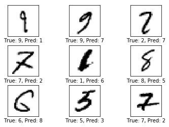
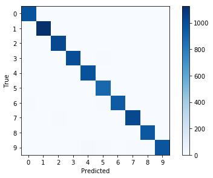
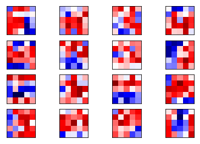
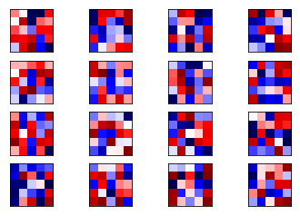
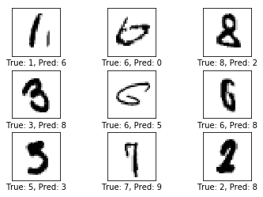
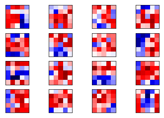

>  本章主要说明如何对训练过程进行存储，恢复操作。以及在模型长期没有改进时，提前终止训练。

这是几篇与原作不完全相同的教程，转载请说明出处：[Gaussic](https://gaussic.github.io/)

原作者：[Magnus Erik Hvass Pedersen](http://www.hvass-labs.org/)  / [GitHub](https://github.com/Hvass-Labs/TensorFlow-Tutorials) / [Videos on YouTube](https://www.youtube.com/playlist?list=PL9Hr9sNUjfsmEu1ZniY0XpHSzl5uihcXZ)

在[第三章](https://gaussic.github.io/2017/08/15/tensorflow-layers/)中，我们使用TensorFlow的API重新构建了网络，并且训练了10000轮次得到了98.7%的测试准确率。然而，在实际训练过程中，模型的结构往往比这更加复杂，数据量也更多，训练10000轮次需要较长的时间。长时间的训练存在多个问题：

- 如果不保存训练过程中的状态，在程序运行完后，整个训练过程被销毁，无法运用到新的数据集上，这样的模型没有意义。
- 如果在训练过程中一旦出现突发情况停止，之前的训练将前功尽弃，必须从头开始训练。
- 如果经过多次的训练，模型的性能不再提升，那么这些训练是没有意义的，如果不提前终止，将浪费大量时间。

事实上，TensorFlow提供了保存和恢复训练的方法，可以避免这类事情的发生。在本章中，我们将继续使用[第三章](https://gaussic.github.io/2017/08/15/tensorflow-layers/)的大部分代码，只做小部分的修改，以实现我们的目的。

### 载入数据，构建模型

这一部分与第三章相似，但是我们在本章中使用验证集来验证模型性能，因此需要稍作改动。此外，需要用到上一章给出的`cnn_helper.py`。

```python
from cnn_helper import *

# notebook使用
%load_ext autoreload  
%autoreload 2
%matplotlib inline
```

#### 数据

```python
from tensorflow.examples.tutorials.mnist import input_data
data = input_data.read_data_sets('data/MNIST/', one_hot=True)

print()
print("数据集大小：")
print('- 训练集：{}'.format(len(data.train.labels)))
print('- 测试集：{}'.format(len(data.test.labels)))
print('- 验证集：{}'.format(len(data.validation.labels)))
```

```python
数据集大小：
- 训练集：55000
- 测试集：10000
- 验证集：5000
```

```python
data.test.cls = np.argmax(data.test.labels, axis=1)
data.validation.cls = np.argmax(data.validation.labels, axis=1)
```

#### 神经网络参数

```python
img_size = 28                        # 图片的高度和宽度
img_size_flat = img_size * img_size  # 展平为向量的尺寸
img_shape = (img_size, img_size)     # 图片的二维尺寸

num_channels = 1                     # 输入为单通道灰度图像
num_classes = 10                     # 类别数目
```

```python
# 卷积层 1
filter_size1 = 5          # 5 x 5 卷积核
num_filters1 = 16         # 共 16 个卷积核

# 卷积层 2
filter_size2 = 5          # 5 x 5 卷积核
num_filters2 = 36         # 共 36 个卷积核

# 全连接层
fc_size = 128             # 全连接层神经元数
```

#### 占位符

```python
x = tf.placeholder(tf.float32, shape=[None, img_size_flat], name='x')          # 原始输入
x_image = tf.reshape(x, [-1, img_size, img_size, num_channels])                # 转换为2维图像
y_true = tf.placeholder(tf.float32, shape=[None, num_classes], name='y_true')  # 原始输出
y_true_cls = tf.argmax(y_true, axis=1)                                         # 转换为真实类别
```

#### 卷积神经网络

```python
layer_conv1 = tf.layers.conv2d(inputs=x_image,            # 输入
                               filters=num_filters1,      # 卷积核个数
                               kernel_size=filter_size1,  # 卷积核尺寸
                               padding='same',            # padding方法
                               activation=tf.nn.relu,     # 激活函数relu
                               name='layer_conv1')        # 命名用于获取变量

net = tf.layers.max_pooling2d(inputs=layer_conv1, pool_size=2, strides=(2, 2),  padding='same')
layer_conv2 = tf.layers.conv2d(inputs=net,          
                               filters=num_filters2,
                               kernel_size=filter_size2,
                               padding='same',
                               activation=tf.nn.relu,
                               name='layer_conv2')

net = tf.layers.max_pooling2d(inputs=layer_conv2, pool_size=2, strides=(2, 2),  padding='same')
layer_flat = tf.contrib.layers.flatten(net)    # flatten暂时在tf.contrib一层

layer_fc1 = tf.layers.dense(inputs=layer_flat, units=fc_size, activation=tf.nn.relu, name='layer_fc1')
layer_fc2 = tf.layers.dense(inputs=layer_fc1, units=num_classes, name='layer_fc2')
```

#### 代价、优化器、准确率

```python
y_pred = tf.nn.softmax(layer_fc2)              # softmax归一化
y_pred_cls = tf.argmax(y_pred, axis=1)         # 真实类别

cross_entropy = tf.nn.softmax_cross_entropy_with_logits(logits=layer_fc2, labels=y_true)
cost = tf.reduce_mean(cross_entropy)

optimizer = tf.train.AdamOptimizer(learning_rate=1e-4).minimize(cost)

correct_prediction = tf.equal(y_pred_cls, y_true_cls)
accuracy = tf.reduce_mean(tf.cast(correct_prediction, tf.float32))
```

#### 获取权重

```python
def get_weights_variable(layer_name):
    # 根据给定的layer_name，返回名为'kernel'的变量
    with tf.variable_scope(layer_name, reuse=True):
        variable = tf.get_variable('kernel')
    return variable

weights_conv1 = get_weights_variable(layer_name='layer_conv1')
weights_conv2 = get_weights_variable(layer_name='layer_conv2')
```

####  Saver

为了保存神经网络中的变量，我们需要创建一个Saver对象用来存储和检索TensorFlow计算图中的所有变量。我们可以保存训练过程中的所有结果，在这里仅保存最优的结果。

```python
saver = tf.train.Saver()    # 用于保存变量

save_dir = 'checkpoints/'   # 保存目录
if not os.path.exists(save_dir):
    os.makedirs(save_dir)

save_path = os.path.join(save_dir, 'best_validation')   # 最佳验证结果保存路径
```

### 运行TensorFlow

#### 创建session并初始化

```python
session = tf.Session()
session.run(tf.global_variables_initializer())
```

#### 优化器的迭代过程

为了测试优化器的性能，需要多添加几个指标，对代码进行相应调整。

```python
train_batch_size = 64

best_validation_accuracy = 0.0    # 当前最佳验证集准确率
last_improvement = 0     # 上一次有所改进的轮次
require_improvement = 1000    # 如果在1000轮内没有改进，停止迭代
```

```python
# 计算目前执行的总迭代次数
total_iterations = 0

def optimize(num_iterations):
    # 保证更新全局变量.
    global total_iterations
    global best_validation_accuracy
    global last_improvement

    # 用来输出用时.
    start_time = time.time()

    for i in range(num_iterations):
        total_iterations += 1

        # 获取一批数据，运行优化器
        x_batch, y_true_batch = data.train.next_batch(train_batch_size)
        feed_dict_train = {x: x_batch, y_true: y_true_batch}
        session.run(optimizer, feed_dict=feed_dict_train)

        # 每100轮迭代输出状态
        if (total_iterations % 100 == 0) or (i == num_iterations - 1):
            # 计算训练集准确率.
            acc_train = session.run(accuracy, feed_dict=feed_dict_train)
            # 验证集准确率，为了尽可能重用代码，这个函数会在后面实现
            acc_validation, _ = validation_accuracy()

            if acc_validation > best_validation_accuracy:   # 如果当前验证集准确率大于之前的最好准确率
                best_validation_accuracy = acc_validation   # 更新最好准确率
                last_improvement = total_iterations         # 更新上一次提升的迭代轮次

                saver.save(sess=session, save_path=save_path)   # 将这一次更新保存下来
                improved_str = '*'    # 标注为找到提升
            else:
                improved_str = ''    

            msg = "迭代轮次: {0:>6}, 训练集准确率: {1:>6.1%}, 验证集准确率: {2:>6.1%} {3}"
            print(msg.format(i + 1, acc_train, acc_validation, improved_str))

        # 如果在require_improvement轮次内未有提升
        if total_iterations - last_improvement > require_improvement:
            print("长时间未提升, 停止优化。")
            break  # 跳出循环

    end_time = time.time()
    time_dif = end_time - start_time

    # 输出用时.
    print("用时: " + str(timedelta(seconds=int(round(time_dif)))))
```

#### 计算分类性能

为了重用代码以评估验证集和测试集的性能，需要重构这部分代码：

```python
batch_size = 256

def predict_cls(images, labels, cls_true):
    num_images = len(images)

    # 为预测结果申请一个数组
    cls_pred = np.zeros(shape=num_images, dtype=np.int)

    i = 0  # 数据集的起始id为0

    while i < num_images:
        # j为下一批次的截止id
        j = min(i + batch_size, num_images)

        # 创建feed_dict
        feed_dict = {x: images[i:j, :], y_true: labels[i:j, :]}

        # 计算预测结果
        cls_pred[i:j] = session.run(y_pred_cls, feed_dict=feed_dict)

        # 设定为下一批次起始值.
        i = j

    # 正确的分类
    correct = (cls_true == cls_pred)

    return correct, cls_pred
```

```python
def predict_cls_test():    # 测试集分类结果
    return predict_cls(images = data.test.images,
                       labels = data.test.labels,
                       cls_true = data.test.cls)

def predict_cls_validation():   # 验证集分类结果
    return predict_cls(images = data.validation.images,
                       labels = data.validation.labels,
                       cls_true = data.validation.cls)

def cls_accuracy(correct):    # 准确率
    # 计算总的正确个数
    correct_sum = correct.sum()
    #计算准确率
    acc = float(correct_sum) / len(correct)
    return acc, correct_sum

def validation_accuracy():    # optimize()用到的验证集准确率函数
    correct, _ = predict_cls_validation()
    return cls_accuracy(correct)
```


#### 测试集性能评估

```python
def print_test_accuracy(show_example_errors=False,
                        show_confusion_matrix=False):

    # 返回测试集的正确情况与预测结果
    correct, cls_pred = predict_cls_test()

    # 计算准确率，准确数
    acc, num_correct = cls_accuracy(correct)

    num_images = len(correct)

    # 打印准确率.
    msg = "测试集准确率: {0:.1%} ({1} / {2})"
    print(msg.format(acc, num_correct, num_images))

    # 打印部分错误样例.
    if show_example_errors:
        print("Example errors:")
        plot_example_errors(data_test=data.test, cls_pred=cls_pred, correct=correct, img_shape=img_shape)

    # 打印混淆矩阵.
    if show_confusion_matrix:
        print("Confusion Matrix:")
        plot_confusion_matrix(cls_true=data.test.cls, cls_pred=cls_pred)
```

优化前性能：

```python
print_test_accuracy()
```

```
测试集准确率: 13.5% (1348 / 10000)
```

执行10000轮迭代：

```python
optimize(num_iterations=10000)
```

```
迭代轮次:    100, 训练集准确率:  81.2%, 验证集准确率:  78.9% *
迭代轮次:    200, 训练集准确率:  85.9%, 验证集准确率:  86.9% *
迭代轮次:    300, 训练集准确率:  93.8%, 验证集准确率:  90.9% *
迭代轮次:    400, 训练集准确率:  92.2%, 验证集准确率:  92.1% *
迭代轮次:    500, 训练集准确率:  93.8%, 验证集准确率:  93.0% *
迭代轮次:    600, 训练集准确率:  95.3%, 验证集准确率:  93.7% *
迭代轮次:    700, 训练集准确率:  90.6%, 验证集准确率:  94.3% *
迭代轮次:    800, 训练集准确率:  98.4%, 验证集准确率:  94.7% *
迭代轮次:    900, 训练集准确率:  96.9%, 验证集准确率:  95.4% *
迭代轮次:   1000, 训练集准确率:  96.9%, 验证集准确率:  95.5% *
迭代轮次:   1100, 训练集准确率:  93.8%, 验证集准确率:  95.7% *
迭代轮次:   1200, 训练集准确率:  98.4%, 验证集准确率:  96.0% *
迭代轮次:   1300, 训练集准确率:  96.9%, 验证集准确率:  95.8%
迭代轮次:   1400, 训练集准确率:  96.9%, 验证集准确率:  96.1% *
迭代轮次:   1500, 训练集准确率:  98.4%, 验证集准确率:  96.3% *
迭代轮次:   1600, 训练集准确率:  98.4%, 验证集准确率:  96.7% *
迭代轮次:   1700, 训练集准确率:  92.2%, 验证集准确率:  96.8% *
迭代轮次:   1800, 训练集准确率:  96.9%, 验证集准确率:  96.9% *
迭代轮次:   1900, 训练集准确率: 100.0%, 验证集准确率:  96.8%
迭代轮次:   2000, 训练集准确率:  98.4%, 验证集准确率:  97.0% *
迭代轮次:   2100, 训练集准确率: 100.0%, 验证集准确率:  97.0% *
迭代轮次:   2200, 训练集准确率:  98.4%, 验证集准确率:  97.4% *
迭代轮次:   2300, 训练集准确率:  96.9%, 验证集准确率:  97.3%
迭代轮次:   2400, 训练集准确率:  96.9%, 验证集准确率:  97.3%
迭代轮次:   2500, 训练集准确率:  96.9%, 验证集准确率:  97.5% *
迭代轮次:   2600, 训练集准确率:  98.4%, 验证集准确率:  97.3%
迭代轮次:   2700, 训练集准确率:  95.3%, 验证集准确率:  97.4%
迭代轮次:   2800, 训练集准确率: 100.0%, 验证集准确率:  97.7% *
迭代轮次:   2900, 训练集准确率:  98.4%, 验证集准确率:  97.7%
迭代轮次:   3000, 训练集准确率:  93.8%, 验证集准确率:  97.8% *
迭代轮次:   3100, 训练集准确率:  98.4%, 验证集准确率:  97.9% *
迭代轮次:   3200, 训练集准确率:  98.4%, 验证集准确率:  97.9%
迭代轮次:   3300, 训练集准确率:  96.9%, 验证集准确率:  97.9%
迭代轮次:   3400, 训练集准确率:  98.4%, 验证集准确率:  97.9%
迭代轮次:   3500, 训练集准确率:  96.9%, 验证集准确率:  97.8%
迭代轮次:   3600, 训练集准确率: 100.0%, 验证集准确率:  98.0% *
迭代轮次:   3700, 训练集准确率:  98.4%, 验证集准确率:  97.8%
迭代轮次:   3800, 训练集准确率: 100.0%, 验证集准确率:  97.9%
迭代轮次:   3900, 训练集准确率:  98.4%, 验证集准确率:  97.9%
迭代轮次:   4000, 训练集准确率: 100.0%, 验证集准确率:  97.7%
迭代轮次:   4100, 训练集准确率:  98.4%, 验证集准确率:  98.1% *
迭代轮次:   4200, 训练集准确率:  98.4%, 验证集准确率:  98.0%
迭代轮次:   4300, 训练集准确率: 100.0%, 验证集准确率:  97.9%
迭代轮次:   4400, 训练集准确率:  98.4%, 验证集准确率:  98.1% *
迭代轮次:   4500, 训练集准确率: 100.0%, 验证集准确率:  98.1%
迭代轮次:   4600, 训练集准确率: 100.0%, 验证集准确率:  97.9%
迭代轮次:   4700, 训练集准确率:  98.4%, 验证集准确率:  98.2% *
迭代轮次:   4800, 训练集准确率:  96.9%, 验证集准确率:  98.2% *
迭代轮次:   4900, 训练集准确率: 100.0%, 验证集准确率:  98.2%
迭代轮次:   5000, 训练集准确率: 100.0%, 验证集准确率:  98.3% *
迭代轮次:   5100, 训练集准确率: 100.0%, 验证集准确率:  98.3%
迭代轮次:   5200, 训练集准确率:  98.4%, 验证集准确率:  98.3%
迭代轮次:   5300, 训练集准确率: 100.0%, 验证集准确率:  98.4% *
迭代轮次:   5400, 训练集准确率:  98.4%, 验证集准确率:  98.3%
迭代轮次:   5500, 训练集准确率:  96.9%, 验证集准确率:  98.4% *
迭代轮次:   5600, 训练集准确率:  98.4%, 验证集准确率:  98.3%
迭代轮次:   5700, 训练集准确率:  98.4%, 验证集准确率:  98.4% *
迭代轮次:   5800, 训练集准确率:  98.4%, 验证集准确率:  98.4% *
迭代轮次:   5900, 训练集准确率:  96.9%, 验证集准确率:  98.4%
迭代轮次:   6000, 训练集准确率:  95.3%, 验证集准确率:  98.4%
迭代轮次:   6100, 训练集准确率: 100.0%, 验证集准确率:  98.3%
迭代轮次:   6200, 训练集准确率: 100.0%, 验证集准确率:  98.5% *
迭代轮次:   6300, 训练集准确率: 100.0%, 验证集准确率:  98.4%
迭代轮次:   6400, 训练集准确率: 100.0%, 验证集准确率:  98.6% *
迭代轮次:   6500, 训练集准确率: 100.0%, 验证集准确率:  98.4%
迭代轮次:   6600, 训练集准确率: 100.0%, 验证集准确率:  98.7% *
迭代轮次:   6700, 训练集准确率: 100.0%, 验证集准确率:  98.7% *
迭代轮次:   6800, 训练集准确率: 100.0%, 验证集准确率:  98.4%
迭代轮次:   6900, 训练集准确率: 100.0%, 验证集准确率:  98.6%
迭代轮次:   7000, 训练集准确率:  96.9%, 验证集准确率:  98.7%
迭代轮次:   7100, 训练集准确率:  98.4%, 验证集准确率:  98.4%
迭代轮次:   7200, 训练集准确率: 100.0%, 验证集准确率:  98.5%
迭代轮次:   7300, 训练集准确率:  98.4%, 验证集准确率:  98.6%
迭代轮次:   7400, 训练集准确率:  98.4%, 验证集准确率:  98.6%
迭代轮次:   7500, 训练集准确率:  98.4%, 验证集准确率:  98.4%
迭代轮次:   7600, 训练集准确率: 100.0%, 验证集准确率:  98.6%
迭代轮次:   7700, 训练集准确率: 100.0%, 验证集准确率:  98.7%
长时间未提升, 停止优化。
用时: 0:13:31
```

我们发现，在经过6700轮次后，由于性能不再提升，优化器提前停止了迭代，减少了部分的训练时间，而验证集的准确率达到了98.7%。

```python
print_test_accuracy(show_example_errors=True, show_confusion_matrix=True)
```

```python
测试集准确率: 98.7% (9865 / 10000)
Example errors:
```



```python
Confusion Matrix:
[[ 973    0    1    0    0    1    2    1    2    0]
 [   0 1127    2    0    0    0    2    1    3    0]
 [   0    1 1021    1    1    0    0    3    4    1]
 [   0    0    1  998    0    7    0    1    3    0]
 [   0    0    1    0  979    0    1    1    0    0]
 [   2    0    0    3    0  885    2    0    0    0]
 [   5    3    0    0    3    5  940    0    2    0]
 [   1    1    6    2    0    0    0 1017    1    0]
 [   3    0    4    2    1    2    0    3  957    2]
 [   2    4    1    4   13    6    0    7    4  968]]
```



打印权重

```python
weights1 = session.run(weights_conv1)
plot_conv_weights(weights=weights1)
```



#### 重新初始化

再次重新初始化所有的变量

```
session.run(tf.global_variables_initializer())    # 重新初始化
```

```python
print_test_accuracy()     # 准确率降回随机
```

```python
测试集准确率: 19.4% (1937 / 10000)
```

可见，输出降回了随机的情况。

```python
weights1 = session.run(weights_conv1)   
plot_conv_weights(weights=weights1)     # 权重也与上面的权重不同
```



权重也与训练好的模型大不相同。

#### 恢复路径下的变量

现在需要从变量所保存的路径下恢复所有的变量。

```python
saver.restore(sess=session, save_path=save_path)   # 现在从保存的目录中重新载入所有的变量
```

再次计算准确率

```python
# 再次打印测试准确率
print_test_accuracy(show_example_errors=True, show_confusion_matrix=True)
```

```python
测试集准确率: 98.6% (9864 / 10000)
Example errors:
```



```python
Confusion Matrix:
[[ 974    0    1    0    0    1    2    0    1    1]
 [   0 1126    3    0    0    0    2    1    3    0]
 [   0    0 1022    1    1    0    0    3    4    1]
 [   0    0    1 1002    0    3    0    1    2    1]
 [   0    0    1    0  980    0    1    0    0    0]
 [   2    0    0    4    0  882    2    0    0    2]
 [   3    2    0    0    3    6  942    0    2    0]
 [   1    3    7    3    0    0    0 1005    1    8]
 [   4    0    6    6    1    3    1    2  946    5]
 [   2    3    2    3    7    4    0    2    1  985]]
```


可以发现，测试集的准确率达到了98.6%，与前面训练好的模型相差无几。

```python
weights1 = session.run(weights_conv1)
plot_conv_weights(weights=weights1)    
```



这一次权重和训练过后的就基本相同了，存在轻微不同的原因是原始的模型多训练了1000次。

在重新载入变量后，我们还可以继续优化这些变量。

### 关闭session

```python
session.close()
```
