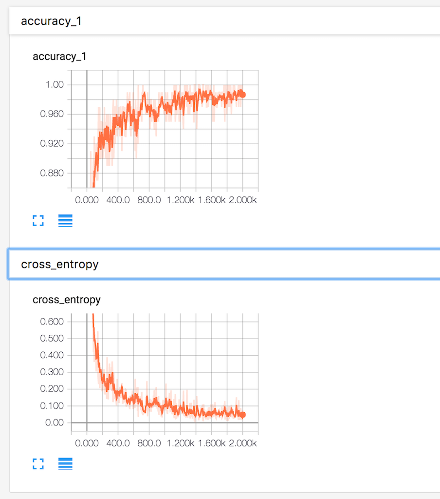

>  本章主要说明如何使用TensorBoard进行可视化，以及部分的调参方法。

这是一篇dandelionmane在[TensorFlow Dev Summit 2017](https://www.youtube.com/watch?v=eBbEDRsCmv4)关于TensorBoard介绍的总结教程。

转载请说明出处：[Gaussic](https://gaussic.github.io/)

在之前的章节中，几乎所有的性能评估都是通过打印中间结果字符串来完成的。使用更多的可视化的图表可以让人对模型有一个更加直观的认识。在本章中，我们将使用TensorBoard对模型进行可视化。


### 计算图可视化

要可视化TensorFlow的计算图，需要先构建网络。

#### 网络层

本章的网络，依然使用之前几个章节对MNIST数据集使用的网络结构。为了方便实现，固定了其中的一部分参数。相关层如下：

```python
# 简单卷积层，为方便本章教程叙述，固定部分参数
def conv_layer(input,
               channels_in,    # 输入通道数
               channels_out):  # 输出通道数

    weights = tf.Variable(tf.truncated_normal([5, 5, channels_in, channels_out], stddev=0.05))
    biases = tf.Variable(tf.constant(0.05, shape=[channels_out]))
    conv = tf.nn.conv2d(input, filter=weights, strides=[1, 1, 1, 1], padding='SAME')
    act = tf.nn.relu(conv + biases)
    return act

# 简化全连接层
def fc_layer(input, num_inputs, num_outputs, use_relu=True):
    weights = tf.Variable(tf.truncated_normal([num_inputs, num_outputs], stddev=0.05))
    biases = tf.Variable(tf.constant(0.05, shape=[num_outputs]))
    act = tf.matmul(input, weights) + biases

    if use_relu:
        act = tf.nn.relu(act)
    return act     

# max pooling 层
def max_pool(input):
    return tf.nn.max_pool(input, ksize=[1, 2, 2, 1], strides=[1, 2, 2, 1], padding='SAME')
```

#### 载入数据，构建网络

```python
from tensorflow.examples.tutorials.mnist import input_data
data = input_data.read_data_sets('data/MNIST', one_hot=True)

x = tf.placeholder(tf.float32, shape=[None, 784])   # 固定这部分值
y = tf.placeholder(tf.float32, shape=[None, 10])
x_image = tf.reshape(x, [-1, 28, 28, 1])

conv1 = conv_layer(x_image, 1, 32)   # 增加了卷积核数目
pool1 = max_pool(conv1)

conv2 = conv_layer(pool1, 32, 64)
pool2 = max_pool(conv2)

flat_shape = pool2.get_shape()[1:4].num_elements()
flattened = tf.reshape(pool2, [-1, flat_shape])

fc1 = fc_layer(flattened, flat_shape, 1024)     # 增大神经元数目
logits = fc_layer(fc1, 1024, 10, use_relu=False)
```

#### 交叉熵，优化器，准确率

```python
# 计算交叉熵
cross_entropy = tf.reduce_mean(tf.nn.softmax_cross_entropy_with_logits(labels=y, logits=logits))

# 使用Adam优化器来训练
optimizer = tf.train.AdamOptimizer(learning_rate=1e-4).minimize(cross_entropy)

# 计算准确率
correct_prediction = tf.equal(tf.argmax(y, axis=1), tf.argmax(logits, axis=1))
accuracy = tf.reduce_mean(tf.cast(correct_prediction, tf.float32))
```

#### 创建session，训练

```python
session = tf.Session()
session.run(tf.global_variables_initializer())

train_batch_size = 100

for i in range(2001):
    x_batch, y_batch = data.train.next_batch(train_batch_size)

    feed_dict = {x: x_batch, y: y_batch}

    if i % 500 == 0:
        train_accuracy = session.run(accuracy, feed_dict=feed_dict)
        print("迭代轮次: {0:>6}, 训练准确率: {1:>6.4%}".format(i, train_accuracy))

    session.run(optimizer, feed_dict=feed_dict)
```

```python
迭代轮次:      0, 训练准确率: 9.0000%
迭代轮次:    500, 训练准确率: 93.0000%
迭代轮次:   1000, 训练准确率: 97.0000%
迭代轮次:   1500, 训练准确率: 98.0000%
迭代轮次:   2000, 训练准确率: 100.0000%
```

可见训练效果比较理想。

#### 可视化计算图

现在需要将计算图可视化，需要使用tf.summary.FileWriter来将计算图写入指定目录：

```python
tensorboard_dir = 'tensorboard/mnist'   # 保存目录
if not os.path.exists(tensorboard_dir):
    os.makedirs(tensorboard_dir)

writer = tf.summary.FileWriter(tensorboard_dir)
writer.add_graph(session.graph)
```

以上代码运行结束后，在保存目录下生成了相应文件。在终端运行如下命令：

```bash
$ tensorboard --logdir tensorboard/mnist
```

浏览器中访问[localhost:6006](localhost:6006)便可进入TensorBoard控制台。


当前导航栏除了GRAPHS以外，其他均没有数据，点击进入GRAPHS，可查看如下计算图：


然而，目前来看，这个图实在过于复杂，因为它显示了所有的计算细节。我们需要对代码进行相应的调整。

#### 命名范围

我们在之前的章节已经使用了为某个网络模块命名的方法。TensorFlow使用name scope来确定模块的作用范围。对代码进行相应的调整，添加部分名称和作用域：

```python
# 简单卷积层，为方便本章教程叙述，固定部分参数
def conv_layer(input,
               channels_in,    # 输入通道数
               channels_out,   # 输出通道数
               name='conv'):   # 名称
    with tf.name_scope(name):    # 在该名称作用域下的子变量
        weights = tf.Variable(tf.truncated_normal([5, 5, channels_in, channels_out],
                                                  stddev=0.05), name='W')
        biases = tf.Variable(tf.constant(0.05, shape=[channels_out]), name='B')
        conv = tf.nn.conv2d(input, filter=weights, strides=[1, 1, 1, 1], padding='SAME')
        act = tf.nn.relu(conv + biases)
        return act

# 简化全连接层
def fc_layer(input, num_inputs, num_outputs, use_relu=True, name='fc'):
    with tf.name_scope(name):   # 在该名称作用域下的子变量
        weights = tf.Variable(tf.truncated_normal([num_inputs, num_outputs],
                                                  stddev=0.05), name='W')
        biases = tf.Variable(tf.constant(0.05, shape=[num_outputs]), name='B')
        act = tf.matmul(input, weights) + biases

        if use_relu:
            act = tf.nn.relu(act)
        return act     

# max pooling 层
def max_pool(input):
    return tf.nn.max_pool(input, ksize=[1, 2, 2, 1], strides=[1, 2, 2, 1], padding='SAME')
```

给其他的部分同样添加名称和相关作用域：

```python
x = tf.placeholder(tf.float32, shape=[None, 784], name='x')
y = tf.placeholder(tf.float32, shape=[None, 10], name='labels')
x_image = tf.reshape(x, [-1, 28, 28, 1])

conv1 = conv_layer(x_image, 1, 32, 'conv1')
pool1 = max_pool(conv1)

conv2 = conv_layer(pool1, 32, 64, 'conv2')
pool2 = max_pool(conv2)

flat_shape = pool2.get_shape()[1:4].num_elements()
flattened = tf.reshape(pool2, [-1, flat_shape])

fc1 = fc_layer(flattened, flat_shape, 1024, name='fc1')
logits = fc_layer(fc1, 1024, 10, use_relu=False, name='fc2')

# 计算交叉熵
with tf.name_scope("xent"):
    cross_entropy = tf.reduce_mean(tf.nn.softmax_cross_entropy_with_logits(labels=y, logits=logits))

# 使用Adam优化器来训练
with tf.name_scope('optimizer'):
    optimizer = tf.train.AdamOptimizer(learning_rate=1e-4).minimize(cross_entropy)

# 计算准确率
with tf.name_scope('accuracy'):
    correct_prediction = tf.equal(tf.argmax(y, axis=1), tf.argmax(logits, axis=1))
    accuracy = tf.reduce_mean(tf.cast(correct_prediction, tf.float32))
```

先不训练，创建一个新的目录保存新的计算图，然后将计算图写入这个目录

```python
tensorboard_dir = 'tensorboard/mnist2'   # 保存目录
if not os.path.exists(tensorboard_dir):
    os.makedirs(tensorboard_dir)

writer = tf.summary.FileWriter(tensorboard_dir)
writer.add_graph(session.graph)
```

运行tensorboard，将logdir指向新的目录，计算图如下：


现在的计算图变得更加直观容易理解，因为它将部分的细节藏在了一个个大的模块里面。点击某个模块可以查看它的内部细节：


可以看到，定义的名称W和B是属于conv2内部的子名称。

点击左边的Trace inputs，可以查看数据到某一模块的流向，例如计算accuracy，是x经过了一系列网络层并比对label计算出来的。


### 标量，直方图

除了画出模型的计算图外，TensorBoard还支持收集一些准确率、损失等标量信息，检查输入的图像，以及描绘变量的直方图信息等等，这些信息对于评判模型的性能有着重要作用。

我们需要对代码做一定修改，来收集这些信息。

#### 卷积层直方图

使用`tf.summary.histogram`收集直方图信息。

```python
# 简单卷积层，为方便本章教程叙述，固定部分参数
def conv_layer(input,
               channels_in,    # 输入通道数
               channels_out,   # 输出通道数
               name='conv'):   # 名称
    with tf.name_scope(name):
        weights = tf.Variable(tf.truncated_normal([5, 5, channels_in, channels_out],
                                                  stddev=0.05), name='W')
        biases = tf.Variable(tf.constant(0.05, shape=[channels_out]), name='B')
        conv = tf.nn.conv2d(input, filter=weights, strides=[1, 1, 1, 1], padding='SAME')
        act = tf.nn.relu(conv + biases)

        # 收集以下三个信息，统计直方图
        tf.summary.histogram('weights', weights)   
        tf.summary.histogram('biases', biases)     
        tf.summary.histogram('activations', act)
        return act
```

#### 交叉熵，准确率，图像输入

使用`tf.summary.scalar`收集标量信息，使用`tf.summary.image`收集图像。

```python
tf.summary.scalar('cross_entropy', cross_entropy)
tf.summary.scalar('accuracy', accuracy)
tf.summary.image('input', x_image, 3)
```

#### 保存这些信息

使用`tf.summary.merge_all()`，喂入训练数据，可以收集以上定义的所有信息。

```python
tensorboard_dir = 'tensorboard/mnist3'   # 保存到新的目录
if not os.path.exists(tensorboard_dir):
    os.makedirs(tensorboard_dir)

merged_summary = tf.summary.merge_all()   # 使用tf.summary.merge_all()，可以收集以上定义的所有信息
writer = tf.summary.FileWriter(tensorboard_dir)
writer.add_graph(session.graph)
```

通过训练进行数据收集

```python
train_batch_size = 100

for i in range(2001):
    x_batch, y_batch = data.train.next_batch(train_batch_size)

    feed_dict = {x: x_batch, y: y_batch}

    if i % 5 == 0:   # 运行merger_summary，使用add_summary写入数据
        # 这里的feed_dict应该使用验证集，但是当前仅作为演示目的，在此不做修改
        s = session.run(merged_summary, feed_dict=feed_dict)
        writer.add_summary(s, i)

    if i % 500 == 0:
        train_accuracy = session.run(accuracy, feed_dict=feed_dict)
        print("迭代轮次: {0:>6}, 训练准确率: {1:>6.4%}".format(i, train_accuracy))

    session.run(optimizer, feed_dict=feed_dict)
```

运行tensorboard，指向 tensorboard/mnist3。点击导航栏SCALARS：



显示了准确率和交叉熵在迭代过程中的变化情况，准确率在稳步上升，交叉熵逐渐下降，可见该模型的效果还算理想。

点击导航栏HISTOGRAMS：


可以查看变量在不同迭代轮次的直方图分布情况。第一层卷积的权重随着迭代变化较为明显，第二层表现出平滑的趋势。

点击导航栏IMAGES，可以显示不同迭代轮次的3张图片：


### 参数搜索

以上的示例中，TensorBoard都只显示了一个模型的可视化数据。对于不同的参数，如何将多个模型显示在一张图中进行对比？TensorBoard对这一问题作了同样的支持。我们需要调整部分代码，并加入一些参数搜索的代码。

#### 将 max_pooling 合并到卷积中，将relu从全连接抽离

```python
# 简单卷积层，为方便本章教程叙述，固定部分参数
def conv_layer(input,
               channels_in,    # 输入通道数
               channels_out,   # 输出通道数
               name='conv'):   # 名称
    with tf.name_scope(name):
        weights = tf.Variable(tf.truncated_normal([5, 5, channels_in, channels_out],
                                                  stddev=0.05), name='W')
        biases = tf.Variable(tf.constant(0.05, shape=[channels_out]), name='B')
        conv = tf.nn.conv2d(input, filter=weights, strides=[1, 1, 1, 1], padding='SAME')
        act = tf.nn.relu(conv + biases)

        tf.summary.histogram('weights', weights)
        tf.summary.histogram('biases', biases)
        tf.summary.histogram('activations', act)

        return tf.nn.max_pool(act, ksize=[1, 2, 2, 1], strides=[1, 2, 2, 1], padding='SAME')

# 简化全连接层
def fc_layer(input, num_inputs, num_outputs, name='fc'):
    with tf.name_scope(name):
        weights = tf.Variable(tf.truncated_normal([num_inputs, num_outputs],
                                                  stddev=0.05), name='W')
        biases = tf.Variable(tf.constant(0.05, shape=[num_outputs]), name='B')
        act = tf.matmul(input, weights) + biases

        tf.summary.histogram('weights', weights)
        tf.summary.histogram('biases', biases)
        tf.summary.histogram('activations', act)

        return act
```

#### 保存到新的目录

```python
tensorboard_dir = 'tensorboard/mnist4/'   # 保存目录
if not os.path.exists(tensorboard_dir):
    os.makedirs(tensorboard_dir)
```

#### 根据不同参数构建模型

```python
def mnist_model(learning_rate, use_two_fc, use_two_conv, hparam):
    tf.reset_default_graph()    # 重置计算图
    sess = tf.Session()

    x = tf.placeholder(tf.float32, shape=[None, 784], name="x")
    x_image = tf.reshape(x, [-1, 28, 28, 1])
    tf.summary.image('input', x_image, 3)
    y = tf.placeholder(tf.float32, shape=[None, 10], name="labels")

    if use_two_conv:    # 是否使用两个卷积
        conv1 = conv_layer(x_image, 1, 32, "conv1")
        conv_out = conv_layer(conv1, 32, 64, "conv2")
    else:
        conv1 = conv_layer(x_image, 1, 64, "conv")    # 如果使用一个卷积，则再添加一个max_pooling保证维度相通
        conv_out = tf.nn.max_pool(conv1, ksize=[1, 2, 2, 1], strides=[1, 2, 2, 1], padding="SAME")

    flattened = tf.reshape(conv_out, [-1, 7 * 7 * 64])

    if use_two_fc:    # 是否使用两个全连接
        fc1 = fc_layer(flattened, 7 * 7 * 64, 1024, "fc1")
        relu = tf.nn.relu(fc1)
        tf.summary.histogram("fc1/relu", relu)
        logits = fc_layer(fc1, 1024, 10, "fc2")
    else:
        logits = fc_layer(flattened, 7*7*64, 10, "fc")

    with tf.name_scope("xent"):
        xent = tf.reduce_mean(
            tf.nn.softmax_cross_entropy_with_logits(
                logits=logits, labels=y), name="xent")
        tf.summary.scalar("xent", xent)

    with tf.name_scope("train"):
        train_step = tf.train.AdamOptimizer(learning_rate).minimize(xent)

    with tf.name_scope("accuracy"):
        correct_prediction = tf.equal(tf.argmax(logits, 1), tf.argmax(y, 1))
        accuracy = tf.reduce_mean(tf.cast(correct_prediction, tf.float32))
        tf.summary.scalar("accuracy", accuracy)

    summ = tf.summary.merge_all()    # 收集所有的summary

    saver = tf.train.Saver()     # 保存训练过程

    sess.run(tf.global_variables_initializer())
    writer = tf.summary.FileWriter(tensorboard_dir + hparam)
    writer.add_graph(sess.graph)

    for i in range(2001):
        batch = data.train.next_batch(100)
        if i % 5 == 0:   # 每5轮写入一次
            # 同上，feed_dict应该使用验证集，但是当前仅作为演示目的，在此不做修改
            [train_accuracy, s] = sess.run([accuracy, summ], feed_dict={x: batch[0], y: batch[1]})
            writer.add_summary(s, i)

        if i % 100 == 0:    # 每100轮保存依存训练过程
            train_accuracy = sess.run(accuracy, feed_dict={x: batch[0], y: batch[1]})
            saver.save(sess, os.path.join(tensorboard_dir, "model.ckpt"), i)

            print("迭代轮次: {0:>6}, 训练准确率: {1:>6.4%}".format(i, train_accuracy))

        sess.run(train_step, feed_dict={x: batch[0], y: batch[1]})
```

以下函数用于生成超参数的字符串：

```python
def make_hparam_string(learning_rate, use_two_fc, use_two_conv):
    conv_param = "conv=2" if use_two_conv else "conv=1"
    fc_param = "fc=2" if use_two_fc else "fc=1"
    return "lr_%.0E,%s,%s" % (learning_rate, conv_param, fc_param)
```

开始训练：

```python
for learning_rate in [1E-3, 1E-4, 1e-5]:
    for use_two_fc in [False, True]:
        for use_two_conv in [False, True]:
            hparam = make_hparam_string(learning_rate, use_two_fc, use_two_conv)
            print('Starting run for %s' % hparam)

            mnist_model(learning_rate, use_two_fc, use_two_conv, hparam)

print('Done training!')  
```

在训练过程中即可直接打开tensorboard实时查看训练情况：

```bash
$ tensorboard --logdir tensorboard/mnist4
```


以上就显示了不同参数情况下的准确率和交叉熵变化情况，左下角区域可以选择显示几条线。中间的Horizontal Axis同样给了三种不同的显示，STEP按步长，RELATIVE按相对时间，WALL将它们分开显示。鼠标移动到图像上，会给出部分的详细信息：


其他几个部分也是如此，不再详述。

### Embeddings

Embeddings可能是TensorBoard最惊艳的部分。它显示了训练样本在三维空间的距离。如下图所示：


但是目前我们无法确定某个样本的标签，因此无法确认。需要对代码做一定的修改。

这里只显示1024张图片，需要两个额外的文件，一个存储标签，一个存储每个点的缩略图。这两个文件可以在[dandelionmane的GitHub](https://github.com/dandelionmane/tf-dev-summit-tensorboard-tutorial/)下载。

```python
LABELS = os.path.join(os.getcwd(), "labels_1024.tsv")
SPRITES = os.path.join(os.getcwd(), "sprite_1024.png")

def mnist_model(learning_rate, use_two_fc, use_two_conv, hparam):
    tf.reset_default_graph()    # 重置计算图
    sess = tf.Session()

    x = tf.placeholder(tf.float32, shape=[None, 784], name="x")
    x_image = tf.reshape(x, [-1, 28, 28, 1])
    tf.summary.image('input', x_image, 3)
    y = tf.placeholder(tf.float32, shape=[None, 10], name="labels")

    if use_two_conv:    # 是否使用两个卷积
        conv1 = conv_layer(x_image, 1, 32, "conv1")
        conv_out = conv_layer(conv1, 32, 64, "conv2")
    else:
        conv1 = conv_layer(x_image, 1, 64, "conv")    # 如果使用一个卷积，则再添加一个max_pooling保证维度相通
        conv_out = tf.nn.max_pool(conv1, ksize=[1, 2, 2, 1], strides=[1, 2, 2, 1], padding="SAME")

    flattened = tf.reshape(conv_out, [-1, 7 * 7 * 64])

    if use_two_fc:    # 是否使用两个全连接
        fc1 = fc_layer(flattened, 7 * 7 * 64, 1024, "fc1")
        relu = tf.nn.relu(fc1)
        embedding_input = relu
        tf.summary.histogram("fc1/relu", relu)
        embedding_size = 1024
        logits = fc_layer(fc1, 1024, 10, "fc2")
    else:
        embedding_input = flattened   # 新添加的embedding_input和embedding_size
        embedding_size = 7*7*64
        logits = fc_layer(flattened, 7*7*64, 10, "fc")

    with tf.name_scope("xent"):
        xent = tf.reduce_mean(
            tf.nn.softmax_cross_entropy_with_logits(
                logits=logits, labels=y), name="xent")
        tf.summary.scalar("xent", xent)

    with tf.name_scope("train"):
        train_step = tf.train.AdamOptimizer(learning_rate).minimize(xent)

    with tf.name_scope("accuracy"):
        correct_prediction = tf.equal(tf.argmax(logits, 1), tf.argmax(y, 1))
        accuracy = tf.reduce_mean(tf.cast(correct_prediction, tf.float32))
        tf.summary.scalar("accuracy", accuracy)

    summ = tf.summary.merge_all()    # 收集所有的summary

    # 添加embedding变量
    embedding = tf.Variable(tf.zeros([1024, embedding_size]), name="test_embedding")
    assignment = embedding.assign(embedding_input)
    saver = tf.train.Saver()     # 保存训练过程

    sess.run(tf.global_variables_initializer())
    writer = tf.summary.FileWriter(tensorboard_dir + hparam)
    writer.add_graph(sess.graph)

    # embedding的配置，详见官方文档
    config = tf.contrib.tensorboard.plugins.projector.ProjectorConfig()
    embedding_config = config.embeddings.add()
    embedding_config.tensor_name = embedding.name
    embedding_config.sprite.image_path = SPRITES
    embedding_config.metadata_path = LABELS
    # Specify the width and height of a single thumbnail.
    embedding_config.sprite.single_image_dim.extend([28, 28])
    tf.contrib.tensorboard.plugins.projector.visualize_embeddings(writer, config)

    for i in range(2001):
        batch = data.train.next_batch(100)
        if i % 5 == 0:   # 每5轮写入一次
            # 同样，最好使用验证集
            [train_accuracy, s] = sess.run([accuracy, summ], feed_dict={x: batch[0], y: batch[1]})
            writer.add_summary(s, i)

        if i % 100 == 0:    # 每100轮保存依存训练过程
            sess.run(assignment, feed_dict={x: data.test.images[:1024], y: data.test.labels[:1024]})
            train_accuracy = sess.run(accuracy, feed_dict={x: batch[0], y: batch[1]})
            saver.save(sess, os.path.join(tensorboard_dir, "model.ckpt"), i)

            print("迭代轮次: {0:>6}, 训练准确率: {1:>6.4%}".format(i, train_accuracy))

        sess.run(train_step, feed_dict={x: batch[0], y: batch[1]})
```

初始运行时，样本基本分散在空间中，没有什么特殊的规律：


在经过多轮的迭代后，相同类别的样本聚集在了一起，不同类别的样本分散开来，呈现聚类趋势，虽然存在部分的误分样本。


可见，Embedding能够反映聚类的属性，这对我们观察分类性能有很直观的帮助。Embedding常用在文本中，例如判断词向量的相似程度。
